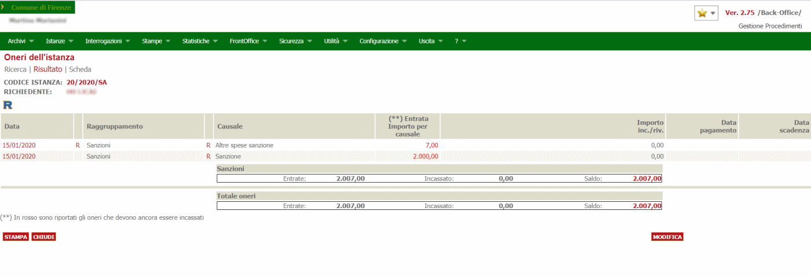

# Configurazione connettore Silfi

In questa documentazione verrà trattata la configurazione che è necessaria per attivare il connettore **Silfi** nel nodo pagamenti.
Per quanto riguarda l'installazione del nodo pagamenti in generale e la configurazione delle verticalizzazioni sul backoffice fare riferimento al documento

[Configurazione del nodo dei pagamenti](./configurazione-nodo-pagamenti.md)

## Prerequisiti

- backend ( VBG ) alla versione 2.85 o successiva
- applicativo nodo-pagamenti versione 2.85

## Servizi usati dal connettore

Il connettore di Silfi implementa i servizi di:

- caricamento del debito
- annullamento del debito
- annullamento di un debito come già pagato offline
- verifica dello stato di pagamento 
- attivazione della sessione di pagamento
- download dell'avviso di pagamento 

Il sistema di pagamenti di Silfi espone tutti i servizi necessari al connettore come metodi diversi di uno stesso endpoint SOAP.
Perciò sarà sufficiente configurare un solo record nella tabella *pay_connector_ws_endpoint* e impostare il riferimento a questo record nei campi corrispondenti nella riga di *pay_connector_config* che configura il connettore.
La configurazione da impostare per il connettore e il suo endpoint è illustrata nei due paragrafi seguenti.

Il connettore Silfi espone anche un servizio SOAP che deve essere invocato da Silfi per notificare al nodo-pagamenti l'avvenuto pagamento di una posizione debitoria e trasmettere la ricevuta telematica.
Questo servizio è esposto all'URL /services/silfi/esiti e deve essere accessibile al sitema di pagamento di Silfi.

### PAY_CONNECTOR_WS_ENDPOINT

| Colonna | Valore | Note |
| ------ | ------ | ------ |
| **CODICE_CONNETTORE** | SILFI | Codice del connettore nel nodo pagamenti come definito in PAY_CONNECTOR_CONFIG.CODICE, si può impostare qualunque codice. Il codice deve essere valorizzato in FK nel campo PAY_PROFILI_ENTI_CREDITORI.CODICE_CONNETTORE   |
| **ID** |  | Numero progressivo |
| ENDPOINT_URL | `https://pagopabe-staging.055055.it/pagopabe/ws/pagamentiattesi/mip2bePublic.wsdl` | URL dell'endpoint SOAP |
| UTENTE |  | lasciare vuoto |
| PASSWORD |  | lasciare vuoto |
| TIMEOUT | 15000 | Serve a configurare il timeout di attesa nell'invocazione del servizio configurato nel campo ENDPOINT_URL |
| DESCRIZIONE | endpoint unico per i servizi mip2bo di Silfi | Descrizione aggiuntiva che spiega a cosa si riferisce questo endpoint |

## Configurazione del connettore

Il connettore Silfi per Firenze è deployato già col nodo pagamenti e per poter essere utilizzato deve essere configurato inserendo un record nella tabella PAY_CONNECTOR_CONFIG

### PAY_CONNECTOR_CONFIG

| Colonna | Valore | Note |
| ------ | ------ | ------------ |
| **CODICE** |  | Identificativo del connettore che deve essere poi associato al profilo dell'ente creditore in PAY_PROFILI_ENTI_CREDITORI.CODICE_CONNETTORE |
| DESCRIZIONE | Connettore Silfi | Descrizione del connettore usata nei messaggi di errore |
| PAY_CONNECTOR_JAVA_CLASS | it.gruppoinit.pal.gp.pay.connector.silfi.SilfiPayConnector | Classe java che implementa il connettore |
| URL_PORTALE_PAGAMENTI | `https://pagopa-staging.055055.it/pagopafe/fe` | URL del portale dei pagamenti per i pagamenti online
| FK_WS_CARICAMENTO | | FK all'enpoint SOAP configurato al paragrafo precedente |
| FK_WS_ANNULLAMENTO | | FK all'enpoint SOAP configurato al paragrafo precedente |
| FK_WS_VERIFICA | | FK all'enpoint SOAP configurato al paragrafo precedente |
| FK_WS_AVVISO | | FK all'enpoint SOAP configurato al paragrafo precedente |
| FK_WS_ATTIVA_SESSIONE | | FK all'enpoint SOAP configurato al paragrafo precedente |

gli altri campi devono essere lasciati vuoti

## Configurazione dell'amministrazione

Deve essere inserito un record in AMMINISTRAZIONI per popolare gli attributi dell'anagrafica del comune di Firenze.

| Colonna | Descrizione |
| ------ | ------ |
| **IDCOMUNE** | Identificativo dell'installazione  |
| **CODICEAMMINISTRAZIONE** | Numero progressivo  |
| AMMINISTRAZIONE | Denominazione dell'ente |

## Configurazione delle causali di registrazione

Tutti i debiti che vengono caricati nel nodo pagamenti devono essere associati ad una causale di registrazione. Per l'ufficio sanzioni del comune di Firenze deve essere valorizzato il campo CODICE_VERSAMENTO con il valore '9/0102105SA/'.

## pay_registrazioni_causali

Le causali vanno definite insieme all'ente in quanto andranno abilitate / gestite nel nodo pagamenti / backoffice quelle proprie specifiche per ogni specifico servizio(es. Sanzioni piuttosto che sportello unico).

| Colonna | Valore | Note |
| ------  | ------ | ------ |
| **ID** |  | Numero progressivo |
| **IDCOMUNE** |  |  |
| SOFTWARE |  | Identificativo del modulo dell'ente (non utilizzato) |
| DESCRIZIONE |  | Descrizione della causale (libero) |
| ORDINE |  | (non utilizzato) |
| FLAG_RIDUZIONE |  | (non utilizzato) |
| FLAG_NOINCASSI | | (non utilizzato) |
| CODICE_VERSAMENTO | 9/0102105SA/ | Codice che identifica la tipologia di onere nel backoffice (TIPICAUSALIONERI.CODICECAUSALEPEOPLE) il codice riportato è quello stabilito dal comune di Firenze per l'ufficio sanzioni ed è usato come valore di default  |

## pay_regcausali_parametri

In questa tabella vanno inseriti i valori da impostare per le date di scadenza.

IDCOMUNE|ID|FK_PAYREGCAUSALE_ID|CHIAVE|VALORE
---|---|---|---|---
**IDCOMUNE**|**PROGRESSIVO**|*FK_CAUSALE*|DATA_SCADENZA_STAMPABILE|30° giorno dalla data di notifica
**IDCOMUNE**|**PROGRESSIVO**|*FK_CAUSALE*|DATA_SCADENZA|31/12/2030

Questo perchè le date di scadenza del pagamento nel modulo sanzioni hanno la scadenza definita e modificata in un secondo momento e dipende dalla data di notifica dell'atto.

## Configurazione del profilo dell'ente

Tutte le chiamate che il nodo pagamenti riceve devono contenere un parametro **cfEnteCreditore** che deve fare riferimento all'identificativo del profilo di un ente censito nel nodo pagamenti.
Per attivate il connettore Silfi per il comune di Firenze è quindi necessario inserire il corrispindente profilo ente nella tabella PAY_PROFILI_ENTI_CREDITORI.
Il record inserito associerà l'amministrazione inserita nella tabella AMMINISTRAZIONI al connettore Silfi precedentemente configurato in PAY_CONNECTOR_CONFIG.
Il CF_CODICE_PROFILO usato per Firenze è 'D612'.
Tale valore deve essere configurato nella apposita verticalizzazione del BackOffice per assicurarsi che il nodo pagamenti sia invocato con il parametro corretto.

## pay_profili_enti_creditori

| Colonna | Valore | Note |
| ------ | ------ | ------ |
| **IDCOMUNE** |  | Identificativo dell'ente |
| **ID** |  | Numero progressivo |
| CODICEAMMINISTRAZIONE |  | Fk verso la tabella AMMINISTRAZIONI che identifica i dati dell'ente |
| CF_CODICE_PROFILO | **IDCOMUNE** | E' il codice che il backoffice trasmette per identificare il sistema dei pagamenti da utilizzare |
| CODICE_CONNETTORE | SILFI | Identificativo del connettore Silfi già configurato |
| FK_CUSALE_REG_DEFAULT |  | FK verso pay_registrazioni_causali che definisce la causale di registrazione del debito da usare nel caso in cui non venga specificata in fase di caricamento. |
| ID_APP_PSP | SAN_ATTECO | Identificativo dell'applicazione nel sistema Silfi |
| CF_CODICE_PROFILO_PSP | FIRENZE | Ientificativo dell'ente nel sistema Silfi |
| URL_ESITO_PAGAMENTO | `http://[host]:[port]/nodo-pagamenti-silfi/esitoSessionePagamento/silfi` |  |
| CF_ENTE_QRCODE_PAGOPA | |Il codice fiscale/partitaiva dell'ente che serve per generare la sezione Identificativo Ente/codice fiscale dell'Ente Creditore dell'algoritmo di generazione qrcode|

Le colonne della tabella PAY_PROFILI_ENTI_CREDITORI che non sono mostrate non devono essere valorizzate.

## Configurazione dei parametri specifici del connettore Silfi

### pay_connector_config_values

Il connettore Silfi il sistema Silfi prevede l'autenticazione tramite certificato SSL, per far questo devono essere configurati una serie di parametri per il connettore.
I valori di questi parametri devono essere configurati nella tabella PAY_CONNECTOR_CONFIG_VALUES come mostrato sotto.

Il sistema di gestione dei gagamenti di Silfi ha un limite nel numero massimo di pagamenti che possono essere trasmessi in un'unica chiamata.
Questo limite si cofigura tramite il parametro MAX_POSIZIONI.
| IDCOMUNE | ID | CONFIG_PARAM | CODICE_CONNETTORE | VALORE |
|-------- | ------ | ----------------- | ----------------- | -------------------------------------------------------------------------------------------------------- |
| DEF | 1 | SSL_KEY_STORE_LOCATION | SILFI | path locale al keystore che contiene il certificato client |
| DEF | 2 | SSL_KEY_STORE_PASSWORD | SILFI | changeit |
| DEF | 3 | SSL_TRUST_STORE_LOCATION | SILFI | path locale al keystore che contiene le definizioni delle CA per trustare il certificato server |
| DEF | 4 | SSL_TRUST_STORE_PASSWORD | SILFI | changeit |
| DEF | 5 | MAX_POSIZIONI | SILFI | 100 |

## pay_connector_config_params

I parametri di configurazione mostrati nel precedente paragrafo per poter essere configurati devono essere definiti come parametri del connettore.
Questo significa che devono esistere nella tabella PAY_CONNECTOR_CONFIG_PARAMS dei record che associano i nomi dei precedenti parametri (CONFIG_PARAM) al connettore NEXI (CODICE_CONNETTORE).
Quindi nella tabella PAY_CONNECTOR_CONFIG_PARAMS devono esistere i record mostrati nella tabella che segue.

| CONFIG_PARAM            | DESCRIZIONE                                                                                                                                                        | CODICE_CONNETTORE   |
| ----------------------- | ------------------------------------------------------------------------------------------------------------------------------------------------------------------ | ------------------- |
| CENTRO_DI_COSTO         | Codice del centro di costo utilizzato per la nomenclatura dei files del flusso NEXI                                                                                | NEXIGE              |
| DOCUMENTI_SERVICE       | URL del servizio del BO per la generazione di documenti                                                                                                            | NEXIGE              |
| SECURITY_ALIAS          | Id comune alias per interrogare securiry                                                                                                                           | (NULL)              |
| SECURITY_PWD            | Password per la connessione a security                                                                                                                             | (NULL)              |
| SECURITY_URL            | URL del servizio di security                                                                                                                                       | (NULL)              |
| SECURITY_USER           | Utente per la connessione a security                                                                                                                               | (NULL)              |

## Configurazione del backend

Ora che il nodo-pagamenti e il connettore sono configurati, bisogna indicare al backend che è attivo un sistema per poter pagare in maniera integrata. Per fare ciò bisogna recarsi nella voce di menù del backend **Configurazione** -> **Tutti i backoffice** -> **Configurazione regole**


attivare la verticalizzazione NODO_PAGAMENTI


e configurare i seguenti parametri personalizzandoli a seconda dell'ente


| Parametro | Valore |
| ------ | ------ |
| AR_COD_FISC_ENTE_CREDITORE | D612 |
| URL_WS |  `http://devel9:8085/nodo-pagamenti/services/pagamentiSOAP?wsdl` |
| CREA_PER_SOGGETTI_COLLEGATI | S
| ID_MODALITA_PAGAMENTO | 9

Sono i movimenti da specificare nel caso si voglia riportare i documenti delle posizioni debitorie nella pratica di riferimento

## conti

ID|CODICECONTO|CODICESOTTOCONTO|DESCRIZIONE|NOTE|FK_CODICEAMMINISTRAZIONE|SOFTWARE|IDCOMUNE|IVA|ANNO_ACCERTAMENTO|NUMERO_ACCERTAMENTO|DATASCADENZA|NUMERO_SOTTO_ACCERTAMENTO
-|-|-|-|-|-|-|-|-|-|-|-|-
2|1||Conto altre spese sanzione|||SN|DEF|0|2021|29072|31-DIC-21|29072
3|2||Conto sanzione|||SN|DEF|0|2021|19510|31-DIC-21|19510

ed è importante la colonna accertamento e  numero_sotto_accertamento (si riferisce al capitolo) che è un valore che deve essere comunicato dall'ente e configurato per quel tipo di pendenza

## causali oneri

CO_ID|CO_DESCRIZIONE|CO_SERICHIEDEENDO|IDCOMUNE|SOFTWARE|FK_RCO_ID|CO_DISABILITATO|CO_ORDINAMENTO|CODICECAUSALEPEOPLE|PAGAMENTIREGULUS|FKIDCAUSALEBOLLO|FLG_TIPICAUSALIINTERESSI|FK_TIPICAUSALIINTERESSI|FLAG_GENERA_FATTURA|FLAG_GENERA_AVVISO
-|-|-|-|-|-|-|-|-|-|-|-|-|-|-
89|Altre spese sanzione|0|DEF|SN|1|0||9/0102105SA/|0||0||0|0
83|Sanzione|0|DEF|SN|1|0||9/0102105SA/|0||0||0|0

È importante la colonna CODICECAUSALEPEOPLE che va a corrispondere  nel nodo pagamento la colonna PAY_REGISTRAZIONI_CAUSALI.CODICE_VERSAMENTO e serve per capire se generare un avviso o una fattura.

È importante impostare le causale con lo stess **codicecausalepeople** per generare una sola posizione debitoria a fronte di due istanze oneri come ad esempio nel caso delle sanzioni dove a fronte del pagamento delle causali **Altre spese sanzioni** e **Sanzioni** viene generata una sola posizione debitoria.



## creazione certificato

Di seguito i passaggi fatti per creare il certificato di autenticazione per collegarsi alle API SILFI

```shell

openssl pkcs12 -export -name cmfi-client-cert -in CMFI-VBG.crt -inkey CMFI-VBG.key -out CMFI-VBG.p12

keytool -importkeystore -destkeystore cmfi_vbg_client.jks -srckeystore CMFI-VBG.p12 -srcstoretype pkcs12 -alias cmfi-client-cert -deststoretype JKS
keytool -keystore cmfi_vbg_truststore.jks -genkey -alias client

keytool -delete -alias client -keystore cmfi_vbg_truststore.jks

keytool -import -trustcacerts -alias cmfi_ca -file CMFI-VBG.crt -keystore cmfi_vbg_truststore.jks
  
ora importo i certificati nel keystore 

keytool -import -trustcacerts -alias sectigo_intermediate -file sectigo_intermediate.cer -keystore cmfi_vbg_truststore.jks

keytool -import -trustcacerts -alias sectigo_root_ca -file sectigo_root_ca.cer -keystore cmfi_vbg_truststore.jks

 ```
