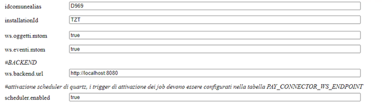
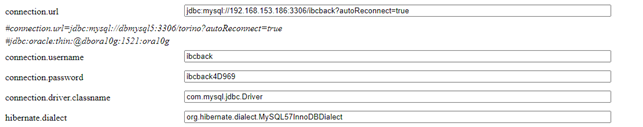
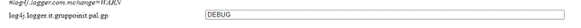
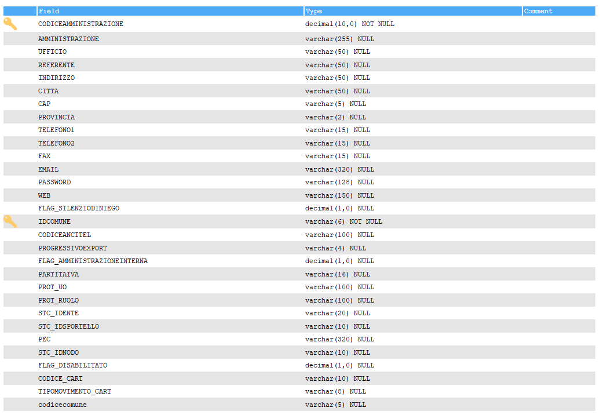
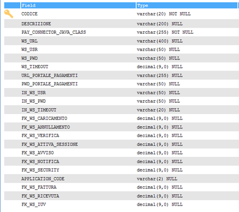
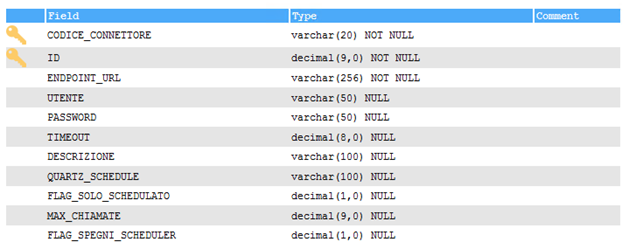
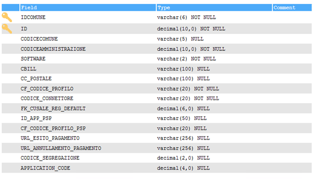
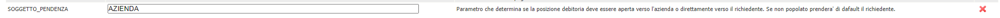

Il nodo dei pagamenti è un applicativo che funge da middleware per tutti i servizi di pagamento che possono essere richiesti dai componenti software della galassia VBG.
Il suo compito è quello di esporre ai componenti di VBG una interfaccia unificata e standardizzata per l'accesso ai servizi di pagamento su piattaforma PagoPA.
In questa documentazione verrà trattata la configurazione che permette di interfacciare VBG con il nodo dei pagamenti.

# Prerequisiti
  - backend ( VBG ) alla versione 2.77 o successiva
  - applicativo nodo-pagamenti
  - comunicazione tra l'applicativo nodo-pagamenti e vbg ( solitamtente tramite http sulla porta 8080 )
  - comunicazione tra l'applicativo nodo-pagamenti e ibcsecurity ( solitamtente tramite http sulla porta 8080 )

# Configurazioni preliminari 
E' necessario verificare che l'applicativo nodo-pagamenti sia installato e che i seguenti parametri siano impostati nei relativi file di configurazione

#### deploy.properties
In questo file ci sono alcune configurazioni utili per il corretto avvio del nodo-pagamenti. Ogni modifica a questo file necessita di un riavvio dell'applicativo

```sh
idcomunealias=<indicare l`identificativo dell`ente all`interno di ibcsecurity>
installationId=TZT
ws.oggetti.mtom=true
ws.eventi.mtom=true
#BACKEND
ws.backend.url=<indicare la url per raggiungere il backend>
#attivazione scheduler di quartz, i trigger di attivazione dei job devono essere configurati nella tabella PAY_CONNECTOR_WS_ENDPOINT
scheduler.enabled=true
```

un esempio di configurazione funzionante è il seguente



#### db.properties
In questo file ci sono le configurazione che permettono all'applicativo nodo-pagamenti di accedere al proprio db contentente le impostazioni dello specifico connettore

```sh
connection.url=<stringa di connessione al database>
connection.username=<utente del database>
connection.password=<password dell`utente del database>
connection.driver.classname=<driver utilizzati per connettersi al database>
hibernate.dialect=<dialect di hibernate da utilizzare per le interrogazioni al database>
```

un esempio di configurazione funzionante è il seguente



#### log4j.properties
In questo file ci sono le impostazioni che permettono di monitorare le attività svolte dal nodo-pagamenti. Tali parametri vanno modificati con cautela in quanto una eccessiva attività di logging potrebbe portare al blocco dell`applicativo stesso

```sh
log4j.logger.it.gruppoinit.pal.gp=DEBUG
```

un esempio di configurazione funzionante è il seguente




# Configurazioni dello specifico connettore

Per potersi interfacciare con i differenti sistemi di pagamento utilizati dai vari enti il nodo dei pagamenti utilizza degli specifici componenti software chiamati connettori.
I connettori sono già presenti nell'installazione del nodo pagamenti ma per poterli utilizzare occorre configurarli in un gruppo di specifiche tabelle del nodo pagamenti. 

Allo stato attuale non è presente una UI per poter configurare tali contenuti per cui si andrà ad operare direttamente nelle tabelle interessate che sono le seguenti:

  - AMMINISTRAZIONI
  - PAY_CONNECTOR_WS_ENDPOINT
  - PAY_CONNECTOR_CONFIG
  - PAY_CONNECTOR_CONFIG_PARAMS
  - PAY_CONNECTOR_CONFIG_VALUES
  - PAY_REGISTRAZIONI_CAUSALI
  - PAY_PROFILI_ENTI_CREDITORI

Di seguito verranno illustrate le informazioni da riportare nelle varie tabelle 

#### amministrazioni
Tabella che configura o dati anagrafici salienti dell'ente creditore per cui si attiva il connettore.

| Colonna | Descrizione |
| ------ | ------ |
| **IDCOMUNE** | Identificativo dell'installazione  |
| **CODICEAMMINISTRAZIONE** | Numero progressivo  |
| AMMINISTRAZIONE | Nome dell'amministrazione  |
| INDIRIZZO | Indirizzo  |
| CITTA | Località  |
| CAP | CAP  |
| PROVINCIA | Provincia  |
| TELEFONO1 | Numero di telefono  |
| EMAIL | Email  |

#### pay_connector_config
Tabella che censisce i connettori installati nel nodo e ne definisce i servizi attivi

| Colonna | Descrizione |
| ------ | ------ |
| **CODICE** | Identificativo del connettore |
| DESCRIZIONE | Descrizione del connettore |
| PAY_CONNECTOR_JAVA_CLASS | Classe java che identifica il connettore |
| WS_URL | Deprecata vedi fk_ws_caricamento |
| WS_USR | Deprecata vedi fk_ws_caricamento |
| WS_PWD | Deprecata vedi fk_ws_caricamento |
| WS_TIMEOUT | Deprecata vedi fk_ws_caricamento |
| URL_PORTALE_PAGAMENTI | Url per accedere al portale dei pagamenti |
| PWD_PORTALE_PAGAMENTI | Password applicativa per accedere al portale dei pagamenti |
| IN_WS_TIMEOUT | Deprecata |
| IN_WS_PWD | Deprecata |
| IN_WS_USR | Deprecata |
| FK_WS_CARICAMENTO | FK ai parametri di configurazione del servizio per il caricamento delle posizioni debitorie |
| FK_WS_ANNULLAMENTO | FK ai parametri di configurazione del servizio di annulklamento delle posizioni debitorie |
| FK_WS_VERIFICA | FK ai parametri di configurazione del servizio di verifica dello stato di una posizione debitoria |
| FK_WS_ATTIVA_SESSIONE | FK ai parametri di configurazione del servizio di attivazione di una sessione di pagamento |
| FK_WS_AVVISO | FK ai parametri di configurazione del servizio di generazione/invio dell'avviso di pagamento |
| FK_WS_NOTIFICA | FK ai parametri di configurazione del servizio esposto dal nodo di ricezione della notifica dell'avvenuto pagamento |
| FK_WS_SECURITY | FK ai parametri di configurazione del servizio di generazione del token di sicurezza |
| APPLICATION_CODE | Codice che identifica lo specifico connettore presso il sistema di pagamenti esterno con cui si interfaccia |
| FK_WS_FATTURA | FK ai parametri di configurazione del servizio di generazione della fattura |
| FK_WS_RICEVUTA | FK ai parametri di configurazione del servizio per il recupero della ricevuta telematica di pagamento |
| FK_WS_IUV | FK ai parametri di configurazione del servizio per la generazione dello iuv |

#### pay_connector_ws_endpoint
Tabella di configurazione dei servizi (SOAP, json, scambio files) utilizzati dai connettori per dialogare con i sistemi di pagamento esterni

| Colonna | Descrizione |
| ------ | ------ |
| **CODICE_CONNETTORE** | Codice del connettore nel nodo pagamenti, si può impostare qualunque codice. Il codice deve essere valorizzato in FK nel campo PAY_PROFILI_ENTI_CREDITORI.CODICE_CONNETTORE   |
| **ID** | Numero progressivo |
| ENDPOINT_URL | URL per l'invocazione del servizio |
| UTENTE | Utente per l'autenticazione del servizio |
| PASSWORD | Password per l'autenticazione del servizio |
| TIMEOUT | Serve a configurare il timeout di attesa nell'invocazione del servizio configurato nel campo ENDPOINT_URL |
| DESCRIZIONE | Descrizione aggiuntiva che spiega a cosa si riferisce questo endpoint |
| QUARTZ_SCHEDULE | Espressione chron di schedulazione. Se impostato il servizio viene attivato anche come procedura schedulata |
| FLAG_SOLO_SCHEDULATO | Indica se la chiamata all'endpoint avviene in maniera solo schedulata (1) oppure anche sincrona (0) |
| MAX_CHIAMATE | Numero massimo di tentativi di chiamata prima di restituire l'errore di irraggiungibilità del servizio, non impostato significa nessun limite |
| FLAG_SPEGNI_SCHEDULER | utile per disattivare gli scheduler mantenendo memorizzata l'espressione che lo configura in quartz_schedule |

#### pay_connector_config_params
Tabella che definisce dei parametri di configurazione che possono essere validi per dei connettori specifici oppure per tutti i connettori

| Colonna | Descrizione |
| ------ | ------ |
| **CONFIG_PARAM** | Nome del parametro |
| DESCRIZIONE | Descrizione del parametro |
| CODICE_CONNETTORE | Riferimento al connettore per cui e' prevista la valorizzazione del parametro, se lasciato vuoto il parametro esiste per tutti i connettori |

#### pay_connector_config_values
Tabella che configura i valori assegnati ai parametri di configurazione definiti nella tabella PAY_CONNECTOR_CONFIG_PARAMS.

| Colonna | Descrizione |
| ------ | ------ |
| **IDCOMUNE** | Identificativo dell'installazione |
| **ID** | Numero progressivo |
| CONFIG_PARAM | Nome del parametro |
| CODICE_CONNETTORE | Identificativo del connettore per cui si assegna il valore al parametro. Se lasciato vuoto assegna un valore di default al parametro che è valido per tutti i connettori |
| VALORE | Valore che assume per lo specifico connettore |

#### pay_profili_enti_creditori
Tabella che definisce i profili che gli enti possono utilizzare per caricare debiti nel nodo pagamenti.
Ogni profilo ente creditore associa tramite le sue foreign key una amministrazione (CODICEAMMINISTRAZIONE) ad un connettore (CODICE_CONNETTORE).
Alcune specifiche informazioni di configurazione sono associate al profilo ente creditore
Tutte le chiamate che i client effuano al nodo devono contenere un codice identificativo (CF_CODICE_PROFILO) del profilo ente per indicare al nodo quale configurazione usare per gestire il servizio richiesto.

| Colonna | Descrizione |
| ------ | ------ |
| **IDCOMUNE** | Identificativo dell'ente |
| **ID** | Numero progressivo |
| CODICECOMUNE | Codice Belfiore che identifica il comune |
| CODICEAMMINISTRAZIONE | Fk verso la tabella AMMINISTRAZIONI che identifica i dati dell'ente |
| SOFTWARE | Identificativo del modulo dell'ente |
| CBILL |  |
| CC_POSTALE | Conto Corrente Postale |
| CF_CODICE_PROFILO | E' il codice che il backoffice trasmette per identificare il sistema dei pagamenti da utilizzare |
| CODICE_CONNETTORE | Identificativo del connettore |
| FK_CUSALE_REG_DEFAULT | FK verso pay_registrazioni_causali |
| ID_APP_PSP | |
| CF_CODICE_PROFILO_PSP | ID dell’ente in NEXI |
| URL_ESITO_PAGAMENTO | Url che gestisce il reindirizzamento dell'utente che vuole tornare all'applicazione client dopo aver effettuato con successo un pagamento sul portale on-line  |
| URL_ANNULLAMENTO_PAGAMENTO | Url che gestisce il ritorno all'app chiamante dopo l'annullamento del pagamento online |
| CODICE_SEGREGAZIONE | Identificativo numerico del punto di emissione degli iuv di un ente creditore |
| APPLICATION_CODE | Identificativo numerico dell'archivo di pagamenti associato a questo servizio dell'ente creditore in pagopa, utilizzato per la generazione del codice avviso con aux digit = 0 |
|CF_ENTE_QRCODE_PAGOPA|Il codice fiscale/partitaiva dell'ente che serve per generare la sezione Identificativo Ente/codice fiscale dell’Ente Creditore dell'algoritmo di generazione qrcode|
#### pay_registrazioni_causali
Tabella che definisce le causali per cui è possibile caricare i debiti nel sistema di pagamento esterno.
Ad ogni debito che viene caricato tramite il nodo pagamenti sarà associata una causale di questa tabella. 
Se il client non specifica la causale di registrazione del debito il sistema gliene assegnerà una di default che è definita per ciascun ente in PAY_PROFILI_ENTI_CREDITORI.FK_CUSALE_REG_DEFAULT. 

| Colonna | Descrizione |
| ------ | ------ |
| **ID** | Numero progressivo |
| **IDCOMUNE** | Identificativo dell'ente |
| SOFTWARE | Identificativo del modulo dell'ente |
| DESCRIZIONE | Descrizione della causale |
| ORDINE |  |
| FLAG_RIDUZIONE | |
| FLAG_NOINCASSI | |
| CODICE_VERSAMENTO | Codice che identifica l'onere nel sistema dei pagamenti dell'ente |

# Configurazione del backend
Ora che il nodo-pagamenti e il connettore sono configurati, bisogna indicare al backend che è attivo un sistema per poter pagare in maniera integrata. Per fare ciò bisogna recarsi nella voce di menù del backend _**Configurazione**_ -> _**Tutti i backoffice**_ -> _**Configurazione regole**_ 


attivare la verticalizzazione NODO_PAGAMENTI


e configurare i seguenti parametri personalizzandoli a seconda dell'ente in modo che <id_profilo_ente> corrisponda al valore configurato nel campo CF_CODICE_PROFILO della tabella PAY_PROFILI_ENTI_CREDITORI.
Mentre L'URL_WS deve riportare l'URL su cui è esposto il nodo pagamenti.


| Parametro | Valore |
| ------ | ------ |
| AR_COD_FISC_ENTE_CREDITORE | <id_profilo_ente> |
| URL_WS |  http://devel9:8085/nodo-pagamenti/services/pagamentiSOAP?wsdl |


## Configurazione soggetto debitore

È possibile aggiungere un nuovo parametro sulla verticalizzazione NODO_PAGAMENTI per determinare se la posizione debitoria deve essere aperta verso l'azienda (se presente, altrimenti il richiedente ) o direttamente verso il richiedente (comportamento di DEFAULT). Il parametro è configurabile per comune e software.



Se configurato accetta come parametri:
- AZIENDA: inserirà il titolare legale della società ;
- RICHIEDENTE: inserirà il richiedente della pratica.
Se non configurato, di default la posizione sarà aperta verso il richiedente.