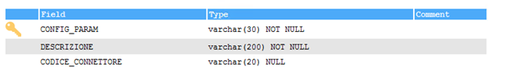
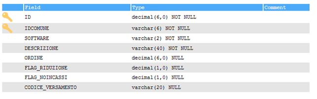
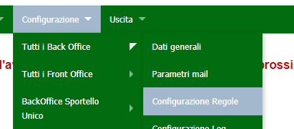
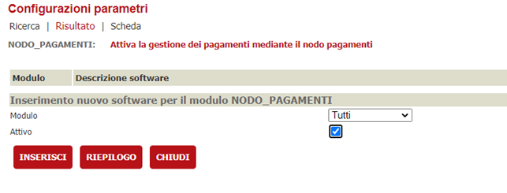
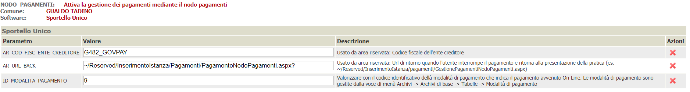
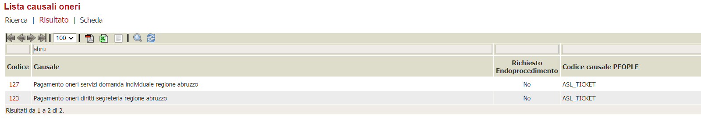
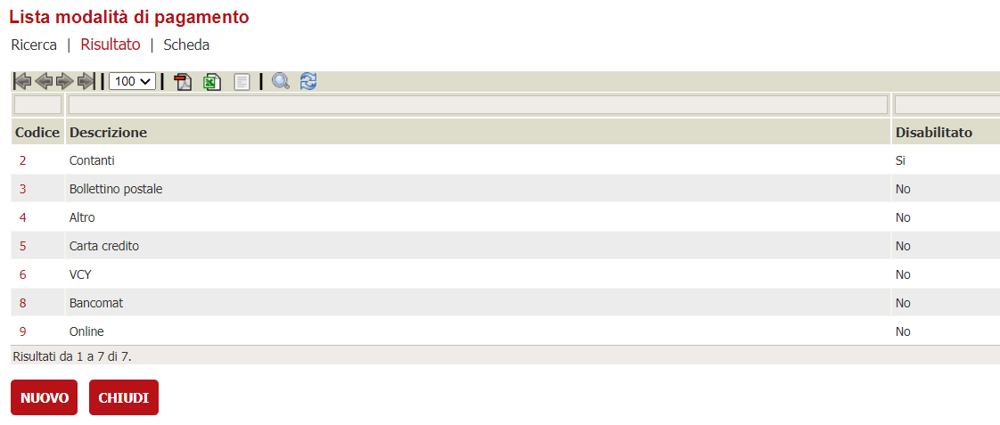

# Connettore MIP

In questa documentazione verrà trattata la configurazione che è necessaria per attivare il connettore GovPay nel nodo pagamenti.
Per quanto riguarda l'installazione del nodo pagamenti in generale e la configurazione delle verticalizzazioni sul backoffice fare riferimento al documento  [Configurazione del nodo dei pagamenti](./configurazione-nodo-pagamenti.md)

## Servizi utilizzati dal connettore

Il connettore di GovPay implementa:

1. Caricamento della Pendenza;
2. Modifica della data scadenza del pagamento avviso della posizione debitoria;
3. Notifica  dell'avvenuta pagamento dell'avviso.
4. Invio avvisi di pagamento

## Configurazioni preliminari

L'URL web service per le varie chiamate API dovrà essere configurato in un nuovo record della tabellla _PAY_CONNECTOR_WS_ENDPOINT_. 

I valori da inserire sono i seguenti:

| Colonna | Valore | Note |
| ------ | ------ | ------ |
| **CODICE_CONNETTORE** | MIPGE | Codice del connettore nel nodo pagamenti, si può impostare qualunque codice. Il codice deve essere valorizzato in FK nel campo PAY_PROFILI_ENTI_CREDITORI.CODICE_CONNETTORE   |
| **ID** |  | Numero progressivo |
| ENDPOINT_URL | `http://SERVER_NAME:SERVERPORT` | URL WS dell'ambiente di test |
| UTENTE | (inserire utente) | nome utente fornito |
| PASSWORD | (password)| password fornita  |
| TIMEOUT |  | Se impostato, serve a configurare il timeout di attesa nell'invocazione del servizio configurato nel campo ENDPOINT_URL |
| DESCRIZIONE | url base per le varie chiamate API | Descrizione aggiuntiva che spiega a cosa si riferisce questo endpoint |
| QUARTZ_SCHEDULE |  | Espressione chron che fa partire le chiamate ogni 10 minuti a partire dal minuto 4, ossia a e 4, a e 14, a e 24 eccetera |
| FLAG_SOLO_SCHEDULATO | 0 | Indica se la chiamata all'endpoint avviene in maniera solo schedulata (1) oppure anche sincrona (0) |
| MAX_CHIAMATE |  | lasciare vuoto |
| FLAG_SPEGNI_SCHEDULER | 0 | utile per disattivare gli scheduler mantenendo memorizzata l'espressione che lo configura in quartz_schedule |

## Configurazione del connettore

Il connettore GovPay per la regione Abruzzo è deployato già col nodo pagamenti e per poter essere utilizzato deve essere configurato inserendo un record nella tabella _PAY_CONNECTOR_CONFIG_

### PAY_CONNECTOR_CONFIG

| Colonna | Valore | Note |
| ------ | ------ | ------------ |
| **CODICE** |  | Identificativo del connettore che deve essere poi associato al profilo dell'ente creditore in PAY_PROFILI_ENTI_CREDITORI.CODICE_CONNETTORE
| DESCRIZIONE | Gov Pay | Descrizione del connettore |
| PAY_CONNECTOR_JAVA_CLASS | it.gruppoinit.pal.gp.pay.connector.mip.MIPConnector | Classe java che identifica il connettore |
| URL_PORTALE_PAGAMENTI | | Url per accedere al portale dei pagamenti |
| FK_WS_CARICAMENTO | | FK ai parametri di configurazione del servizio per il caricamento delle posizioni debitorie configurato al paragrafo precedente |
| FK_WS_ANNULLAMENTO | | FK ai parametri di configurazione del servizio di annullamento delle posizioni debitorie configurato al paragrafo precedente |
| FK_WS_VERIFICA | | FK ai parametri di configurazione del servizio di verifica dello stato di una posizione debitoria configurato al paragrafo precedente |
| FK_WS_ATTIVA_SESSIONE | | FK ai parametri di configurazione del servizio di attivazione di una sessione di pagamento configurato al paragrafo precedente |
|FK_WS_AVVISO||FK ai parametri di configurazione del servizio di generazione/invio dell'avviso di pagamento

È sufficente configurare un solo endpoint per tutte le chiamate

CODICE_CONNETTORE|ID|ENDPOINT_URL|UTENTE|PASSWORD|TIMEOUT|DESCRIZIONE|QUARTZ_SCHEDULE|FLAG_SOLO_SCHEDULATO|MAX_CHIAMATE|FLAG_SPEGNI_SCHEDULER
---|---|---|---|---|---|---|---|---|---|---
GOVPAY|1|https://SERVER_NAME|..in prod si usa il certificato..|....||url base per le varie chiamate API||0||0

gli altri campi devono essere lasciati vuoti

## Configurazione dell'amministrazione

Deve essere inserito un record in _AMMINISTRAZIONI_ per popolare gli attributi dell'anagrafica della Regione Abruzzo.
I campi nell'elenco sottostante, se presenti, vengono riportati nei dati (facoltativi) descritttivi dell'ente creditore durante la trasmissione delle posizioni debitorie al sistema di pagamento GovPay.

| Colonna | Descrizione |
| ------ | ------ |
| **IDCOMUNE** | Identificativo dell'installazione  |
| **CODICEAMMINISTRAZIONE** | Numero progressivo  |
| AMMINISTRAZIONE | Denominazione dell'ente |
| INDIRIZZO | Indirizzo  |
| CITTA | Località  |
| CAP | CAP  |
| PROVINCIA | Provincia  |
| TELEFONO1 | Numero di telefono  |
| EMAIL | Email  |

### pay_connector_config_params


| Colonna | Descrizione |
| ------ | ------ |
| **CONFIG_PARAM** | Nome del parametro |
| DESCRIZIONE | Descrizione del parametro |
| CODICE_CONNETTORE | Riferimento al connettore per cui e' prevista la valorizzazione del parametro, se lasciato vuoto il parametro esiste per tutti i connettori |

### pay_connector_config_values


| Colonna | Descrizione |
| ------ | ------ |
| **IDCOMUNE** | Identificativo dell'installazione |
| **ID** | Numero progressivo |
| CONFIG_PARAM | Nome del parametro |
| CODICE_CONNETTORE | Identificativo del connettore |
| VALORE | Valore che assume per la specifica configurazione dell'ente |

Da popolare con i seguenti valori:

IDCOMUNE|ID|CONFIG_PARAM|CODICE_CONNETTORE|VALORE
---|---|---|---|---
IDCOMUNE|PROGRESSIVO|SSL_TRUST_STORE_LOCATION|MIPGE|...
IDCOMUNE|PROGRESSIVO|SSL_KEY_STORE_LOCATION|GOVPAY|...
IDCOMUNE|PROGRESSIVO|MIPGE_GENOVA_APP_CODE|MIPGE|APPMERCATI_PROCEDURA
IDCOMUNE|PROGRESSIVO|MIPGE_GENOVA_CLIENT_ID|MIPGE|APPMERCATI_TEST
IDCOMUNE|PROGRESSIVO|MIPGE_GENOVA_SUBJECT|MIPGE|APPMERCATI_PROCEDURA
IDCOMUNE|PROGRESSIVO|MIPGE_GENOVA_AUD|MIPGE|`https://apitest.comune.genova.it:28243/manageToken/getToken`
IDCOMUNE|PROGRESSIVO|MIPGE_GENOVA_IIS|MIPGE|APPMERCATI.comune.genova.it

la truststore location **SSL_TRUST_STORE_LOCATION** si riferisce al certificato ( **nomefilecertificato.crt** ) mentre 
la keystore location **SSL_KEY_STORE_LOCATION** si riferisce al certificato ( **nomefilecertificato.key** ) generati con questo comando 

```
 openssl req -x509 -nodes -sha256 -days 3650 -newkey rsa:2048 -keyout <nome-file-certificato>.key -out <nome-file-certificato>.crt

```

- **ATTENZIONE!!** Una volta generati i file vanno rimossi al loro interno ritorni a capo per entrambe i file mentre per la **.KEY** va eliminata anche l'intestazione ---BEGIN PRIVATE CERTIFICATE --- e ---END PRIVATE CERTIFICATE ---


### pay_registrazioni_causali


| Colonna | Descrizione |
| ------ | ------ |
| **ID** | Numero progressivo |
| **IDCOMUNE** | Identificativo dell'ente |
| SOFTWARE | Identificativo del modulo dell'ente |
| DESCRIZIONE | Descrizione della causale |
| ORDINE |  |
| FLAG_RIDUZIONE | |
| FLAG_NOINCASSI | |
| CODICE_VERSAMENTO | Codice che identifica l'onere nel sistema dei pagamenti dell'ente |

ad esempio

ID|IDCOMUNE|SOFTWARE|DESCRIZIONE|ORDINE|CODICE_VERSAMENTO|PARAMETRI
---|---|---|---|---|---|---
progressivo|idcomune|TT|APPMERCATI GENOVA|1|MERCATI_APP_MER_WS|

### pay_profili_enti_creditori

!cf_enti_creditori[](./immagini/PAY_PROFILI_ENTI_CREDITORI.png )
| Colonna | Descrizione |
| ------ | ------ |
| **IDCOMUNE** | Identificativo dell'ente |
| **ID** | Numero progressivo |
| CODICECOMUNE | Codice Belfiore che identifica il comune |
| CODICEAMMINISTRAZIONE | Fk verso la tabella AMMINISTRAZIONI che identifica i dati dell'ente |
| SOFTWARE | Identificativo del modulo dell'ente |
| CBILL |  |
| CC_POSTALE | Conto Corrente Postale |
| CF_CODICE_PROFILO | E' il codice che il backoffice trasmette per identificare il sistema dei pagamenti da utilizzare |
| CODICE_CONNETTORE | Identificativo del connettore |
| FK_CUSALE_REG_DEFAULT | FK verso pay_registrazioni_causali |
| ID_APP_PSP | l'identificativo che viene passato come ida2a|
| CF_CODICE_PROFILO_PSP | Il codice fiscale dell'ente/piva  |
| URL_ESITO_PAGAMENTO | Url da richiamare per sapere l'esito di un pagamento |
| URL_ANNULLAMENTO_PAGAMENTO | Url assoluto che gestisce il ritorno all'app chiamante dopo l'annullamento del pagamento online |
| CODICE_SEGREGAZIONE | Identificativo numerico del punto di emissione degli iuv di un ente creditore |
| APPLICATION_CODE | Identificativo numerico dell'archivo di pagamenti associato a questo servizio dell'ente creditore in pagopa, utilizzato per la generazione del codice avviso con aux digit = 0 |
|CF_ENTE_QRCODE_PAGOPA|Il codice fiscale/partitaiva dell'ente che serve per generare la sezione Identificativo Ente/codice fiscale dell'Ente Creditore dell'algoritmo di generazione qrcode|

Ad esempio:
IDCOMUNE|ID|CODICECOMUNE|CODICEAMMINISTRAZIONE|SOFTWARE|CBILL|CC_POSTALE|CF_CODICE_PROFILO|CODICE_CONNETTORE|FK_CUSALE_REG_DEFAULT|ID_APP_PSP|CF_CODICE_PROFILO_PSP|URL_ESITO_PAGAMENTO|URL_ANNULLAMENTO_PAGAMENTO|CODICE_SEGREGAZIONE|APPLICATION_CODE|CF_ENTE_QRCODE_PAGOPA
---|---|---|---|---|---|---|---|---|---|---|---|---|---|---|---|---
IDCOMUNE|PROGRESSSIVO||1|TT|||MIPGE|MIPGE|1|APPMERCATI_PROCEDURA|10025||||00856930102

# Configurazione del backend/console

Ora che il nodo-pagamenti e il connettore sono configurati, bisogna indicare al backend che è attivo un sistema per poter pagare in maniera integrata. Per fare ciò bisogna recarsi nella voce di menù del backend _**Configurazione**_ -> _**Tutti i backoffice**_ -> _**Configurazione regole**_  



attivare la verticalizzazione NODO_PAGAMENTI



e configurare i seguenti parametri personalizzandoli a seconda dell'ente



| Parametro | Valore |
| ------ | ------ |
| AR_COD_FISC_ENTE_CREDITORE | G482_GOVPAY |

# Tipicausali oneri



# Tipi modalità pagamento



# creazione del certificato di autenticazione

Quello che segue è la procedura per generare il jks per il certificato client

### esportazione in pfx dei certificati forniti

```bash
[root@sporvic3app01 prod]# openssl pkcs12 -export -in pae-gp-prod4.cer -inkey pae-gp-prod.key -out pae-gp-prod4.pfx
Enter Export Password:
Verifying - Enter Export Password:
```

### creazione del certificato client

```bash
[root@sporvic3app01 prod]# keytool -importkeystore -srckeystore /root/certs/arit/prod/pae-gp-prod4.pfx -srcstoretype pkcs12 -destkeystore /root/certs/arit/prod/pae-gp-prod4.jks -deststoretype JKS
```

### nome dell'alias creato

```bash
[root@sporvic3app01 prod]# keytool -list -v -keystore /root/certs/arit/prod/pae-gp-prod4.jks
Immettere la password del keystore:

Tipo keystore: JKS
Provider keystore: SUN

Il keystore contiene 1 entry

Nome alias: 1

```

## creazione del truststore

```bash
[root@sporvic3app01 prod]# keytool -import -file pae-gp- -alias firstCA -keystore pae-gp-test4_truststore.jks

Considerare attendibile questo certificato? [no]:  si
Il certificato è stato aggiunto al keystore

```
