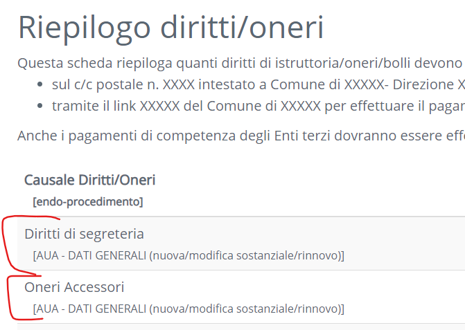
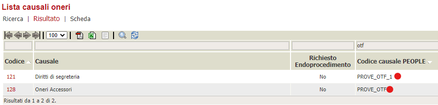
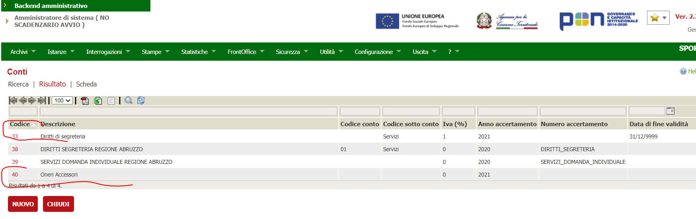

In questa documentazione verrà trattata la configurazione che è necessaria per attivare il connettore PagoUmbria nel nodo pagamenti.

Per quanto riguarda l'installazione del nodo pagamenti in generale e la configurazione delle verticalizzazioni sul backoffice fare riferimento al documento 

[Configurazione del nodo dei pagamenti](./configurazione-nodo-pagamenti.md)

# Prerequisiti
  - backend ( VBG ) alla versione 2.82 o successiva
  - applicativo nodo-pagamenti versione 2.82
  - comunicazione tra l'applicativo nodo-pagamenti e vbg ( solitamtente tramite http sulla porta 8080 )
  - comunicazione tra l'applicativo nodo-pagamenti e ibcsecurity ( solitamente tramite http sulla porta 8080 )
  - comunicazione tra il nodo dei pagamenti e API STORE Umbria digitale (tipicamente sulla 443)

# Accordi di servizio
Per ogni ente che si intende attivare va richiesta tramite l'API store l'attivazione delle credenziali per accedere alle API per conto dell'ente.
Le credenziali serviranno per configurare i parametri dell'ente.

**DA CAPIRE SE POSSIBILE ATTIVARE UNA RICHIESTA PER APPLICATIVO VBG PIUTTOSTO CHE UNA RICHIESTA PER ENTE**
Allo stato attuale questo non è possibile in quanto il connettore si appoggia sulla tabella pay_connector_config_values per i valori come endpoint, utenza e password che non è possibile indicare
per comune ma solo per connettore. Difatto ogni ente avrà le sue credenziali anche se l'endpoint sarà senmpre lo stesso

# Configurazioni
## pay_connettor_config
| Colonna | Valore | Note |
| ------ | ------ | ------ |
| CODICE | PUMB ||
|DESCRIZIONE| Connettore PagoUmbria||
|PAY_CONNECTOR_JAVA_CLASS|it.gruppoinit.pal.gp.pay.connector.pagoumbria.PagoUmbriaPayConnector||
|URL_PORTALE_PAGAMENTI|https://pagoumbria.regione.umbria.it/pagoumbria/||
|FK_WS_CARICAMENTO        | | |
|FK_WS_ANNULLAMENTO       | | |
|FK_WS_VERIFICA           | | |
|FK_WS_SECURITY           | | |

## pay_connector_config_values
Per i connettori che non hanno servizi sincroni di verifica stato vanno impostati anche questi parametri che permettono l'aggiornamento dello stato delle posizioni debitorie nel backend

|IDCOMUNE|ID|CONFIG_PARAM|CODICE_CONNETTORE|VALORE|
|----|----|----|----|----|
|AUA|1|URL_CALLBACK_CAMBIO_STATO|PPAY|http://x.x.x.x:8080/api-backend/services/rest-auth-token/nodo-pagamenti/posizione-debitoria/aggiorna-stato|
|AUA|2|SECURITY_ALIAS|PPAY|AUAPR|
|AUA|3|SECURITY_PWD|PPAY|password da impostare|
|AUA|4|SECURITY_URL|PPAY|http://x.x.x.x:8080/ibcsecurity/services/sigeproSecurity.wsdl|
|AUA|5|SECURITY_USER|PPAY|NODO_PAGAMENTI|

p.s. Sulla security va verificato che esistano le credenziali impostati in
**SECURITY_ALIAS**, **SECURITY_PWD**, **SECURITY_USER**

## pay_connector_ws_endpoint
Rappresentano le due URL per la gestione del caricamento delle posizioni debitorie ed il verifica stato, più  la URL per il recupero del Token di autenticazione all'Api Store WSO2

|CODICE_CONNETTORE|ID |ENDPOINT_URL |UTENTE |PASSWORD |TIMEOUT|DESCRIZIONE|QUARTZ_SCHEDULE|FLAG_SOLO_SCHEDULATO |MAX_CHIAMATE |FLAG_SPEGNI_SCHEDULER|
|---- |---- |----  |---- |---- |----|----|----|---- |---- |----|
|PUMB| 1 |https://api.regione.umbria.it:443/pagoumbriacomunicazioneposizionedebitoria/ | | ||||0 | |0|
|PUMB| 2 |https://api.regione.umbria.it:443/token | DA ACCORDO DI SERVIZIO |DA ACCORDO DI SERVIZIO |15000|||0 | |0|
|PUMB| 3 |https://api.regione.umbria.it:443/pagoumbriaverificastatopag/ |  |||||0 | |0|

## pay_profili_enti_creditori
per ogni ente che si intende avviare va configurata una riga su questa tabella.

**CF_ENTE_QRCODE_PAGOPA** 
Il codice fiscale/partitaiva dell'ente che serve per generare la sezione Identificativo Ente/codice fiscale dell’Ente Creditore dell'algoritmo di generazione qrcode|

|IDCOMUNE|ID|CODICECOMUNE|CODICEAMMINISTRAZIONE |SOFTWARE|CBILL |CC_POSTALE|CF_CODICE_PROFILO |CODICE_CONNETTORE |FK_CUSALE_REG_DEFAULT |ID_APP_PSP|CF_CODICE_PROFILO_PSP |URL_ESITO_PAGAMENTO |URL_ANNULLAMENTO_PAGAMENTO|CODICE_SEGREGAZIONE |APPLICATION_CODE|CF_ENTE_QRCODE_PAGOPA|
|----|----|----|---- |----|---- |----|---- |---- |---- |----|---- |---- |----|---- |----|----|
|AUA|1||1|TT|TSTBILL|CCPTST|PAGOAUA|PUMB|1|SIL_ADISU|RU|http://..nomeserver../nodo-pagamenti/esitoSessionePagamento/pagoaua?esito=1|http://..nomeserver../nodo-pagamenti/esitoSessionePagamento/pagoaua?esito=0	| |	|000012321564|

Dove l'IDCOMUNE **AUA** è lo spazio del comune sul quale si intendono salvare le informazioni delle posizioni debitorie

Il codice amministrazione si deve riferire ad una amministrazione esistente nel DB

## pay_registrazioni_causali
È necessario popolare queste causali con gli identificativi delle pendenze (o codici entrata configurati e richiesti dall'ente).
I pagamenti prendono questa causale per definire il tipo entrata e quindi è necessario impostarne uno per ogni tipo di entrata, che corrisponde a tipi causali oneri per il quale si intende creare una posizione debitoria.
Se non viene specificata dal codice allora viene presa la causale onere di default impostata nella tabella dei profili enti creditori.

*Sarebbe meglio che ogni client passi una causale e che questa sia configurata in questa tabella*

  La lookup del codice passato dal client viene fatta sulla colonna **CODICE_VERSAMENTO**

ID|IDCOMUNE|SOFTWARE|DESCRIZIONE|ORDINE|CODICE_VERSAMENTO|PARAMETRI
---|---|---|---|---|---|---
1|AUA|TT|Oneri accessori|1|PROVE_OTF|
2|AUA|TT|Diritti segreteria|2|PROVE_OTF_1|

Dove PROVE_OTF è il codice tributo definito in sede di accordo di servizio.

# Configurazione Backoffice
Configurazioni tabelle **TipiCausaliOneri**, **Conti**. 

Devono esistere delle causali oneri con la definizione delle causali oneri della console. Le causali dovrebbero essere create con l'identificativo della console (es.> 91.000.000)

**CONSOLE**

>  

## BACKOFFICE ENTE

### Tipi causali oneri

Le causali devono avere il nome della causale della console nel software di ricezione della pratica.

È importante il **codicecausalepeople** che definisce il tipo pendenza per l'ente (deve essere specificata in attivazione dell'ente nell'accordo di servizio)

> 

### Conti
> 

