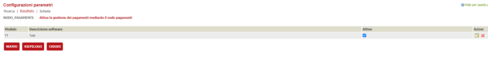

In questa documentazione verrà trattata la configurazione che è necessaria per attivare il connettore Piemonte PAY nel nodo pagamenti.
Per quanto riguarda l'installazione del nodo pagamenti in generale e la configurazione delle verticalizzazioni sul backoffice fare riferimento al documento 

[Configurazione del nodo dei pagamenti](./configurazione-nodo-pagamenti.md)

# Descrizione
Il connettore in oggetto, permette di integrarsi con il sistema dei pagamenti di Piemonte Pay sia in maniera sincrona che asincrona. Nel documento verranno trattate entrambe le modalità di integrazione che si differiscono in alcune configurazioni

# Prerequisiti
  - backend ( VBG ) alla versione 2.82 o successiva
  - applicativo nodo-pagamenti versione 2.8.2
  - comunicazione tra l'applicativo nodo-pagamenti e vbg ( solitamtente tramite http sulla porta 8080 )
  - comunicazione tra l'applicativo nodo-pagamenti e ibcsecurity ( solitamente tramite http sulla porta 8080 )

# Integrarsi in modalità sincrona
Questo livello di integrazione è molto più recente rispetto a quello asincrono. Il vantaggio principale è quello di avere a disposizione la verifica dello stato del pagamento in tempo reale. Si basa su chiamate REST tra il connettore e Piemonte Pay

## Servizi messi a disposizione
- Attivazione di una sessione di pagamento ( On The Fly )
- Apertura di una posizione debitoria non On The Fly
- Verifica dello stato dei pagamenti sia su richiesta che tramite evento generato da Piemonte Pay
- Annullamento di una posizione debitoria non ancora pagata

## ( Step 1 ) configurazione della tabella AMMINISTRAZIONI
L'amministrazione che identifica l'ente deve essere censita anche nel database in cui si appoggia il nodo dei pagamenti di VBG. Nella maggior parte delle installazioni coincide con il database dove opera VBG pertanto la tabella AMMINISTRAZIONI è condivisa tra i due applicativi. Se così non fosse, questo è quello che va configurato nella tabella AMMINISTRAZIONI del database del nodo dei pagamenti

| Colonna | Valore | Note |
| ------ | ------ | ------ |    
| **CODICEAMMINISTRAZIONE** | 7 | Primo numero progressivo libero in base al campo IDCOMUNE |
| **AMMINISTRAZIONE** | Comune di Torino | Nome dell'ente |
| **FLAG_SILENZIODINIEGO** | 1 |  |
| **IDCOMUNE** | L219TS | Identificativo dell'installazione in VBG. Il codice riportato rappresenta l'installazione di test del comune di Torino |
| **FLAG_AMMINISTRAZIONEINTERNA** | 0 |  |

Questa è la configurazione minima quando il db del nodo dei pagamenti e il db di VBG non stanno sullo stesso schema. In caso contrario l'amministrazione va configurata tramite interfaccia di VBG e verranno impostati i valori secondo le necessità applicative di VBG e dell'Ente

## ( Step 2 ) configurazione della tabella PAY_REGISTRAZIONI_CAUSALI
In questa tabella va censita la causale di default da utilizzare qualora non ne venga passata una specifica.
| Colonna | Valore | Note |
| ------ | ------ | ------ |
| **ID** | 1 | Primo numero progressivo libero in base al campo IDCOMUNE |
| **IDCOMUNE** | L219TS | Identificativo dell'installazione in VBG. Il codice riportato rappresenta l'installazione di test del comune di Torino |
| **SOFTWARE** | SS | Identificativo del modulo di VBG che si sta integrando con il sistema dei pagamenti |
| **DESCRIZIONE** | oneri comune di Torino | Descrizione della causale. Viene fornita dall'ente in quanto verrà poi trasmessa al nodo dei pagamenti Piemonte Pay |
| **ORDINE** | 1 |  |
| **CODICE_VERSAMENTO** | HT00 | Codice della causale. Viene fornita dall'ente in quanto verrà poi trasmessa al nodo dei pagamenti Piemonte Pay |
| **PARAMETRI** |  |  |

## ( Step 3 ) configurazione della tabella PAY_CONNECTOR_WS_ENDPOINT
| Colonna | Valore | Note |
| ------ | ------ | ------ |
| **CODICE_CONNETTORE** | PPAYJSON | Codice del connettore nel nodo pagamenti, si può impostare qualunque codice. |
| **ID** | 1  | Primo numero progressivo libero in base a CODICE_CONNETTORE |
| **ENDPOINT_URL** | https://tu-EXP-pay-sistemapiemonte.bilancio.csi.it/epayapi/api/ | Url del sistema dei pagamenti ( quello indicato in questa guida è dell'ambiente di test) |
| **UTENTE** | Fornito da Piemonte Pay | Utente utilizzato per la basic authentication nelle chiamate verso l'endpoint |
| **PASSWORD** | Fornita da Piemonte Pay | Password dell'utente utilizzato per la basic authentication nelle chiamate verso l'endpoint |
| **TIMEOUT** | 150000 | Serve a configurare il timeout di attesa nell'invocazione del servizio configurato nel campo **ENDPOINT_URL** |
| **DESCRIZIONE** | Caricamento, annullamento posizioni debitorie e attivazione sessione PiemontePay | Descrizione dell'endpoint |
| **QUARTZ_SCHEDULE** |  | Lasciare vuoto in quanto i servizi sincroni non hanno bisogno di operazioni schedulate |
| **FLAG_SOLO_SCHEDULATO** | 0 | Indica se la chiamata all'endpoint avviene in maniera solo schedulata (1) oppure anche sincrona (0) |
| **MAX_CHIAMATE** |  | lasciare vuoto |
| **FLAG_SPEGNI_SCHEDULER** | 0 | utile per disattivare gli scheduler mantenendo memorizzata l'espressione che lo configura in quartz_schedule |

| Colonna | Valore | Note |
| ------ | ------ | ------ |
| **CODICE_CONNETTORE** | PPAYJSON | Codice del connettore nel nodo pagamenti, si può impostare qualunque codice. |
| **ID** | 2  | Primo numero progressivo libero in base a CODICE_CONNETTORE |
| **ENDPOINT_URL** | https://tu-exp-srv-paywso-sistemapiemonte.bilancio.csi.it/wso001/services/Enti2EPaywsoSecureProxy | Url del sistema dei pagamenti ( quello indicato in questa guida è dell'ambiente di test) |
| **UTENTE** | Fornito da Piemonte Pay | Utente utilizzato per la basic authentication nelle chiamate verso l'endpoint |
| **PASSWORD** | Fornita da Piemonte Pay | Password dell'utente utilizzato per la basic authentication nelle chiamate verso l'endpoint |
| **TIMEOUT** | 150000 | Serve a configurare il timeout di attesa nell'invocazione del servizio configurato nel campo **ENDPOINT_URL** |
| **DESCRIZIONE** | Annullamento posizioni debitorie PiemontePay | Descrizione dell'endpoint |
| **QUARTZ_SCHEDULE** |  | Lasciare vuoto in quanto i servizi sincroni non hanno bisogno di operazioni schedulate |
| **FLAG_SOLO_SCHEDULATO** | 0 | Indica se la chiamata all'endpoint avviene in maniera solo schedulata (1) oppure anche sincrona (0) |
| **MAX_CHIAMATE** |  | lasciare vuoto |
| **FLAG_SPEGNI_SCHEDULER** | 0 | utile per disattivare gli scheduler mantenendo memorizzata l'espressione che lo configura in quartz_schedule |

## ( Step 4 ) configurazione della tabella PAY_CONNECTOR_CONFIG
| Colonna | Valore | Note |
| ------ | ------ | ------ |
| **CODICE** | PPAYJSON | Codice del connettore nel nodo pagamenti, si può impostare qualunque codice |
| **DESCRIZIONE** | Piemonte Pay servizi sincroni |  |
| **PAY_CONNECTOR_JAVA_CLASS** | it.gruppoinit.pal.gp.pay.connector.piemontepay.rest.PiemontePayRestConnector | Classe JAVA del nodo dei pagamenti che gestisce l'integrazione tra VBG e lo specifico nodo dei pagamenti di Piemonte Pay |
| **WS_URL** | https://tu-exp-pay-sistemapiemonte.bilancio.csi.it/epayapi/api/ | Url del Web Service Rest di Piemonte Pay utilizzato per integrare i vari metodi |
| **WS_USR** | Fornito da Piemonte Pay | Utente utilizzato per la basic authentication nelle chiamate verso l'endpoint |
| **WS_PWD** | Fornita da Piemonte Pay | Password dell'utente utilizzato per la basic authentication nelle chiamate verso l'endpoint |
| **WS_TIMEOUT** | 150000 | Serve a configurare il timeout di attesa nell'invocazione del servizio configurato nel campo **WS_URL** |
| **IN_WS_TIMEOUT** | 150000 |  |
| **FK_WS_CARICAMENTO** | 1 | Riferimento all'endpoint da utilizzare. Fa riferimento a quanto specificato in PAY_CONNECTOR_WS_ENDPOINT.ID |
| **FK_WS_ANNULLAMENTO** | 2 | Riferimento all'endpoint da utilizzare. Fa riferimento a quanto specificato in PAY_CONNECTOR_WS_ENDPOINT.ID |
| **FK_WS_VERIFICA** | 1 | Riferimento all'endpoint da utilizzare. Fa riferimento a quanto specificato in PAY_CONNECTOR_WS_ENDPOINT.ID |
| **FK_WS_ATTIVA_SESSIONE** | 1 | Riferimento all'endpoint da utilizzare. Fa riferimento a quanto specificato in PAY_CONNECTOR_WS_ENDPOINT.ID |

Nella modalità sincrona, i valori dei campi **FK_WS_CARICAMENTO**,**FK_WS_ANNULLAMENTO**,**FK_WS_VERIFICA** e **FK_WS_ATTIVA_SESSIONE**  fanno riferimento allo stesso endpoint

## ( Step 5 ) configurazione della tabella PAY_PROFILI_ENTI_CREDITORI
| Colonna | Valore | Note |
| ------ | ------ | ------ |
| **IDCOMUNE** | L219TS | Identificativo dell'installazione in VBG. Il codice riportato rappresenta l'installazione di test del comune di Torino |
| **ID** | 2 | Primo numero progressivo libero in base al campo IDCOMUNE |
| **CODICEAMMINISTRAZIONE** | 7 | Fa riferimento a quanto indicato nella tabella AMMINISTRAZIONI.CODICEAMMINISTRAZIONE |
| **SOFTWARE** | TT | Identificativo del modulo di VBG che si sta integrando con il sistema dei pagamenti. E' possibile impostarlo in maniera generica con un valore TT |
| **CBILL** | Fornito dall'ente |  |
| **CC_POSTALE** | Fornito dall'ente |  |
| **CF_CODICE_PROFILO** | TOPPAYJSON | Identifica il profilo dell'Ente creditore. Questo codice può essere impostato liberamente ma deve essere indicato nella verticalizzazione del nodo dei pagamenti di VBG  |
| **CODICE_CONNETTORE** | PPAYJSON | Codice del connettore nel nodo pagamenti, si può impostare qualunque codice. |
| **FK_CAUSALE_REG_DEFAULT** | 1 | Fa riferimento a quanto indicato nella tabella PAY_REGISTRAZIONI_CAUSALI.ID |
| **ID_APP_PSP** | APP_MERCATO |  |
| **CF_CODICE_PROFILO_PSP** | 00514490010 | Codice fiscale dell'ente ( o dello sportello ) che si stà integrando con il nodo dei pagamenti di Piemonte Pay |
| **URL_ESITO_PAGAMENTO** | http://devel3.init.gruppoinit.it/nodo-pagamenti/esitoSessionePagamento/toppay | Url noto a Piemonte Pay sulla quale arriveranno le notifiche, da parte di Piemonte Pay, ad ogni cambio di stato della posizione debitoria creata |
| **CF_ENTE_QRCODE_PAGOPA** | 00514490010 | Il codice fiscale/partitaiva dell'ente che serve per generare la sezione Identificativo Ente/codice fiscale dell’Ente Creditore dell'algoritmo di generazione qrcodE |

## ( Step 6 ) configurazione della verticalizzazione NODO_PAGAMENTI su VBG
Per integrarsi con qualsiasi sistema di pagamenti, la verticalizzazione **NODO_PAGAMENTI** deve essere attiva

e configurata con i seguenti parametri

| Parametro | Valore | Note |
| ------ | ------ | ------ |
| **AR_COD_FISC_ENTE_CREDITORE** | TOPPAYJSON | Codice del connettore Piemonte Pay censito nelle varie tabelle del nodo dei pagamenti |
| **URL_WS** | http://devel9:8085/nodo-pagamenti/services/pagamentiSOAP?wsdl | Url del sistema dei pagamenti che gestisce l'integrazione; da non confondere con l'URL del sistema dei pagamenti Piemonte Pay in quanto VBG comunica con un unico sistema di pagamenti interno che, di volta in volta, gestisce le chiamate verso i sistemi di pagamenti esterni |

Potrebbero essere presenti altri parametri configurati in questa verticalizzazione; per intergarsi con il nodo dei pagamenti, quelli sopra indicati sono i due parametri necessari.

# Integrarsi in modalità asincrona
Questa modalità di integrazione è la prima che è stata implementato in quanto non esisteva la possibilità di integrazione in maniera sincrona. Si basa su chiamate SOAP tra il connettore e Piemonte Pay

## Servizi messi a disposizione
- Apertura di una posizione debitoria non On The Fly
- Verifica dello stato dei pagamenti solamente tramite evento generato da Piemonte Pay
- Annullamento di una posizione debitoria non ancora pagata

## ( Step 1 ) configurazione della tabella AMMINISTRAZIONI
Stesse configurazioni dello Step 1 dell'integrazione in modalità sincrona

## ( Step 2 ) configurazione della tabella PAY_REGISTRAZIONI_CAUSALI
Stesse configurazioni dello Step 2 dell'integrazione in modalità sincrona

## ( Step 3 ) configurazione della tabella PAY_CONNECTOR_WS_ENDPOINT
Il funzionamento è identico allo Step 3 dell'integrazione in modalità sincrona ma cambiano alcuni valori

| Colonna | Valore |
| ------ | ------ |
| **CODICE_CONNETTORE** | PPAY |
| **ID** | 1  |  |
| **ENDPOINT_URL** | https://tu-exp-srv-paywso-sistemapiemonte.bilancio.csi.it/wso001/services/Enti2EPaywsoSecureProxy |
| **UTENTE** | Fornito da Piemonte Pay |
| **PASSWORD** | Fornita da Piemonte Pay |
| **TIMEOUT** | 150000 |
| **DESCRIZIONE** | Caricamento, annullamento posizioni debitorie e attivazione sessione PiemontePay |
| **QUARTZ_SCHEDULE** |  |
| **FLAG_SOLO_SCHEDULATO** | 0 |
| **MAX_CHIAMATE** |  |
| **FLAG_SPEGNI_SCHEDULER** | 0 |

## ( Step 4 ) configurazione della tabella PAY_CONNECTOR_CONFIG
Il funzionamento è identico allo Step 4 dell'integrazione in modalità sincrona ma cambiano alcuni valori
| Colonna | Valore |
| ------ | ------ |
| **CODICE** | PPAY |
| **DESCRIZIONE** | Piemonte Pay |
| **PAY_CONNECTOR_JAVA_CLASS** | it.gruppoinit.pal.gp.pay.connector.piemontepay.PiemontePayConnector |
| **WS_URL** | https://tu-exp-srv-paywso-sistemapiemonte.bilancio.csi.it/wso001/services/Enti2EPaywsoSecureProxy |
| **WS_USR** | Fornito da Piemonte Pay |
| **WS_PWD** | Fornita da Piemonte Pay |
| **WS_TIMEOUT** | 150000 |
| **URL_PORTALE_PAGAMENTI** | Fornito da Piemonte Pay |
| **PWD_PORTALE_PAGAMENTI** | Fornita da Piemonte Pay |
| **IN_WS_TIMEOUT** | 150000 |
| **IN_WS_PWD** | Fornita da Piemonte Pay |
| **IN_WS_USR** | Fornito da Piemonte Pay |
| **FK_WS_CARICAMENTO** | 1 |
| **FK_WS_ANNULLAMENTO** | 2 |
| **FK_WS_ATTIVA_SESSIONE** | 1 |

Nella modalità asincrona, i valori dei campi **FK_WS_CARICAMENTO**, e **FK_WS_ATTIVA_SESSIONE**  fanno riferimento allo stesso endpoint. Non è presente il servizio di verifica stato posizione debitoria pertanto il campo **FK_WS_VERIFICA** va lasciato vuoto

## ( Step 5 ) configurazione della tabella PAY_PROFILI_ENTI_CREDITORI
Il funzionamento è identico allo Step 5 dell'integrazione in modalità sincrona ma cambiano alcuni valori

| Colonna | Valore |
| ------ | ------ |
| **IDCOMUNE** | L219TS |
| **ID** | 1 |
| **CODICEAMMINISTRAZIONE** | 7 |
| **SOFTWARE** | TT |
| **CBILL** | Fornito dall'ente |
| **CC_POSTALE** | Fornito dall'ente |
| **CF_CODICE_PROFILO** | TOPPAY |
| **CODICE_CONNETTORE** | PPAY |
| **FK_CAUSALE_REG_DEFAULT** | 1 |
| **ID_APP_PSP** | APP_MERCATO |
| **CF_CODICE_PROFILO_PSP** | 00514490010 |
| **URL_ESITO_PAGAMENTO** | http://devel3.init.gruppoinit.it/nodo-pagamenti/esitoSessionePagamento/toppay |
| **CF_ENTE_QRCODE_PAGOPA** | 00514490010 |

## ( Step 6 ) configurazione della verticalizzazione NODO_PAGAMENTI su VBG
Il funzionamento è identico allo Step 6 dell'integrazione in modalità sincrona ma cambiano alcuni valori

| Parametro | Valore |
| ------ | ------ |
| **AR_COD_FISC_ENTE_CREDITORE** | TOPPAY |
| **URL_WS** | http://devel9:8085/nodo-pagamenti/services/pagamentiSOAP?wsdl |