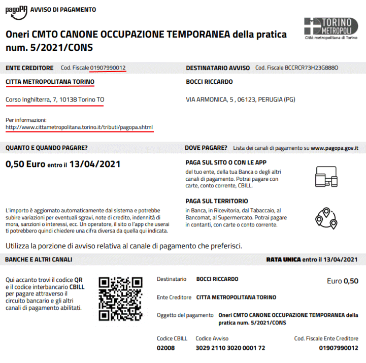

# Unicredit EasyPa

In questa documentazione verrà trattata la configurazione che è necessaria per attivare il connettore Unicredit EasyPA nel nodo pagamenti.
Per quanto riguarda l'installazione del nodo pagamenti in generale e la configurazione delle verticalizzazioni sul backoffice fare riferimento al documento 

[Configurazione del nodo dei pagamenti](./configurazione-nodo-pagamenti.md)

## Prerequisiti

- backend ( VBG ) alla versione 2.85 o successiva
- applicativo nodo-pagamenti versione 2.85
- comunicazione tra l'applicativo nodo-pagamenti e vbg ( solitamtente tramite http sulla porta 8080 )
- comunicazione tra l'applicativo nodo-pagamenti e ibcsecurity ( solitamente tramite http sulla porta 8080 )

## NODO PAGAMENTI

### PAY_CONNECTOR_CONFIG

CODICE|DESCRIZIONE|PAY_CONNECTOR_JAVA_CLASS|WS_URL|WS_USR|WS_PWD|WS_TIMEOUT|URL_PORTALE_PAGAMENTI|PWD_PORTALE_PAGAMENTI|IN_WS_TIMEOUT|IN_WS_PWD|IN_WS_USR|FK_WS_CARICAMENTO|FK_WS_ANNULLAMENTO|FK_WS_VERIFICA|FK_WS_ATTIVA_SESSIONE|FK_WS_AVVISO|FK_WS_NOTIFICA|FK_WS_SECURITY|APPLICATION_CODE|FK_WS_FATTURA|FK_WS_RICEVUTA|FK_WS_IUV
---|---|---|---|---|---|---|---|---|---|---|---|---|---|---|---|---|---|---|---|---|---|---
EASYPA|UNICREDIT EASYPA|it.gruppoinit.pal.gp.pay.connector.easypa.UnicreditEasyPAConnector||||||||||5||2|1|6|4|3||||

### PAY_CONNECTOR_WS_ENDPOINT

CODICE_CONNETTORE|ID|ENDPOINT_URL|UTENTE|PASSWORD|TIMEOUT|DESCRIZIONE|QUARTZ_SCHEDULE|FLAG_SOLO_SCHEDULATO|MAX_CHIAMATE|FLAG_SPEGNI_SCHEDULER
---|---|---|---|---|---|---|---|---|---|---
EASYPA|1| `https://servername:port/connettorenodo/services/soap/paInviaCarrelloPosizioni?wsdl`|username|password|150000|attiva sessione pagamento||0||0
EASYPA|2|`https://servername:port/connettorenodo/services/rest/inc/dettaglio`|username|password||Verifica dello stato delle posizioni debitorie||0||0
EASYPA|3|`https://servername:port/connettorenodo/services/oauth/token`|username|password||||0||0
EASYPA|4|`https://servername:port/connettorenodo/services/rest/rt/iuv/download`||||Endpoint per ricevuta telematica||0||0
EASYPA|5|`https://servername:port/gestoreposizioni?wsdl`|username|password_cifrata||||0||0
EASYPA|6|`http://servername:port/bollettinopagopa/services/utilititypagopa?wsdl`||||||0||

### PAY_PROFILI_ENTI_CREDITORI

IDCOMUNE|ID|CODICECOMUNE|CODICEAMMINISTRAZIONE|SOFTWARE|CBILL|CC_POSTALE|CF_CODICE_PROFILO|CODICE_CONNETTORE|FK_CUSALE_REG_DEFAULT|ID_APP_PSP|CF_CODICE_PROFILO_PSP|URL_ESITO_PAGAMENTO|URL_ANNULLAMENTO_PAGAMENTO|CODICE_SEGREGAZIONE|APPLICATION_CODE|CF_ENTE_QRCODE_PAGOPA
---|---|---|---|---|---|---|---|---|---|---|---|---|---|---|---|---
idcomune ente|1||1|TT|02008||EASYPA_CMTO|EASYPA|1|APP_PSP|cf_ente (es 01907990012)|`http://servername/nodo-pagamenti/esitoSessionePagamento/easypa_cmto?esito=1`||||cf_ente (es 01907990012)

### PAY_CONNECTOR_CONFIG_VALUES

IDCOMUNE|ID|CONFIG_PARAM|CODICE_CONNETTORE|VALORE
---|---|---|---|---
CMTO|10|SECURITY_USER|EASYPA|username su security
CMTO|9 |SECURITY_URL|EASYPA|`http://servername:8080/ibcsecurity/services/sigeproSecurity.wsdl`
CMTO|8 |SECURITY_PWD|EASYPA|password su security
CMTO|7 |SECURITY_ALIAS|EASYPA|alias dell'ente
CMTO|6 |URL_CALLBACK_CAMBIO_STATO|EASYPA|`http://servername:8080/api-backend/services/rest-auth-token/nodo-pagamenti/posizione-debitoria/aggiorna-stato`
CMTO|5 |AUTH_ID_DOMINIO|EASYPA|preso da parametri produzione
CMTO|4 |AUTH_ID_ENTE|EASYPA|preso da parametri produzione
CMTO|3 |AUTH_CODICE_ENTE|EASYPA|preso da parametri produzione
CMTO|2 |AUTH_CODICE_ISTITUTO|EASYPA|preso da parametri produzione
CMTO|1 |AUTH_GRANT_TYPE|EASYPA|preso da parametri produzione
CMTO|1 |CODICE_SIA_ENTE|EASYPA|J7608

### PAY_REGCAUSALI_PARAMETRI

Per il problema della postalizzazione è stato inserito il parametro **INVIA_SOLO_POSIZIONI_DI_SOGGETTI_CON_MAIL** (valori 1,0 predefinito 0) legato alla causale.

Quando viene chiamato il metodo di registrazione della posizione debitoria se la causale della posizione debitoria ha questo parametro (*con valore uguale a 1*) allora la posizione non viene inviata a GATE ma registrata come ACQUISITA.

Al momento il parametro è obbligatorio per le causali che servono a creare posizioni debitorie da bollettazione.

Questo perché dalla Bollettazione vengono recuperate le posizioni debitorie acquisite e inviate mediante trasformazione PENTAHO e tracciato IPRS.

Per la trasformazione Pentaho va configurato anche il parametro **TRACCIATO_CTIPFIL** che serve a Pentaho per creare il tracciato IPRS.

## BACKOFFICE

### AMMINISTRAZIONI

Vanno popolate le informazioni dell'amministrazione
quali

- Amministrazione
- Indirizzo
- Cap
- Citta
- Provincia
- Web

che sono le informazioni che vengono stampate nell'avviso

### VERTICALIZZAZIONI

#### servizi attivi

descrizione | idservizio | codiceservizio|spontaneo
---|---|---|---
CANONE OCCUPAZIONE PERMANENTE SUOLO|COSAP1|0000001|no
CANONE DISTRIBUTORI|DSTRBT|0000004|no
CANONE ESPOSIZIONE PUBBLICITARIA  |CRRMPU|0000007|no
SPESE ISTRUTTORIA CONCESSIONI STRADALI|SPISTR|0000005|si
CANONE OCCUPAZIONE TEMPORANEA|COSAP2|0000002|no
CANONE OCCUPAZIONE|COSAP3|0000003|si
CANONE ESPOSIZIONE PUBBLICITARIA TEMPORANEA|CRRMPT|0000008|no

Per ogni servizio va configurata una causale oneri e un conto da associargli

#### conti

descrizione conto|anno accertamento| iva
---|---|---
CANONE OCCUPAZIONE PERMANENTE SUOLO|2021|0
CANONE DISTRIBUTORI|2021|0
CANONE ESPOSIZIONE PUBBLICITARIA  |2021|0
SPESE ISTRUTTORIA CONCESSIONI STRADALI|2021|0
CANONE OCCUPAZIONE TEMPORANEA|2021|0
CANONE OCCUPAZIONE|2021|0
CANONE ESPOSIZIONE PUBBLICITARIA TEMPORANEA|2021|0

#### causali oneri

Descrizione causale | codice causale people 
--|--
CANONE OCCUPAZIONE PERMANENTE SUOLO|0000001
CANONE DISTRIBUTORI|0000004
CANONE ESPOSIZIONE PUBBLICITARIA |0000007
SPESE ISTRUTTORIA CONCESSIONI STRADALI|0000005
CANONE OCCUPAZIONE TEMPORANEA|0000002
CANONE OCCUPAZIONE|0000003
CANONE ESPOSIZIONE PUBBLICITARIA TEMPORANEA|0000008

Ad ogni causale va associato il conto definito sopra
