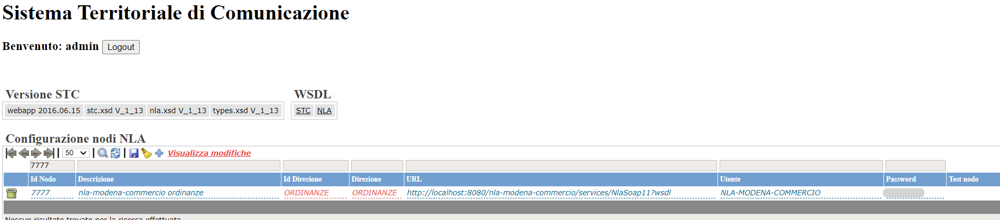
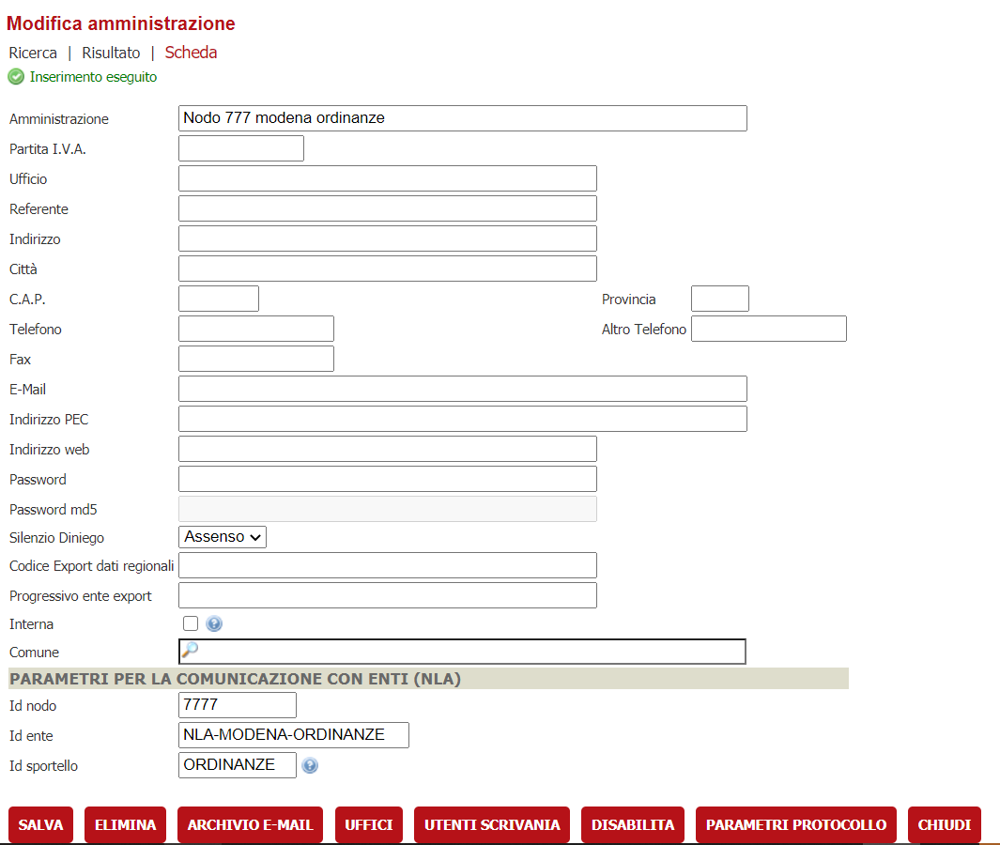
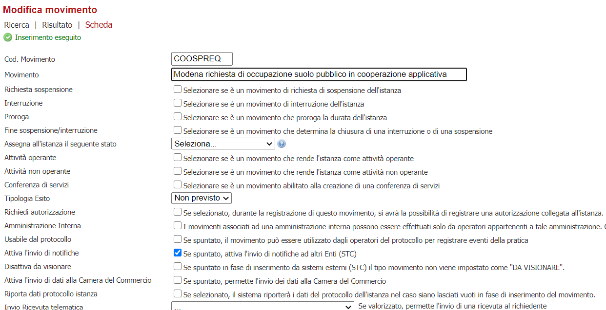
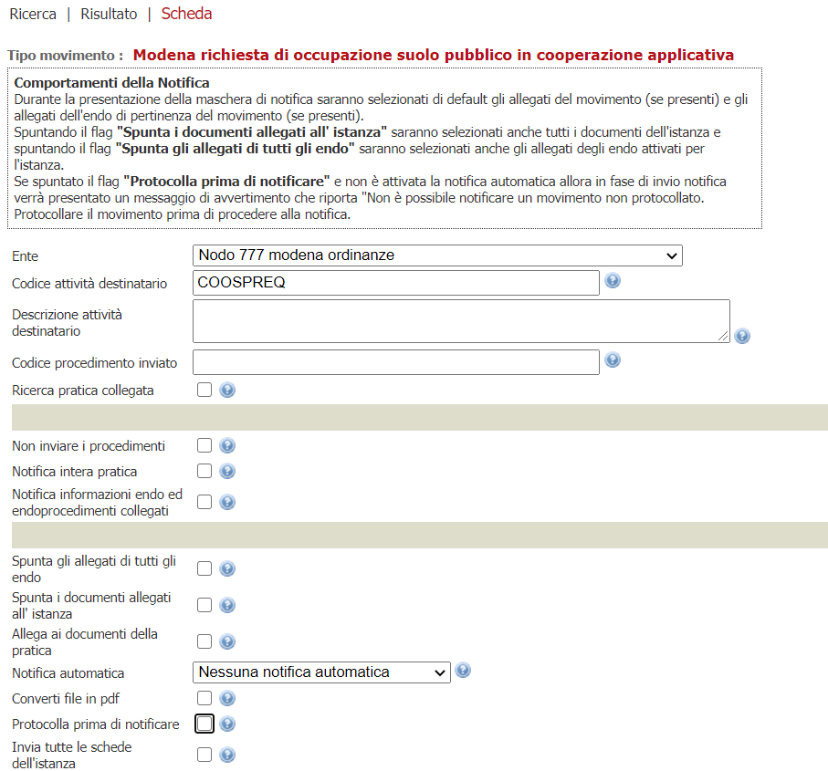
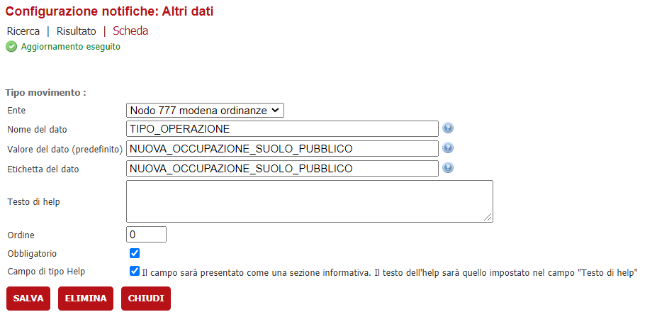
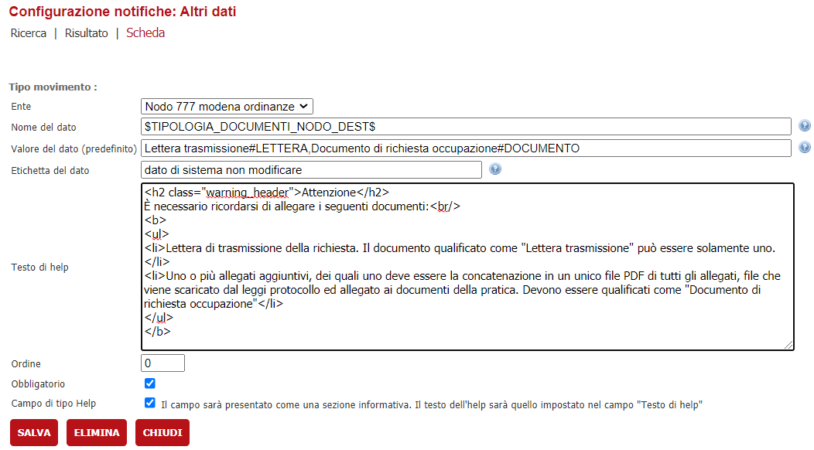
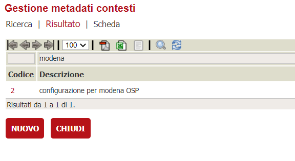
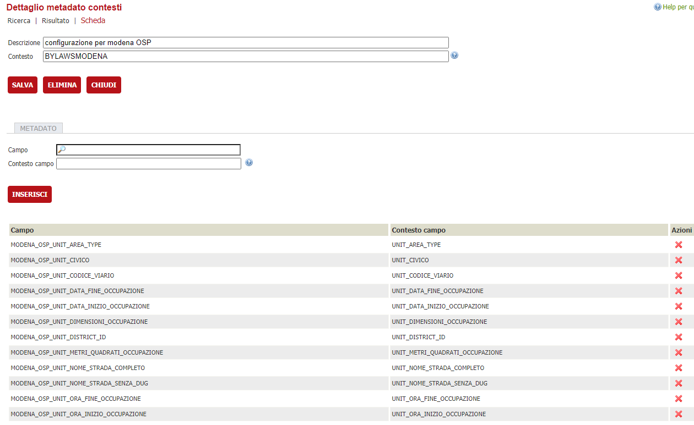
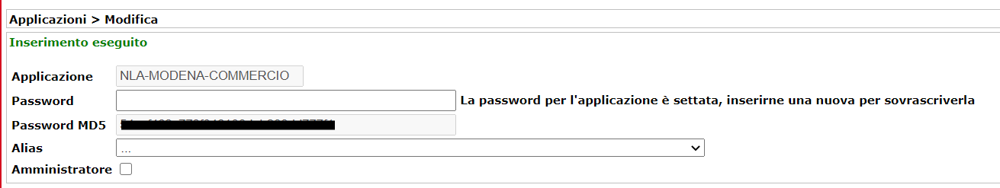

# Integrazione con sistema ordinanze
Per comunicare con il sistema delle ordinanze si usano le notifiche STC.

Lato operatore di backoffice si troverà a fare una notifica STC e si troverà nella seguente interfaccia descritta in questo [documento](interfaccia-operatore.md).

È stata sviluppata una componente NLA che viene delegata al colloquio con il sistema *ByLAW* - sviluppata internamente dall'ente - che espone le interfaccie WS per creare una ordinanza di Occupazione Suolo Pubblico.
È necessario quindi configurare:
1. Il nodo nel DB di [STC](#configurazione-stc);
2. Il [Backoffice](#configurazione-backoffice) con la 
    - creazione della amministrazione che rappresenta il nodo, 
    - del movimento che sarà usato per la notifica e dei relativi parametri; 
    - I modelli dinamici che servono per contenere le informazioni strutturate da inviare al WebService.
    - Le mappature dei dati dinamici. 
    - La eventuale lettera di richiesta occupazione da inviare come allegato.
3. la [componente nla](#configurazione-del-nodo) che dialoga con *ByLaw*
4. Configurare l'applicazione nella [security](#configurazione-security)
5. Va installato l'applicativo api-backen e configurato nelle verticalizzazioni  **API_SERVICE**.**API_SERVICE_URL** indicando la base URL dell'applicativo ad esempio
*http://localhost:8080/api-backend*


# Configurazione stc
Va censito nel DB STC il nodo che risponde alle chiamate del back
> 

IDNODO|WSURL|USERID|PASSWORD|IDDIREZIONE|DIREZIONE|DESCRIZIONE
-|-|-|-|-|-|-
7777|http://server:port/nla-modena-commercio/services/NlaSoap11?wsdl|NLA-MODENA-COMMERCIO|...|ORDINANZE|ORDINANZE|nla-modena-commercio ordinanze


# Configurazione backoffice
## Verticalizzazioni
configurare la verticalizzazione ed il parametro **API_SERVICE**.**API_SERVICE_URL** con la base url dell'papplicativo api-backend  *http://localhost:8080/api-backend* (da verificare che sia installato)

## Amministrazioni
Va configurata l'amministrazione che possa essere contattata come nodo applicativo 

>

## Movimenti
Configurare un nuovo movimento che servirà per comunicare col nuovo nodo

>

### Parametri stc del movimento - dati generali
>

### Parametri stc del movimento - altri dati
**TIPO_OPERAZIONE**
Valore ammesso: *NUOVA_OCCUPAZIONE_SUOLO_PUBBLICO*
>
---

**Tipologia dei documenti che devono essere inoltrati**

Questo parametro permette di identificare gli allegati che saranno inoltrati al nodo. è possibile inviare solamente due allegati: 
1. lettera di trasmissione della richiesta
2. documento di richiesta di occupazione completo dei relativi allegati;
La concatenazione in un unico file PDF di tutti gli allegati, il file viene scaricato dal leggi protocollo ed allegato ai documenti della pratica


>

Nome del dato **\$TIPOLOGIA_DOCUMENTI_NODO_DEST\$**
es. del valore
> Lettera trasmissione#LETTERA,Documento di richiesta occupazione#DOCUMENTO

Descrizione html:
```html
<h2 class="warning_header">Attenzione!</h2>
È necessario ricordarsi di allegare due documenti:<br/>
<b>
<ul>
<li>lettera di trasmissione della richiesta;</li>
<li>documento di richiesta di occupazione completo dei relativi allegati, ovvero la concatenazione in un unico file PDF di tutti gli allegati, il file viene scaricato dal leggi protocollo ed allegato ai documenti della pratica</li>
</ul>
</b>
```


## Mappature campi dinamici
La tabella di configurazione delle mappature che serve alla componente di ricercare tramite etichetta il campo da inputare come valore al WS.

Si configura nel menù
> Archivi --> Archivi di base --> Tabelle --> Gestione Metadati Contesto
1. va creato il contesto

>

2. associati i campo ai metadati
>

Il nome del contesto ed il nome dei dati mappati è fisso e rappresentato dalle tabelle che seguono

#### DYN2_METADATI_CONTESTO
IDCOMUNE|ID|CONTESTO|DESCRIZIONE
---|---|---|---
*IDCOMUNE*|*PROGRESSIVO*|BYLAWSMODENA|configurazione per modena Ordinanze


#### DYN2_METADATI
IDCOMUNE|ID|FK_CONTESTO_ID|FK_CAMPODINAMICO_ID|CONTESTO_CAMPO
---|---|---|---|---
*IDCOMUNE*|*PROGRESSIVO*|*FK_CONTESTO_BYLAWS*|1807|UNIT_DIMENSIONI_OCCUPAZIONE
*IDCOMUNE*|*PROGRESSIVO*|*FK_CONTESTO_BYLAWS*|1975|UNIT_DISTRICT_ID
*IDCOMUNE*|*PROGRESSIVO*|*FK_CONTESTO_BYLAWS*|1799|UNIT_ORA_FINE_OCCUPAZIONE
*IDCOMUNE*|*PROGRESSIVO*|*FK_CONTESTO_BYLAWS*|1798|UNIT_ORA_INIZIO_OCCUPAZIONE
*IDCOMUNE*|*PROGRESSIVO*|*FK_CONTESTO_BYLAWS*|1771|UNIT_DATA_FINE_OCCUPAZIONE
*IDCOMUNE*|*PROGRESSIVO*|*FK_CONTESTO_BYLAWS*|1770|UNIT_DATA_INIZIO_OCCUPAZIONE
*IDCOMUNE*|*PROGRESSIVO*|*FK_CONTESTO_BYLAWS*|1779|UNIT_NOME_STRADA_SENZA_DUG
*IDCOMUNE*|*PROGRESSIVO*|*FK_CONTESTO_BYLAWS*|1780|UNIT_CIVICO
*IDCOMUNE*|*PROGRESSIVO*|*FK_CONTESTO_BYLAWS*|1914|UNIT_CODICE_VIARIO
*IDCOMUNE*|*PROGRESSIVO*|*FK_CONTESTO_BYLAWS*|1806|UNIT_METRI_QUADRATI_OCCUPAZIONE


### configurazione della tabella nell'ente 
ID|NOME_CAMPO_VERO (SCHEDA TOSAP 2)|NOME_CAMPO|ETICHETTA|TIPODATO 
---|---|---|---|--- 
1807|TO_DIMANSIONE|MODENA_OSP_UNIT_DIMENSIONI_OCCUPAZIONE|DIMENSIONI DELL'OCCUPAZIONE DA VERIFICARE SE GIA’ PRESENTE|Testo 
1806|TO_MQ_OCCUPAZIONE_CALCOLATI|MODENA_OSP_UNIT_METRI_QUADRATI_OCCUPAZIONE|METRI DA VERIFICARE SE GIA’ PRESENTE|NumericoDouble 
1914|TO_COD_VIARIO|MODENA_OSP_UNIT_CODICE_VIARIO|Codice viario CAMPO NASCOSTO CODICEVIARIO DI ISTANZESTRADARIO|NumericoIntero 
1974|TO_TOPONIMO|MODENA_OSP_UNIT_AREA_TYPE|DUG dello stradario CAMPO NASCOSTO IL CAMPO PREFISSO DELLO STRADARIO|Testo 
1780|TO_CIVICO|MODENA_OSP_UNIT_CIVICO|Civico o / civici  DA VERIFICARE SE GIA’ PRESENTE|Testo |Concatenazione 
1779|TO_VIA|MODENA_OSP_UNIT_NOME_STRADA_SENZA_DUG|nome strada Senza DUG CAMPO NASCOSTO IL CAMPO DESCRIZIONE DELLO STRADARIO|Testo 
1770|TO_DATA_INI|MODENA_OSP_UNIT_DATA_INIZIO_OCCUPAZIONE|Data inizio occupazione DA VERIFICARE SE GIA’ PRESENTE|Data 
1798|TO_ORA_INI|MODENA_OSP_UNIT_ORA_INIZIO_OCCUPAZIONE|Ora inizio occupazione DA VERIFICARE SE GIA’ PRESENTE|Testo 
1771|TO_DATA_FINE|MODENA_OSP_UNIT_DATA_FINE_OCCUPAZIONE|Data fine occupazione DA VERIFICARE SE GIA’ PRESENTE|Data 
1799|TO_ORA_FINE|MODENA_OSP_UNIT_ORA_FINE_OCCUPAZIONE|Ora fine occupazione DA VERIFICARE SE GIA’ PRESENTE|Testo 
1975|TO_CIRCOSTRIZIONE|MODENA_OSP_UNIT_DISTRICT_ID|IDENTIFICATIVO DELLA CIRCOSCRIZIONE CAMPO NASCOSTO IL CAMPO CIRCOSCRIZIONE DI ISTANZESTRADARIO|Testo 

Espressione per la validazione del
- civico
> ^[1-9][0-9]*(/([1-9]|[1-9][0-9]|[A-Z]))?$
- ora inizio/fine occupazione
> ^([0-1]?[0-9]|[2][0-3])\.[0-5][0-9]$


# Configurazione del nodo

```properties
## SECURITY
ws.token.url=http://localhost:8080/ibcsecurity/services/sigeproSecurity.wsdl
ws.token.user=NLA-MODENA-COMMERCIO
ws.token.pwd=......

## STC
stc.url=http://localhost:8080/ibcstc/services/stc?wsdl
stc.userid=NLA-MODENA-COMMERCIO
stc.password=....
stc.mtom=true
stc.timeout=480000


stc.idNodoMittente=7777
stc.idEnteMittente=NLA-MODENA-ORDINANZE
stc.idSportelloMittente=ORDINANZE
stc.idNodoDestinatario=400
stc.idSportelloDestinatario=CO

ws.oggetti.mtom=true
ws.eventi.mtom=true


#BACKEND
ws.backend.url=http://localhost:8080/backend
# parametri ws by law 
ws.bylaw.url=http://SERVER:PORT/bylawswebservice/services/ByLawsWS.ByLawsWSHttpSoap12Endpoint
ws.bylaw.read_time_out=300000
ws.bylaw.connetcion_time_out=120000
ws.bylaw.mtom=true
ws.bylaw.mtom=true
ws.bylaw.username=suap
ws.bylaw.password=...

```

# Configurazione security

Configurare per l'autenticazione applicativa della componente in ibcsecurity il riferimento
**NLA-MODENA-COMMERCIO**

>

