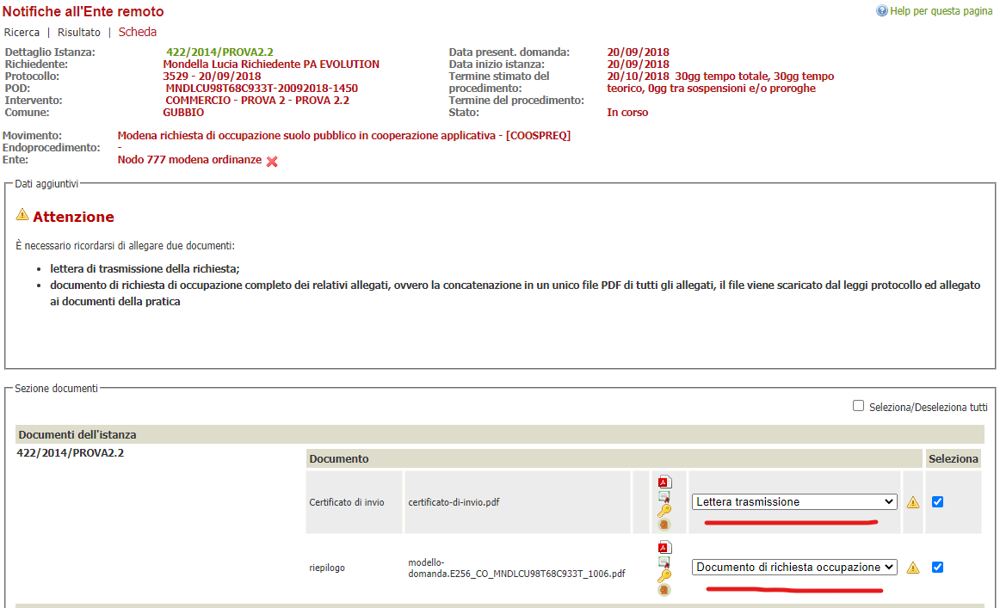

# Interfaccia operatore backoffice

Un movimento che notifica all'STC - come descritto [qui](README.md#movimenti) - sarà configurato nei vari flussi.

Al momento della notifica l'operatore si troverà a dover indicare due documenti obbligatori per la notifica:
1. la lettera
2. l'allegato PDF ottenuto dalla funzionalità leggi protocollo che contiene al suo interno tutti i documenti protocollati.
    > l'allegato deve venir scaricato mediante la funzione salva allegato in locale e salvato nella pratica che si presenta dopo aver fatto il leggi protocollo dell'istanza. 

a seguire la schermata di esempio che si trova l'operatore nella notifica.
Il messaggio è configurabile come descritto in questa parte del [documento](README.md#movimenti) alla sezione altri dati del movimento.

La chiamata alla componente effettua una validazione le informazioni inviate.

