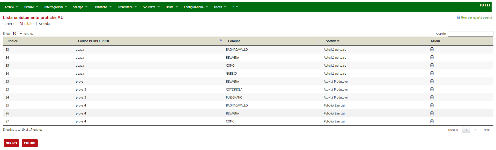
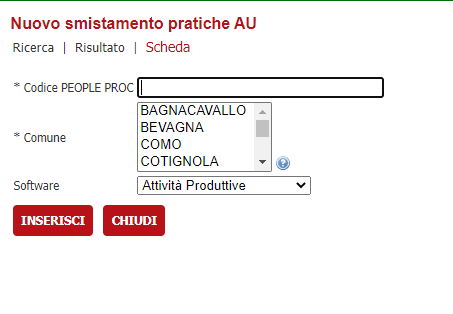
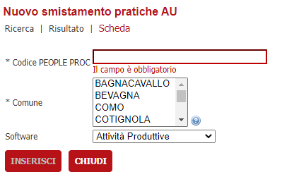

# Smistamento delle pratiche AU

Alla funzionalità si accede dal menu "Archivi -> Archivi di base -> Tabelle -> Smistamento pratiche AU".

Verrà mostrata la pagina contente la lista 

Nel campo in alto a destra "Search" è possibile eseguire una ricerca sulle varie colonne della tabella.

Per eliminare il singolo record è sufficiente cliccare sull'icona cestino, apparirà un messaggio che chiede di confermare o meno l'eliminazione.

Per inserire un nuovo record selezionare il bottone **Nuovo**, si verrà indirizzati al form di creazione

I campi contrassegnati con l'asterisco sono obbligatori e nel caso non vengano compilati verrà visualizzato un errore e il bottone **Inserisci** verrà disattivato, come ad esempio:

