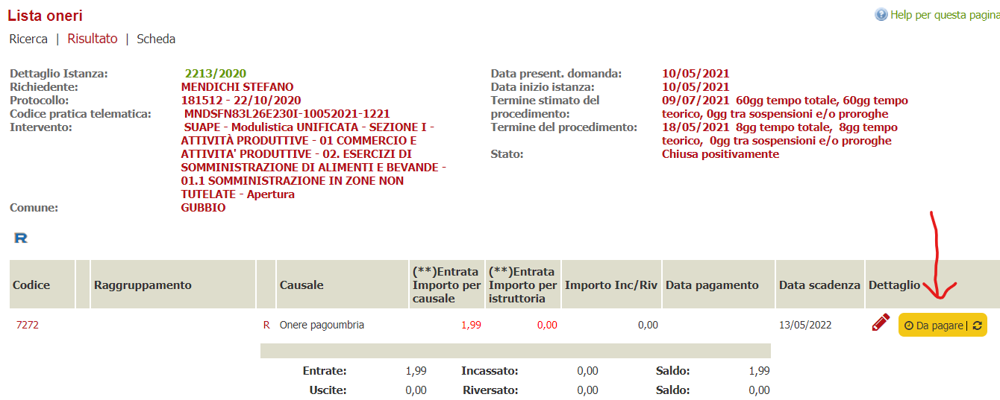
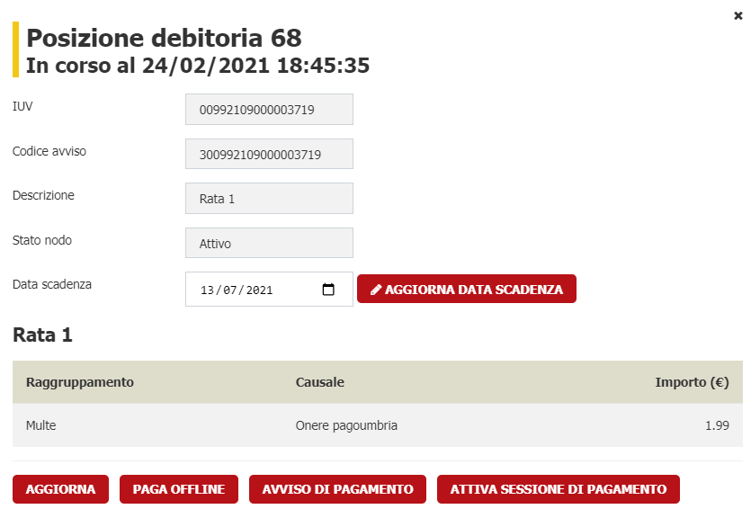
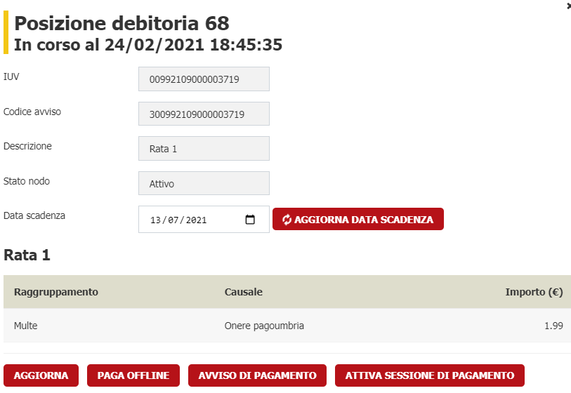

# Posizioni debitorie
In questa sezione sono descritte le varie funzionalità relative alla gestione delle posizioni debitorie, ovvero le entità, ad oggi collegate con le funzionalità **oneri delle istanze** o **Bollettazione**, che si collegano con PAGOPA tramite il connettore specifico (GOVPAY, PiemontePAY, SILFI, ecc....)

## WebComponent delle posizioni debitorie
È stata sviluppata una WebComponent che permette di visualizzare le informazioni delle posizioni debitorie create nel nodo dei pagamenti.

La WebComponent viene inserite nelle funzionalità dove è associata una posizione debitoria.

Ad esempio nelle istanze oneri viene visualizzata come nella seguente immagine

Al click sulla WebComponent viene visualizzato il dettaglio della posizione debitoria con le eventuali operazioni che è possibile compiere.

Le colorazioni della web component variano a seconda dello stato della posizione debitoria che in generale è data da tre stati complessivi che ne determinano le colorazioni

* **Conclusa Positivamente**
    
    Quando la posizione debitoria viene pagata nel sistema dei pagamenti comparià un'icona verde
* **Conclusa Negativamente**

    Se il pagamento di una posizione debitoria è stata annullato o comunque non è andata a buon fine nel sistema dei pagamenti, viene mostrata una icona rossa 
* **In Corso**

    Se la posizione debitoria è in attesa di pagamento o annullamento da parte del soggetto a cui è stata addebitata, viene mostrata un'icona gialla

Le funzionalità presenti, quali ad esempio **PAGA OFFLINE**, oppure **AVVISO DI PAGAMENTO** sono visualizzate a seconda che il connettore li supporti come eventi e dallo stato della posizione debitoria (Ad esempio non posso pagare off line una posizione debitoria già pagata).

## Pagamento OFFLINE
Può accadere che una posizione debitoria creata in PAGOPA venga pagata con altri sistemi, ad esempio bolletino bianco. 
In questo caso l'ente deve comunque accettare il pagamento per motivi legali. 

Per questo scenario è stata creata la funzionalità Pagamento OFFLINE che permette di annullare le posizioni debitorie in PAGOPA e registrare i riferimenti dell'avvenuto pagamento.

L'interfaccia chiede all'operatore di indicare i riferimenti della posizione pagata che poi saranno registrati nel sottosistema integrato (SILFI, PAGOUMBRIA, ecc..)

Il pagamento offline è possibile solo se la posizione non sia già annullata / pagata / o si trovi in stato con errore.

## Modifica data scadenza
Per i conenttori che la supportano, ad oggi SILFI, viene data la possibilità di modificare la data di scadenza di una posizione debitoria.
L'operazione è possibile solo se la posizione non sia già annullata / pagata / o si trovi in stato con errore.

L'operatore dovrà indicare la nuova data di scadenza e confermare l'operazione.

Per aggiornare la data di scadenza è necessario modificare il campo **Data scadenza** indicando la data corretta e cliccare su **AGGIORNA DATA SCADENZA**

ed attendere il risultato dell'operazione.