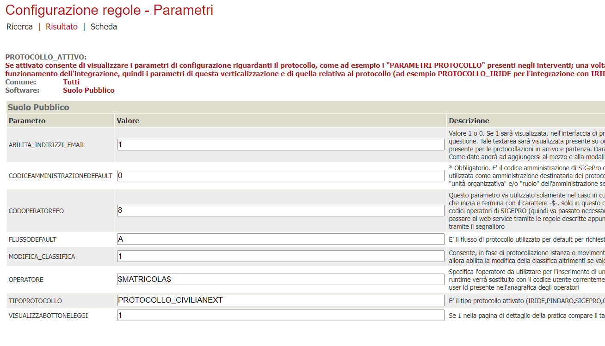
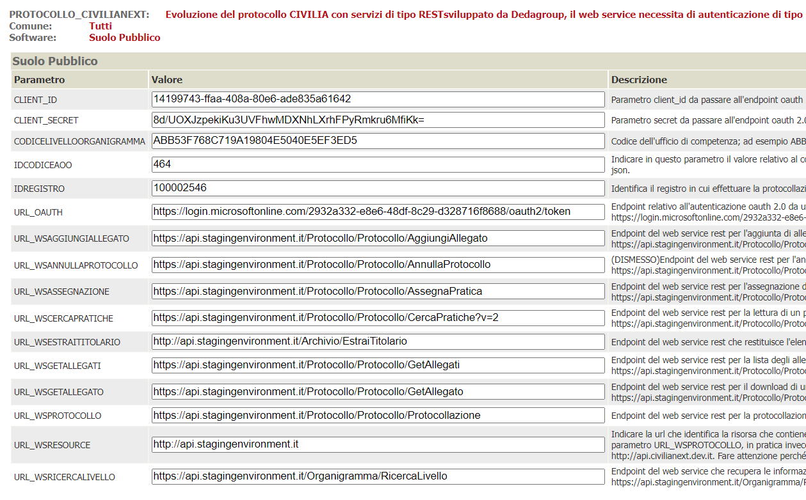
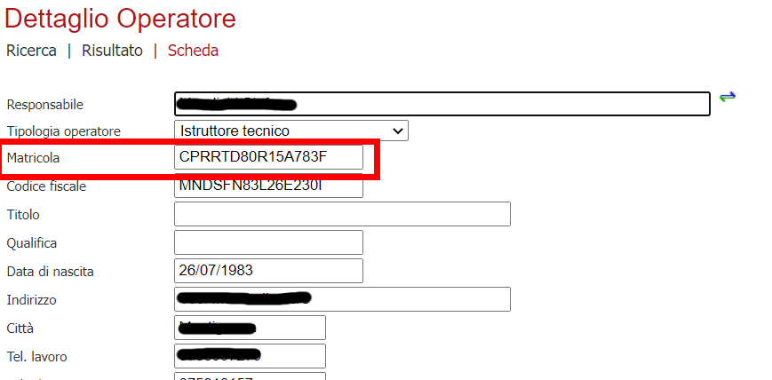
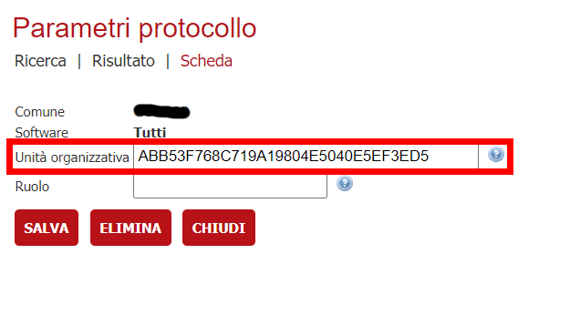

In questa documentazione verrà trattata la configurazione che è necessaria per attivare l'integrazione con il protocollo CiviliaNext
sviluppato da Dedagroup.

# Prerequisiti

  - Backend ( VBG ) alla versione 2.96 o successiva
  - OPZIONALE: Area Riservata alla versione 2.96 o successiva

# Servizi usati dal connettore
  
Allo stato attuale, è possibile:
  - protocollare in arrivo/partenza una pratica
  - protocollare in arrivo/partenza un movimento
  - lettura di un protocollo esistente

I servizi sviluppati da Dedagroup mettono a disposizione altre funzionalità ( assegnazione, smistamento, ... ), che ad oggi non sono state richieste e quindi non implementate

# Configurazione del connettore

## Verticalizzazione PROTOCOLLO_ATTIVO

E' necessario attivare la verticalizzazione PROTOCOLLO_ATTIVO e configurare i seguenti parametri

| Parametro | Utilizzo |
| ------ | ------ |
| **ABILITA_INDIRIZZI_EMAIL** | Impostare a 1 per poter indicare indicare un'indirizzo PEC se si vuole che il protocollo invii la PEC ai destinatari |
| **CODICEAMMINISTRAZIONEDEFAULT** | Utile in presenza di un solo ufficio protocollante, viene solitamente recuperata dalla configurazione dell'albero  |
| **CODOPERATOREFO** | Identifica l'operatore da impersonare per le protocollazioni che deriviano da pratiche o movimenti effettuati on-line ( da AreaRiservata ad esempio ) |
| **FLUSSODEFAULT** | E' il flusso di protocollo utilizzato per default per richieste provenienti da FO. |
| **MODIFICA_CLASSIFICA** | Consente, in fase di protocollazione istanza o movimento da backoffice, di abilitare o meno la modifica della classifica. |
| **OPERATORE** | Serve a collegare l'operatore di backoffice con l'operatore del protocollo. Valorizzare con $MATRICOLA$ |
| **TIPO_PROTOCOLLO** | PROTOCOLLO_CIVILIANEXT |
| **VISUALIZZA_BOTTONE_LEGGI** | 1 in quanto la lettura dei protocolli è stata implementata  |

## Verticalizzazione PROTOCOLLO_CIVILIANEXT

E' necessario attivare la verticalizzazione PROTOCOLLO_CIVILIANEXT e configurare i seguenti parametri

| Parametro | Utilizzo |
| ------ | ------ |
| **CLIENT_ID** | L'accesso ai servizi di Dedagroup si basa su autenticazione applicativa OAuth2; pertanto va configurato il ClientID da utilizzare |
| **CLIENT_SECRET** | ClientSecret utilizzato per l'autenticazione OAuth2 |
| **IDCODICEAOO** | Identificativo della AOO |
| **IDREGISTRO** | Identifica il registro in cui effettuare la protocollazione |
| **IDAOO** | Identificativo della AOO |
| **URL_OAUTH** | Url da utilizzare per l'autenticazione OAuth2 |
| **URL_WSANNULLAPROTOCOLLO** | (OBSOLETO) Questo parametro indica l'URL da chiamare per annullare un protocollo. Di fatto ad oggi non è più possibile fare questa operazione da VBG ma va fatta dall'interfaccia del protocollo |
| **URL_WSASSEGNAZIONE** | URL utilizzato, in fase di protocollazione, per assegnare il protocollo alla UO dell'operatore che sta protocollando |
| **URL_WSCERCAPRATICHE** | URL utilizzato per la funzionalità di leggi protocollo |
| **URL_WSESTRAITITOLARIO** | URL utilizzato per l'elenco delle classifiche utilizzabili in fase di protocollazione |
| **URL_WSGETALLEGATI** | URL utilizzato, in fase di leggi protocollo, per mostrare la lista degli allegati presenti |
| **URL_WSGETALLEGATO** | URL utilizzato, per scaricare/salvare su VBG un singolo allegato del protocollo |
| **URL_WSPROTOCOLLO** | URL utilizzato per la protocollazione |
| **URL_WSRESOURCE** | URL utilizzato in fase di richiesta autenticazione OAuth2 |
| **URL_WSRICERCALIVELLO** | URL utilizzato per ricercare la UO a cui appartiene l'operatore di backoffice che sta protocollando / visualizzando un protocollo |

## Operatori
Tutti gli operatori che dovranno interagire con il protocollo ( protocollazione istanze / movimenti, lettura protocollo ) devono avere il campo matricola valorizzato
con il codice fiscale del rispettivo operatore censito nel protocollo. E' possibile assegnare la stessa matricola a più operatori oppure assegnare ad ognuno
la propria matricola

## Amministrazioni

Nelle amministrazioni che verrano utilizzate come mittenti/destinatari della protocollazione vanno configurati i parametri di protocollazione tramite il bottone **PARAMETRI PROTOCOLLO** indicando nel campo Unità Organizzativa il Codice Organigramma. Questi codici devono essere richiesti al fornitore del protocollo

## Testi tipo

Bisogna configurare una serie di oggetti di default che verranno utilizzati come oggetto della protocollazione; per fare questo va creato, 
per ogni oggetto diverso, un testo tipo con i seguenti parametri

| Parametro | Valore |
| ------ | ------ |
| **Ambito** | Selezionare **Protocollo** dalla tendina |
| **Descrizione** | Comparirà nella ricerca per la configurazione dell'albero dei procedimenti |
| **Oggetto** | E' il testo che verrà unito ai dati della pratica o del movimento, per la sostituzione dei segnaposti, e poi inviato al sistema di protocollazione  |

## Albero degli interventi

Per le varie voci in cui si devono configurare scenari di protocollazione ( automatica, manuale, ... ) e parametri di protocollazione, bisogna procedere tramite il bottone **PARAMETRI PROTOCOLLAZIONE/FASCICOLAZIONE** presente nel dettaglio di ogni voce. Generalmente i parametri da impostare sono i seguenti:

| Parametro | Valore |
| ------ | ------ |
| **Comune** | Selezionare il comune da configurare |
| **Amministrazione** | Indicare l'amministrazione da utilizzare come mittente/destinatario di default per la protocollazione |
| **Protocollo - Classifica** | Indica la voce di classificazione nella quare inserire i protocolli fatti per quell'intervento |
| **Protocollo - Oggetto default** | Oggetto precedentemente configurato in mail/testi tipo |
| **Protocollo - Protocollazione automatica** | Attivare la protocollazione da on line |
| **Fascicolo - Fascicolazione automatica** | Attualmente non utilizzato impostare a Non Fascicolare |

# Scenari di protocollazione

## Protocollazione in arrivo

Si tratta di protocollazioni di istanze o movimenti di integrazione ricevute o comunque di qualsiasi atto in ingresso ricevuto dall'ente.

Vanno indicati obbligatoriamente i seguenti paramentri:
- Classifica 
- Flusso ( ARRIVO )
- Oggetto
- Mittenti ( almeno uno )
- Destinatario
- Allegati ( almeno uno )

In base alle configurazioni, le informazioni saranno proposte o meno in fase di protocollazione manuale. Un parametro non configurato, in presenza di protocollazione automatica ( on line ), genera errore e conseguente impossibilità di procedere alla protocollazione

## Protocollazione in partenza

Si tratta di protocollazione di movimenti in uscita ( rilascio autorizzazioni, richiesta integrazioni, ... )

Vanno indicati obbligatoriamente i seguenti paramentri:
- Classifica 
- Flusso ( PARTENZA )
- Oggetto
- Mittente
- Destinatari ( almeno uno )
- Allegati ( almeno uno )

## Protocollazione Interna

Attualmente non implementata in quanto non richiesta

