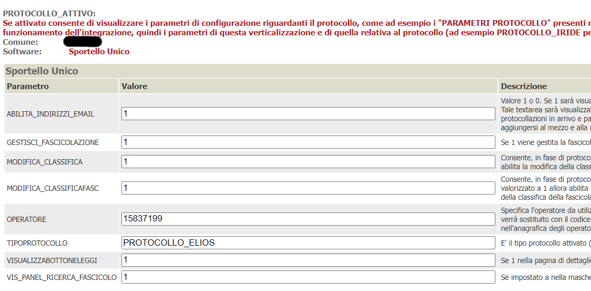
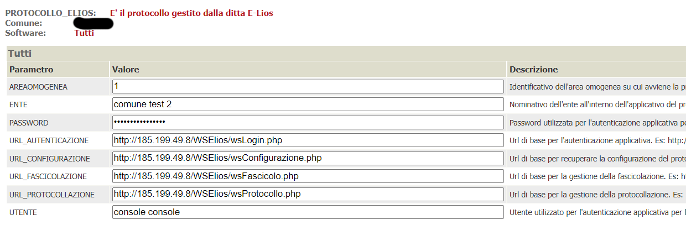
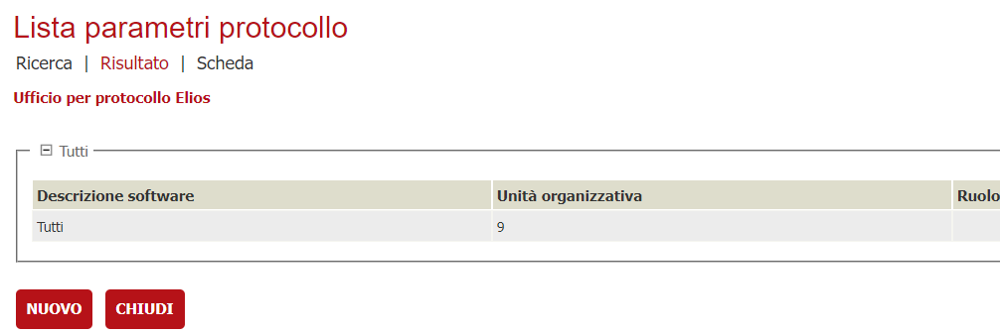
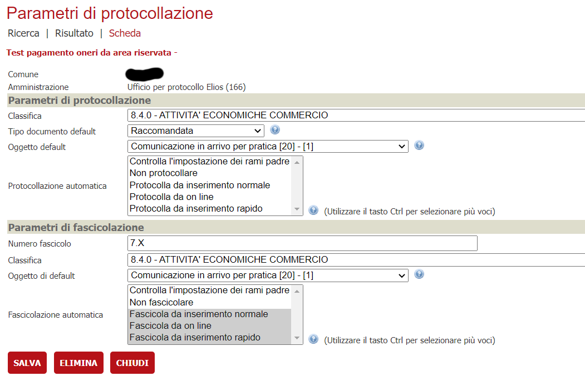

La società E-Lios ha implementato una serie di servizi web SOAP che fungono da proxy verso il sistema di protocollazione Halley

In questa documentazione verrà trattata la configurazione che è necessaria per attivare l'integrazione con il protocollo E-Lios sfruttando appunto tali servizi

# Prerequisiti

  - Backend ( VBG ) alla versione 2.104 o successiva

# Servizi usati dal connettore

Allo stato attuale, è possibile:
- protocollare in arrivo/partenza una pratica
- protocollare in arrivo/partenza un movimento
- lettura di un protocollo esistente
- creare un fascicolo/sottofascicolo
- legare un protocollo ad un fascicolo/sottofascicolo presente
- inviare una mail a fronte della protocollazione in partenza

# Configurazione del connettore

## Verticalizzazione PROTOCOLLO_ATTIVO

E' necessario attivare la verticalizzazione PROTOCOLLO_ATTIVO e configurare i seguenti parametri ( oltre agli altri eventuali parametri necessari alla
 protocollazione da on-line come l'amministrazione di default, il flusso di default, .... )

| Parametro | Utilizzo |
| ------ | ------ |
| **ABILITA_INDIRIZZI_EMAIL** | 1 in quanto il servizio di invio mail, per i protocolli in partenza, è stato implementato |
| **GESTISCI_FASCICOLAZIONE** | 1 in quanto è stata implementata la fascicolazione |
| **MODIFICA_CLASSIFICA** | 1 se gli operatori possono indicare, per la protocollazione, una classifica diversa da quella proposta |
| **MODIFICA_CLASSIFICAFASC** | 1 se gli operatori possono indicare, per la fascicolazione, una classifica diversa da quella proposta |
| **TIPO_PROTOCOLLO** | PROTOCOLLO_ELIOS  |
| **VISUALIZZA_BOTTONE_LEGGI** | 1 in quanto la lettura dei protocolli è stata implementata  |
| **VIS_PANEL_RICERCA_FASCICOLO** | 1 in quanto la ricerca di fascicoli/sottofascicoli esistente è stata implementata |

## Verticalizzazione PROTOCOLLO_ELIOS

E' necessario attivare la verticalizzazione PROTOCOLLO_ELIOS e configurare i seguenti parametri

| Parametro | Utilizzo |
| ------ | ------ |
| **AREAOMOGENEA** | Identificativo dell'area omogenea su cui avviene la protocollazione  |
| **ENTE** | Nominativo dell'ente all'interno dell'applicativo del protocollo |
| **PASSWORD** | Password utilizzata per l'autenticazione applicativa per le chiamate ai vari servizi |
| **URL_AUTENTICAZIONE** | Url di base per l'autenticazione applicativa. Es: http://185.199.49.8/WSElios/wsLogin.php |
| **URL_CONFIGURAZIONE** | Url di base per recuperare la configurazione del protocollo (classifiche, organigramma, ... ). Es: http://185.199.49.8/WSElios/wsConfigurazione.php |
| **URL_FASCICOLAZIONE** | Url di base per la gestione della fascicolazione. Es: http://185.199.49.8/WSElios/wsFascicolo.php |
| **URL_PROTOCOLLAZIONE** | Url di base per la gestione della protocollazione. Es: http://185.199.49.8/WSElios/wsProtocollo.php |
| **UTENTE** | Utente utilizzato per l'autenticazione applicativa per le chiamate ai vari servizi |

## Amministrazioni

Nelle amministrazioni che verrano utilizzate come mittenti/destinatari della protocollazione vanno configurati i parametri di protocollazione tramite il bottone **PARAMETRI PROTOCOLLO** indicando nel campo Unità Organizzativa il Codice dell'Unità Organizzativa.
Questi codici devono essere richiesti al fornitore del protocollo

## Testi tipo

Bisogna configurare una serie di oggetti di default che verranno utilizzati come oggetto della protocollazione / fascicolazione. 
Per fare questo va creato, per ogni oggetto diverso, un testo tipo con i seguenti parametri

| Parametro | Valore |
| ------ | ------ |
| **Ambito** | Selezionare **Protocollo** dalla tendina |
| **Descrizione** | Comparirà nella ricerca per la configurazione dell'albero dei procedimenti |
| **Oggetto** | E' il testo che verrà unito ai dati della pratica o del movimento, per la sostituzione dei segnaposti, e poi inviato al sistema di protocollazione  |

## Albero degli interventi

Per le varie voci in cui si devono configurare scenari di protocollazione ( automatica, manuale, ... ) e parametri di protocollazione, bisogna procedere tramite il bottone **PARAMETRI PROTOCOLLAZIONE/FASCICOLAZIONE** presente nel dettaglio di ogni voce.
Generalmente i parametri da impostare sono i seguenti:

| Parametro | Valore |
| ------ | ------ |
| **Comune** | Selezionare l'ente oppure lasciare vuoto se la configurazione è valida per tutti gli eventuali comuni associati |
| **Amministrazione** | Indicare l'amministrazione da utilizzare come mittente/destinatario di default per la protocollazione |
| **Protocollo - Classifica** | Indica la voce di classificazione alla quale verrà assegnato il protocollo |
| **Protocollo - Oggetto default** | Oggetto precedentemente configurato in mail/testi tipo |
| **Protocollo - Protocollazione automatica** | In fase di sviluppo è prevista la protocollazione manuale, ma a regime dovrà essere attivata anche la protocollazione da on line) |
| **Fascicolo - Numero fascicolo** | Valorizzare con il codice della serie di fascicoli che conterrà tutti i fascicoli creati. Se vuoto viene riletto dalla verticalizzazione |
| **Fascicolo - Classifica** | Indica la voce di classificazione alla quale verrà assegnato il fascicolo |
| **Fascicolo - Oggetto di default** | Va configurato in quanto utilizzato come oggetto del fascicolo che viene creato, impostare il testo tipo precedentemente configurato a seconda dell'intervento che si sta configurando |

Il parametro **Fascicolo - Numero fascicolo** può essere impostato in diverse maniere:

1. Lasciare vuoto se si vuole creare un nuovo fascicolo ogni volta che viene effettuata una protocollazione di istanza per quell'intervento. I movimenti sono sempre e comunque collegati al fascicolo dell'istanza
2. Impostare indicando numerofascicolo.X ( esempio 7.X ) se si vuole creare un nuovo sottofascicolo su un fascicolo esistente per ogni istanza di quell'intervento
3. Impostare indicando numerofascicolo.sottofascicolo ( esempio 7.1. ) se non deve essere creato nessun fascicolo/sottofascicolo per ogni nuova istanza. In questo caso, in fase di protocollazione, tutte le istanze verranno collegate al fascicolo e sottofascicolo indicato senza crearne di nuovi

# Scenari di protocollazione

## Protocollazione in arrivo

Si tratta di protocollazioni di istanze o movimenti di integrazione ricevute o comunque di qualsiasi atto in ingresso ricevuto dall'ente.

Vanno indicati obbligatoriamente i seguenti paramentri:
- Classifica 
- Flusso ( ARRIVO )
- Oggetto
- Mittenti ( almeno uno )
- Destinatario
- Dati per la fascicolazione ( Numero fascicolo, Classifica, Oggetto, Anno )

In base alle configurazioni, le informazioni saranno proposte o meno in fase di protocollazione manuale.
Un parametro non configurato, in presenza di protocollazione automatica ( on line ), genera errore e conseguente impossibilità di procedere alla protocollazione

## Protocollazione in partenza

Si tratta di protocollazione di movimenti in uscita ( rilascio autorizzazioni, richiesta integrazioni, ... )

Vanno indicati obbligatoriamente i seguenti paramentri:
- Classifica 
- Flusso ( PARTENZA )
- Oggetto
- Mittente
- Destinatari ( almeno uno )
- Dati per la fascicolazione ( Numero fascicolo, Classifica, Oggetto, Anno )

## Protocollazione Interna

Attualmente non implementata in quanto non richiesta