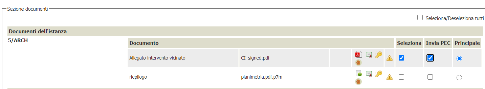

# Invio tramite PEC dei documenti protocollati 
Viene data da interfaccia la possibilità di specificare quali documenti, che saranno protocollati, possono essere inviati tramite mail (solo per i sistemi di protocollazione che supportano questa feature Es. TRIESTE-INSIEL)
## Configurazione
Nella sezione delle regole per la regola **PROTOCOLLO_ATTIVO** va attivato il parametro **SELEZIONA_ALLEGATI_PEC** che riporta la seguente informazione:

>*"Se impostato a 1 consente di selezionare quali degli allegati che verranno protocollati devono essere inviati anche per PEC; Se non valorizzato o 0 non sarà possibile fare la distinzione"*

per attivare il comportamento va impostato a **1**

## Gestione
Durante la protocollazione,se opportunamente configurato, e solo nel caso di Protocollazione in *USCITA* nella sezione degli allegati compare la colonna invia per pec come da immagine che segue

L'operatore avrà la possibilità di indicare, tra gli allegati che decide di inviare alla protocollazione, quali inviare per PEC.

L'operatore potrà scegliere di inviare a PEC solamente gli allegati selezionati per la protocollazione.

Nel caso che l'utente selezioni di protocollare uno zip logico, questo non verrà mai inviato tramite PEC. 
In questo caso infatti l'ente vuole inviare per PEC solamente la lettera contenente il link allo zip logico.