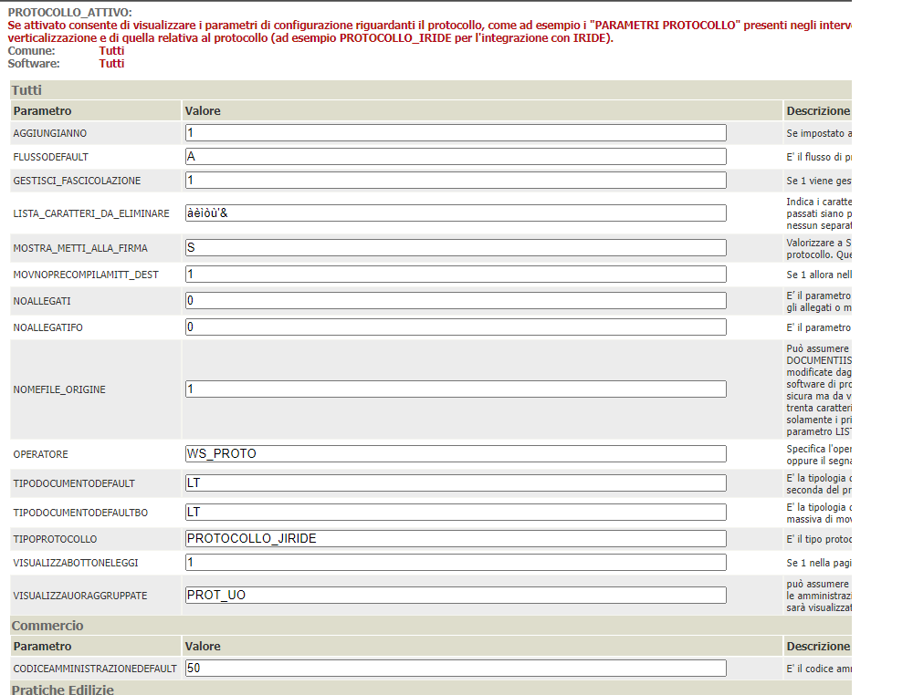
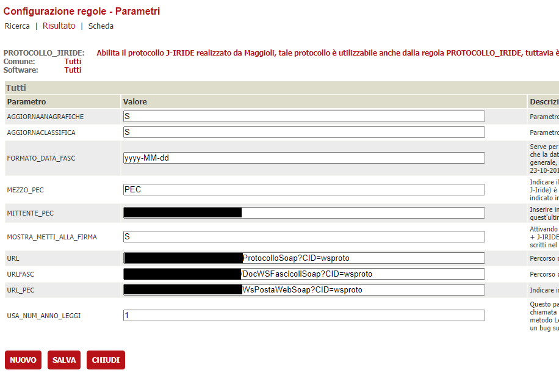
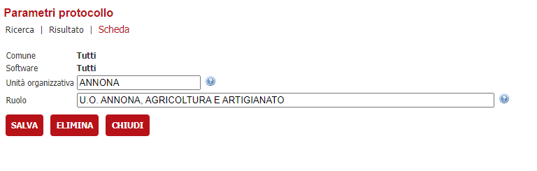
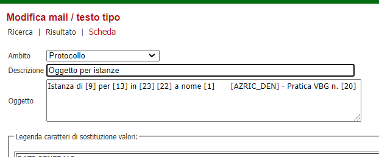
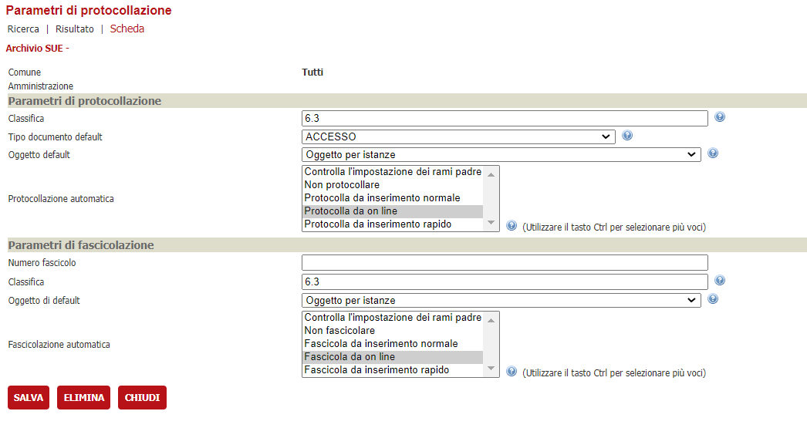
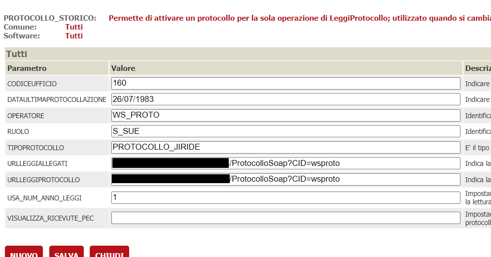

In questa documentazione verrà trattata la configurazione che è necessaria per attivare l'integrazione con il protocollo J-Iride 
sviluppato dal Gruppo Maggioli

# Prerequisiti

Non ci sono prerequisiti in quanto questa integrazione è presente da sempre; tuttavia, qualora si voglia continuare a leggere i protocolli e gli allegati
presenti in JIride dopo aver cambiato fornitore di protocollo, sarà necessario avere il backend alla versione 2.97 o successiva

# Servizi usati dal connettore

Allo stato attuale è possibile
 - Protocollare e leggere i dati di un protocollo
 - Associare un protocollo ad un fascicolo e rileggerne le informazioni
 - Verificare se un protocollo è stato fascicolato o no
 - Cambiare il fascicolo di un protocollo
 - Creare una copia del protocollo
 - Inserire documenti nel protocollo e metterli alla firma
 - Chiedere al protocollo di inviare una PEC

# Configurazione del connettore

## Verticalizzazione PROTOCOLLO_ATTIVO

E' necessario attivare la verticalizzazione PROTOCOLLO_ATTIVO e configurare i seguenti parametri

| Parametro | Utilizzo |
| ------ | ------ |
| **AGGIUNGIANNO** | Impostare a 1 per aggiungere l'anno in fondo al numero di protocollo ( es 7/1983 ) |
| **CODICEAMMINISTRAZIONEDEFAULT** | E' il codice amministrazione di SIGePro che rappresenta lo sportello su cui si sta lavorando |
| **FLUSSODEFAULT** | E' il flusso di protocollo utilizzato per default per richieste provenienti da FO. |
| **FLUSSI_VER_FIRMA_DOC_PRINC** | Può essere impostato per verificare che l'eventuale documento principale sia firmato digitalmente |
| **GESTISCI_FASCICOLAZIONE** | Impostare a 1 se si intende gestire anche la fascicolazione dei protocolli |
| **LISTA_CARATTERI_DA_ELIMINARE** | Indica i caratteri da eliminare nei nomi file in un eventuale passaggio di allegati al protocollo. Alcuni web service di protocollo restituiscono un'eccezione nel caso in cui nel nome file dei documenti passati siano presenti alcuni caratteri, come ad esempio Iride che non accetta i caratteri accentati e gli apici singoli nel nome file. I caratteri inseriti in questo parametro non devono essere divisi da nessun separatore ma inseriti in modo sequenziale (ad esempio àèìòù'&). |
| **MOSTRA_METTI_ALLA_FIRMA** | Impostare a S se si desidera gestire la funzionalità della messa alla firma. Sarà visualizzato il pulsante METTI ALLA FIRMA nella maschera dei movimenti ma solo se non presenti i riferimenti di protocollo. |
| **MOVNOPRECOMPILAMITT_DEST** | Impostare a 1 se nella pagina di richiesta protocollo da movimento non devono essere precompilati automaticamente mittenti e/o destinatari	|
| **NOALLEGATI** | Impostare a 1 se nella pagina di richiesta protocollo debba essere presente la sezione per inviare gli allegati della pratica e dei movimenti. Inoltre permette di stabilire se gestire gli allegati o meno nel caso di protocollazione automatiche da BO (Inserimento normale, inserimento rapido e protocollazione massiva di movimenti.) |
| **NOALLEGATIFO** | E' il parametro che permette di stabilire se nella protocollazione automatica da FO occorre gestire gli allegati o meno, di default gli allegati sono gestiti. Valorizzare a 1 se gi allegati non devono essere gestiti, altrimenti 0 |
| **NOMEFILE_ORIGINE** | Permette di sabilire alcune regole circa i nomi dei file degli allegati che saranno inviati al protocollo |
| **OPERATORE** | Specifica l'operatore da utilizzare per l'inserimento di un protocollo. |
| **TIPODOCUMENTODEFAULT** | E' la tipologia di documento da utilizzare per default per protocollare le istanze o i movimenti pervenuti dal front-office. |
| **TIPOPROTOCOLLO** | Valorizzare con **PROTOCOLLO_JIRIDE** |
| **VISUALIZZABOTTONELEGGI** | Impostare a 1 in quanto il protocollo JIride espone il metodo per la lettura dei dati del protocollo |
| **VISUALIZZAUORAGGRUPPATE** | Se necessario in base alla volontà dell'Ente impostare con un valore a scelta tra PROT_UO e PROT_RUOLO |

## Verticalizzazione PROTOCOLLO_JIRIDE

E' necessario attivare la verticalizzazione PROTOCOLLO_JIRIDE e configurare i seguenti parametri

| Parametro | Utilizzo |
| ------ | ------ |
| **AGGIORNAANAGRAFICHE** | Impostare a S se, in fase di protocollazione, devono essere aggiornati i dati anagrafici presenti all'interno di JIride |
| **AGGIORNACLASSIFICA** | Impostare a S se, in fase di collegamento tra un protocollo e un fascicolo, JIride deve aggiornare la classifica del protocollo se diversa da quella del fascicolo |
| **FORMATO_DATA_FASC** | Impostare a **yyyy-MM-dd** qualora ci siano problemi di compatibilità tra le versione dei servizi esposti da JIride riguardanti il formato della data di fascicolazione di un protocollo |
| **MEZZO_PEC** | 	Indicare il mezzo da utilizzare se si vuole inviare la PEC |
| **MITTENTE_PEC** | Inserire in questo parametro il valore relativo al mittente che invia la mail pec in fase di protocollazione in partenza |
| **MOSTRA_METTI_ALLA_FIRMA** | Impostare a S solo in casi di integrazione di JIride con Intranos |
| **URL** | Percorso completo del servizio di protocollazione WsProtocolloDM |
| **URLFASC** | Percorso completo del servizio di fascicolazione DocWsFascicoli |
| **URL_PEC** | Indicare in questo parametro l'endpoint da utilizzare per usare il servizio di invio posta elettronica certificata di J-Iride, sarà proprio questo servizio che si occuperà di inviare la PEC |
| **USA_NUM_ANNO_LEGGI** | Valorizzare a 1 |

## Amministrazioni

Nelle amministrazioni che verrano utilizzate come mittenti/destinatari della protocollazione vanno configurati i parametri di protocollazione tramite il 
bottone **PARAMETRI PROTOCOLLO** 
indicando nel campo Unità Organizzativa il codice dell'ufficio e nel campo ruolo la descrizione. Questie informazioni devono essere recuperate dal protocollo 
( chiedendole all'Ente o al fornitore del protocollo)

## Testi tipo

Bisogna configurare una serie di oggetti di default che verranno utilizzati come oggetto della protocollazione; per fare questo va creato, 
per ogni oggetto diverso, un testo tipo con i seguenti parametri

| Parametro | Valore |
| ------ | ------ |
| **Ambito** | Selezionare **Protocollo** dalla tendina |
| **Descrizione** | Inserire una descrizione che comparirà nella ricerca per la configurazione della protocollazione nell'albero dei procedimenti |
| **Oggetto** | E' il testo che verrà unito ai dati della pratica o del movimento, per la sostituzione dei segnaposti, e poi inviato al sistema di protocollazione  |

## Albero degli interventi

Per le varie voci in cui si devono configurare scenari di protocollazione ( automatica, manuale, ... ) e parametri di protocollazione, bisogna procedere tramite il bottone **PARAMETRI PROTOCOLLAZIONE/FASCICOLAZIONE** presente nel dettaglio di ogni voce. 
Generalmente i parametri da impostare sono i seguenti:

| Parametro | Valore |
| ------ | ------ |
| **Comune** | Selezionare il comune da configurare |
| **Amministrazione** | Indicare l'amministrazione da utilizzare come mittente/destinatario di default per la protocollazione. E' possibile lasciarla vuota |
| **Protocollo - Classifica** | Indica la voce di classificazione nella quare inserire i protocolli fatti per quell'intervento |
| **Protocollo - Tipo documento default** | Impostare il tipo documento da utilizzare |
| **Protocollo - Oggetto default** | Oggetto precedentemente configurato in mail/testi tipo |
| **Protocollazione automatica** | Impostare eventuali regole di protocollazione automatica |
| **Fascicolo - Numero fascicolo** | Lasciare vuoto |
| **Fascicolo - Classifica** | Indica la voce di classificazione nella quare inserire i fascicoli fatti per quell'intervento |
| **Fascicolo - Oggetto default** | Oggetto precedentemente configurato in mail/testi tipo da utilizzare per la fascicolazione |
| **Fascicolo - Fascicolazione automatica** | Impostare eventuali regole di fascicolazione automatica |

# Lettura dei dati del protocollo storico

E' possibile utilizare JIride anche come protocollo "Storico": cioè se un'Ente passa dal protocollo JIride ad un altro protocollo è possibile mantenere JIride per la sola lettura
dei dati del protocollo ( e degli allegati ) ed averne uno diverso per le nuove protocollazione. Per fare questo è necessario attivare e configurare
la verticalizzazione **PROTOCOLLO_STORICO**

| Parametro | Valore |
| ------ | ------ |
| **CODICEUFFICIO** | E' il codice amministrazione da cui verranno recuperati i parametri per la lettura del protocollo |
| **DATAULTIMAPROTOCOLLAZIONE** | Indicare la data nel formato GG/MM/YYYY che verrà utilizzata dal sistema per capire fino a quando il protocollo storico era in vigore |
| **OPERATORE** | Specifica l'operatore da utilizzare per la lettura dei dati del protocollo. |
| **RUOLO** | E' il codice del ruolo utilizzato per la lettura dei dati del protocollo |
| **TIPOPROTOCOLLO** | Valorizzare con **PROTOCOLLO_JIRIDE** |
| **URLLEGGIALLEGATI** | Percorso completo del servizio di lettura degli allegati del protocollo |
| **URLLEGGIPROTOCOLLO** | Percorso completo del servizio di lettura del protocollo |
| **USA_NUM_ANNO_LEGGI** | Valorizzare a 1 |
| **VISUALIZZA_RICEVUTE_PEC** | Valorizzare a 1 se si vuole visualizzare l'esito delle ricevute inviate via PEC dal sistema di protocollo, tra l'elenco degli allegati |
