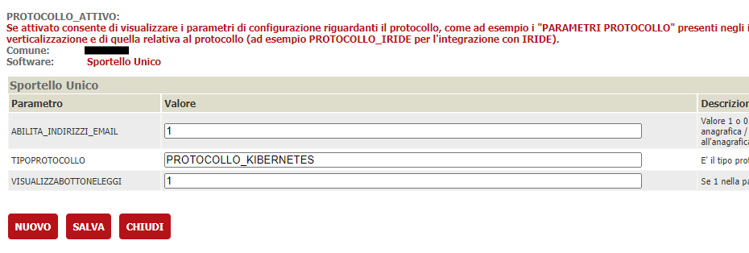
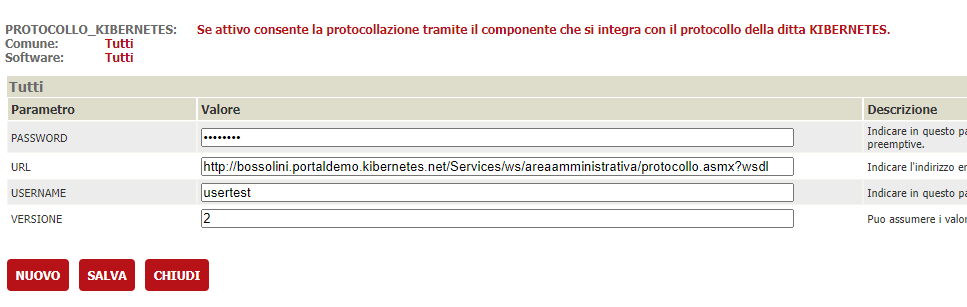
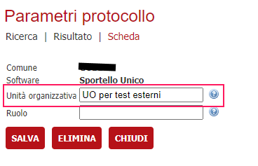
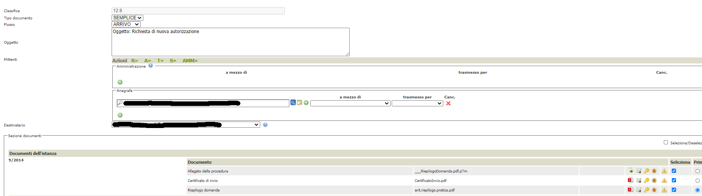

In questa documentazione verrà trattata la configurazione che è necessaria per attivare l'integrazione con il protocollo svilyppato da Kbernetes

# Prerequisiti

  - Backend ( VBG ) alla versione 2.105 o successiva
  - OPZIONALE: Area Riservata alla versione 2.105 o successiva

# Servizi usati dal connettore
Allo stato attuale, è possibile:
  - protocollare in arrivo/partenza una pratica 
  - protocollare in arrivo/partenza un movimento 
  - lettura di un protocollo esistente
  - inviare una mail/pec a fronte di una protocollazione in uscita

# Configurazione del connettore

## Verticalizzazione PROTOCOLLO_ATTIVO

E' necessario attivare la verticalizzazione PROTOCOLLO_ATTIVO e configurare i seguenti parametri

| Parametro | Utilizzo |
| ------ | ------ |
| **ABILITA_INDIRIZZI_EMAIL** | Impostare a 1 per poter indicare indicare un'indirizzo PEC se si vuole che il protocollo invii la PEC ai destinatari |
| **TIPOPROTOCOLLO** | PROTOCOLLO_KIBERNETES |
| **VISUALIZZABOTTONELEGGI** | 1 in quanto la lettura dei protocolli è stata implementata |

## Verticalizzazione PROTOCOLLO_KIBERNETES

E' necessario attivare la verticalizzazione PROTOCOLLO_KIBERNETES e configurare i seguenti parametri

| Parametro | Utilizzo |
| ------ | ------ |
| **PASSWORD** | Utilizzata per l'autenticazione, deve essere richiesta a Kibernetes |
| **URL** | URL utilizzato per tutti i servizi gestiti ( protocollazione, caricamento allegati, lettura protocollo, invio pec ) |
| **USERNAME** | Utilizzata per l'autenticazione, deve essere richiesta a Kibernetes |
| **VERSIONE** | Impostare 2, in quanto Kibernetes sta disnmettendo la vecchia versione |

## Amministrazioni

Nelle amministrazioni che verrano utilizzate come mittenti/destinatari della protocollazione vanno configurati i parametri di protocollazione tramite il bottone PARAMETRI PROTOCOLLO indicando nel campo Unità Organizzativa l'Unità organizzativa censita all'interno del protocollo. Queste informazioni devono essere richieste al fornitore del protocollo

## Testi tipo

Bisogna configurare una serie di oggetti di default che verranno utilizzati come oggetto della protocollazione; per fare questo va creato, per ogni oggetto diverso, un testo tipo con i seguenti parametri

| Parametro | Utilizzo |
| ------ | ------ |
| **AMBITO** | Selezionare **Protocollo** dalla tendina |
| **DESCRIZIONE** | Comparirà nella ricerca per la configurazione dell'albero dei procedimenti |
| **OGGETTO** | E' il testo che verrà unito ai dati della pratica o del movimento, per la sostituzione dei segnaposti, e poi inviato al sistema di protocollazione |

## Albero degli interventi

Per le varie voci in cui si devono configurare scenari di protocollazione ( automatica, manuale, ... ) e parametri di protocollazione, bisogna procedere tramite il bottone **PARAMETRI PROTOCOLLAZIONE/FASCICOLAZIONE** presente nel dettaglio di ogni voce.
Generalmente i parametri da impostare sono i seguenti:

| Parametro | Valore |
| ------ | ------ |
| **Comune** | Selezionare il comune da configurare |
| **Amministrazione** | Indicare l'amministrazione da utilizzare come mittente/destinatario di default per la protocollazione |
| **Protocollo - Classifica** | Indica la voce di classificazione nella quare inserire i protocolli fatti per quell'intervento |
| **Protocollo - Oggetto default** | Oggetto precedentemente configurato in mail/testi tipo |
| **Protocollo - Protocollazione automatica** | Attivare la protocollazione da on line |
| **Fascicolo - Fascicolazione automatica** | Attualmente non implementato, va impostato a Non Fascicolare |

# Scenari di protocollazione

## Protocollazione in arrivo

Si tratta di protocollazioni di istanze o movimenti di integrazione ricevute o comunque di qualsiasi atto in ingresso ricevuto dall'ente.

Vanno indicati obbligatoriamente i seguenti paramentri:
- Classifica 
- Flusso ( ARRIVO )
- Oggetto
- Mittenti ( almeno uno )
- Destinatario

In base alle configurazioni, le informazioni saranno proposte o meno in fase di protocollazione manuale. Un parametro non configurato, in presenza di protocollazione automatica ( on line ), genera errore e conseguente impossibilità di procedere alla protocollazione

## Protocollazione in partenza

Si tratta di protocollazione di movimenti in uscita ( rilascio autorizzazioni, richiesta integrazioni, ... )

Vanno indicati obbligatoriamente i seguenti paramentri:
- Classifica 
- Flusso ( PARTENZA )
- Oggetto
- Mittente
- Destinatari ( almeno uno )
- Allegati ( almeno uno )

## Protocollazione Interna

Attualmente non implementata

