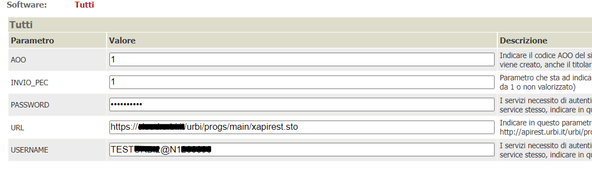

In questa documentazione verrà trattata la configurazione che è necessaria per attivare l'integrazione con il protocollo URBI fornito dalla ditta WeCom

# Prerequisiti

  - Backend ( VBG ) alla versione 2.102 o successiva per la protocollazione e 2.107 o superiore per la fascicolazione
  - OPZIONALE: Area Riservata alla versione 2.102 o successiva

# Servizi usati dal connettore
Allo stato attuale, è possibile:
  - protocollare in arrivo/partenza/interno una pratica 
  - protocollare in arrivo/partenza/interno un movimento 
  - lettura di un protocollo esistente
  - fascicolare un protocollo su un nuovo fascicolo
  - fascicolare un protocollo su un fascicolo esistente mediante ricerca

# Configurazione del connettore

## Verticalizzazione PROTOCOLLO_ATTIVO

E' necessario attivare la verticalizzazione PROTOCOLLO_ATTIVO e configurare i seguenti parametri

| Parametro | Utilizzo |
| ------ | ------ |
| **GESTISCI_FASCICOLAZIONE** | Impostare a 1 per poter gestire la fascicolazione |
| **MODIFICA_CLASSIFICAFASC** | Impostare a 1 per poter modificare la classifica assegnata dal sistema al fascicolo |
| **TIPOPROTOCOLLO** | PROTOCOLLO_URBI |
| **VISUALIZZABOTTONELEGGI** | Impostare a 1 in quanto la lettura dei protocolli è stata implementata |
| **VIS_PANEL_RICERCA_FASCICOLO** | Impostare a 1 se l'operatore deve poter ricercare un fascicolo esistente |

## Verticalizzazione PROTOCOLLO_URBI

E' necessario attivare la verticalizzazione PROTOCOLLO_URBI e configurare i seguenti parametri

| Parametro | Utilizzo |
| ------ | ------ |
| **AOO** | Utilizzato per la protocollazione, dentifica l'Area Organizzativa Omogenea protocollante |
| **INVIO_PEC** | Utilizzata per far partire le PEC dal protocollo per i protocolli in partenza  |
| **PASSWORD** | Utilizzata per l'autenticazione, deve essere richiesta all'Ente |
| **URL** | URL utilizzato per tutti i servizi di protocollazione/fascicolazione |
| **USERNAME** | Utilizzata per l'autenticazione, deve essere richiesta all'Ente |

## Amministrazioni

Nelle amministrazioni che verrano utilizzate come mittenti/destinatari della protocollazione vanno configurati i parametri di protocollazione tramite il bottone PARAMETRI PROTOCOLLO indicando 
nel campo Unità Organizzativa la descrizione dell'amministrazione censita nel protocollo.
Queste informazioni devono essere richieste al fornitore del protocollo

## Testi tipo

Bisogna configurare una serie di oggetti di default che verranno utilizzati come oggetto della protocollazione; per fare questo va creato, per ogni oggetto diverso, un testo tipo con i seguenti parametri

| Parametro | Utilizzo |
| ------ | ------ |
| **AMBITO** | Selezionare **Protocollo** dalla tendina |
| **DESCRIZIONE** | Comparirà nella ricerca per la configurazione dell'albero dei procedimenti |
| **OGGETTO** | E' il testo che verrà unito ai dati della pratica o del movimento, per la sostituzione dei segnaposti, e poi inviato al sistema di protocollazione |

## Albero degli interventi

Per le varie voci in cui si devono configurare scenari di protocollazione ( automatica, manuale, ... ) e parametri di protocollazione, bisogna procedere tramite il bottone **PARAMETRI PROTOCOLLAZIONE/FASCICOLAZIONE** presente nel dettaglio di ogni voce.
Generalmente i parametri da impostare sono i seguenti:

| Parametro | Valore |
| ------ | ------ |
| **Comune** | Selezionare il comune da configurare |
| **Amministrazione** | Indicare l'amministrazione da utilizzare come mittente/destinatario di default per la protocollazione |
| **Protocollo - Classifica** | Indica la voce di classificazione nella quare inserire i protocolli fatti per quell'intervento |
| **Protocollo - Oggetto default** | Oggetto precedentemente configurato in mail/testi tipo |
| **Protocollo - Protocollazione automatica** | Attivare la protocollazione da on line |
| **Fascicolo - Numero fascicolo** | Impostare un numero di fascicolo, qualora le protocollazioni delle istanze di quell'intervento debbano essere collocate tutte nel medesimo fascicolo |
| **Fascicolo - Classifica** | Impostare la classifica da utilizzare in casi di fascicolazione |
| **Fascicolo - Oggetto default** | Oggetto precedentemente configurato in mail/testi tipo |
| **Fascicolo - Fascicolazione automatica** | Impostare la fascicolazione secondo le proprie esigenze |

# Scenari di protocollazione

## Protocollazione in arrivo

Si tratta di protocollazioni di istanze o movimenti di integrazione ricevute o comunque di qualsiasi atto in ingresso ricevuto dall'ente.

Vanno indicati obbligatoriamente i seguenti paramentri:
- Classifica 
- Flusso ( ARRIVO )
- Oggetto
- Mittenti ( almeno uno )
- Destinatario

In base alle configurazioni, le informazioni saranno proposte o meno in fase di protocollazione manuale.
Un parametro non configurato, in presenza di protocollazione automatica ( on line ), genera errore e conseguente impossibilità di procedere alla protocollazione

## Protocollazione in partenza

Si tratta di protocollazione di movimenti in uscita ( rilascio autorizzazioni, richiesta integrazioni, ... )

Vanno indicati obbligatoriamente i seguenti paramentri:
- Classifica 
- Flusso ( PARTENZA )
- Oggetto
- Mittente
- Destinatari ( almeno uno )
- Allegati ( almeno uno )

