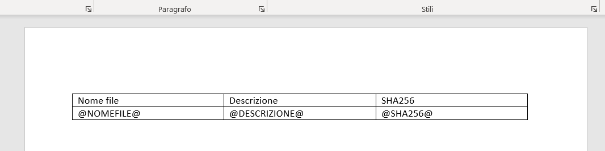
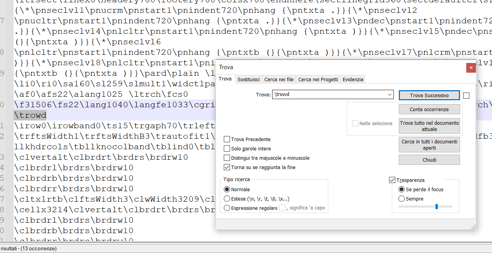
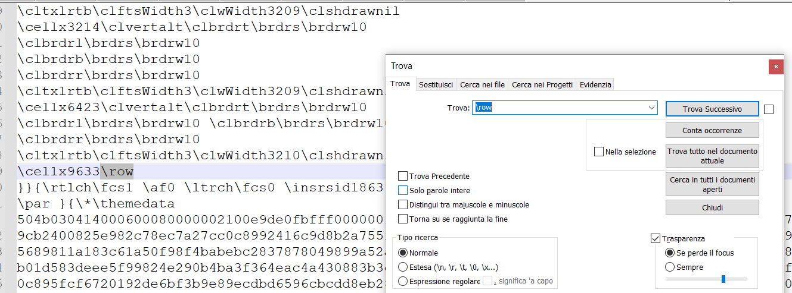
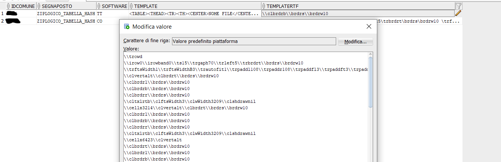
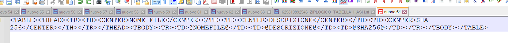

# Segnaposti personalizzabili


## Introduzione
A partire dalla versione 2.91 è stata introdotta la possibilità di personalizzare il layout di stampa di alcuni segnaposto sia sulle lettere tipo 
( ODT/RTF ) che nelle mail tipo.
La configurazione, allo stato attuale, richiede una minima conoscenza di HTML, della codifica RTF e delle tabelle che contengono le personalizzazioni
in quanto non sono presenti interfacce grafiche
La funzionalità è ancora in fase iniziale di sviluppo per cui ci sono molte restrizioni per la sua configurazione; l'obiettivo futuro è quello di estenderla
e semplficarne ancora di più la configurazione in modo da rendere autonome le persone

## Tabelle per la personalizzazione
La lista dei segnaposto che è possibile personalizzare si trova nella tabella di VBG chiamata SEGNAPOSTI. 
In questa tabella viene riportato il TAG, il suo template di base e il suo template di base per quando viene stampato all'interno di un documento RTF

E' una tabella comune a tutte le installazioni per cui NON va modificata e viene sovrascritta durante gli aggiornamenti di versione

Le personalizzazioni possono essere fatte tramite la tabella SEGNAPOSTIPERSONALIZZATI in cui andrà specificato:

| COLONNA | DESCRIZIONE | OBBLIGATORIO |
| ------- | ----------- | ------------ |
| IDCOMUNE | Identificativo dell'Ente per il quale si stà personalizzando un segnaposto | SI |
| SEGNAPOSTO | Nome del segnaposto da personalizzare a scelta tra quelli presenti nella tabella SEGNAPOSTI | SI |
| SOFTWARE | Indicare il modulo per il quale si sta facendo la personalizzazione oppure TT se è una personalizzazione trasversale a tutti i moduli | SI |
| TEMPLATE | Template in HTML che verrà utlizzato per personalizzare i segnaposti su stampe RTF o sul corpo della mail | SI |
| TEMPLATERTF | Template in RTF che verrà utilizzato solamente quando si stampa un documento tipo in formato RTF | SI |

## Personalizzare il template per i documenti RTF
La personalizzazione di un template RTF è mediamente complessa in quanto dettata da una codifica non proprio semplice da interpretare. 
Prendendo come esempio il tag personalizzabile ZIPLOGICO_TABELLA_HASH, si consiglia di procedere in questo modo
 - Aprire Word o qualsiasi altro editor in grado di generare file RTF e disegnare SOLAMENTE la tabella che verrà utilizzata come template.
   In questa fase è possibile impostare il carattere che si vuole, mettere l'intestazione in grassetto, decidere lo stile dei bordi, .....
 

 - Salvare il documento ed aprirlo con il Notepad++ o qualsiasi altro editor di testo ( blocco note, ... )
  - Individuare la prima occorrenza della parola **\trowd** e cancellare tutto quello che è presente prima
 
 
 - Individuare l'ultima occorrenza della parola **\row ** ( va mantenuto anche lo spazio finale ) e cancellare tutto quello che viene dopo
 
 
 - Il testo che rimane è il template da inserire nella colonna TEMPLATERTF della tabella SEGNAPOSTIPERSONALIZZATI


## Personalizzare il template per i documenti ODT
Anche in questo caso ci sono alcune regole da seguire ma il linguaggio usato per personalizzare questo template è HTML.
Prendendo sempre lo stesso esempio della personalizzazione per RTF, si consiglia di procedere in questo modo
- Aprire Notepad++ ( o un qualsiasi tipo di editor di testo o HTML )
- Copiare il template di base dalla tabella di base SEGNAPOSTI, colonna TEMPLATEBASE
- Modificare la tabella a proprio piacimento cambiando, per esempio l'ordine delle colonne
- Inserire il testo risultante, nella colonna TEMPLATE della tabella SEGNAPOSTIPERSONALIZZATI

**ATTENZIONE**: Allo stato attuale *tutto il testo utilizzato come segnaposo va scritto in maiuscolo su una riga sola e i tag HTML non devono essere modificati* ( ad eccezione di eventuali diciture fisse 
che si desidera riportare ). Come stile aggiuntivo, è possibile solamente decidere se il testo deve essere centrato oppure no mediante l'utilizzo dei tag 
HTML
```
<CENTER>
```
e 
```
</CENTER>
```


## Personalizzare il template per le mail tipo
Utilizza la stessa personalizzazione per gli ODT spiegata sopra.
L'unica differenza è che, se l'Ente decide di utilizzare quel segnaposto solo per le mail tipo e gli RTF allora è possibile personalizzare
il template aggiungendo ulteriori tag in quanto verranno interpretati correttamente al momento della creazione della mail tipo. Ovviamente non saranno
comunque interpretati qualora lo stesso segnaposto venga poi utilizzato in un documento ODT per le restrizioni indicate sopra.
Va comunque rispettato il fatto di scrivere in maiuscolo e di non modificare i tag aggiungendo, ad esempio, style, position, ....

