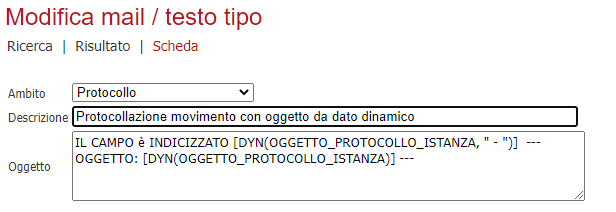
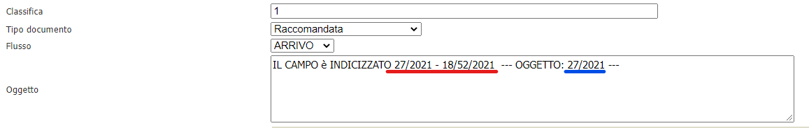

# Segnaposto da schede dinamiche

## Introduzione

La modifica riguarda l'introduzione di due nuovi segnaposto che andranno a recuperare i valori dai campi dinamici.
La richiesta riguarda l'oggetto del protocollo, ma può essere utilizzata anche per il corpo di una mail o lettera tipo.

## Applicazione

I Tag sono della forma:

- **[DYN(nome_campo)]**: dove _nome_campo_ va sostituito con il valore del campo dinamico e andrà a ricercare il relativo valore nel campo _valoredecodificato_ nella tabella _ISTANZEDYN2DATI_;

- **[DYN(nome_campo, "separatore")]**: dove _nome_campo_ ha lo stesso comportamento precedente, mentre _"separatore"_ andrà sostituito con un separatore a scelta (ad esempio: **[DYN(OGGETTO_PROTOCOLLO_ISTANZA," - ")**).

## Esempio pratico

Configurando ad esempio l'oggetto del protocollo come in immagine sotto

otteniamo

dove la parte in rosso rappresenta la parte con il separatore, mentre in blu quella senza separatore.
