

# Descrizione
L'esigenza è quella di poter inoltrare una pratica/movimento da un VBG installato presso un CED ad un altro VBG installato presso un altro CED (ad esempio il comune di Argenta (prov Ferrara) vuole mandare le pratiche della sismica all'unione dei Comuni della Bassa Romagna (prov. Ravenna) ...e quest'ultima a sua volta potrà richiedere integrazioni e/o notificare l'esito.
# Casi d'uso
- Creazione pratica da Back Ferrara
  - Pratica creata nel back Ravenna
    - documenti presenti nel back Ravenna
- Richiesta integrazione da Ravenna
  - movimento creato nella pratica sorgente di Ferrara
- Invio integrazione da Ferrara
  - movimento creato nel back di Ravenna
    - allegati presenti
- Invio esito da Ravenna
  - movimento creato nel back di Ferrara
    - documenti presenti nel movimento
# Identificazione degli ambienti

Viene identificato nel documento **FERRARA** l'installazione dalla quale le pratiche partono verso l'ufficio sismica.

È stato creato l'ambiente con alias **ARGENTA** e raggiungibile con l'url <http://server/argenta>

Viene identificato con **RAVENNA** l'ambiente dove sta l'ufficio sismica raggiungibile dall'url <http://server/ravenna>

Nell'installazione di test l'ambiente della sismica è configurato nel software CE (Pratiche edilizie)

## Configurazione STC
In questa sezione si descrivono le configurazioni STC.

Vengono configurati due ambienti STC differenti per restare quanto più possibile rispondenti al target della produzione dove gli STC sono dislocati in installazioni differenti come immagine che segue.

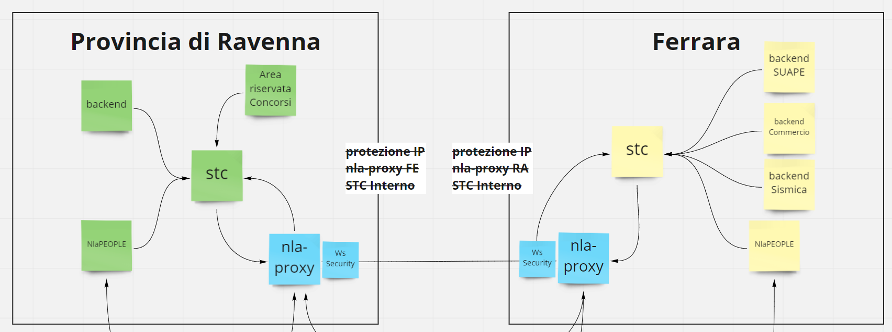

### RAVENNA
L'ambiente di Ravenna punta a IBCSTC localizzato in 

<http://server/ibcstc_ravenna>

Dove sono stati registrati i nodi di backend e nla-proxy

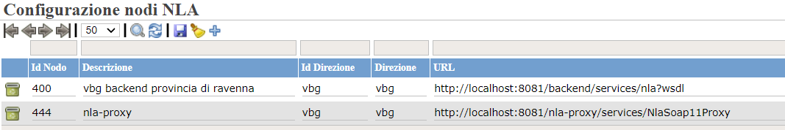
### FERRARA
L'ambiente di FERRARA punta ibcstc al servizio pubblicato all'url

<http://server/ibcstc>

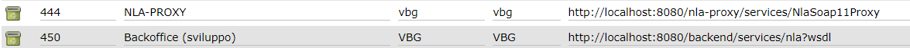

L'idea è quella di configurare e lanciare durante lo sviluppo due tomcat in locale uno sulla porta 8081 (Ravenna) l'altro sulla porta 8080 (Ferrara). Entrambe i tomcat dovrebbero avere il **backend** e **STC** e **nla-proxy**. 

Il contesto ibcstc nella porta 8081 dovrebbe chiamarsi **ibcstc\_ravenna.**
# Backoffice
In questa sezione descriviamo le configurazioni di backoffice
## Comuni associati
Nel backend di Ravenna vanno associati i comuni presenti in ferrara per permettere di gestire le pratiche per quegli enti e non dare errore in risposta. ES a Ravenna sono stati aggiunti i comuni del ferrarese e configurati sull'operatore che dovrà gestire le pratiche

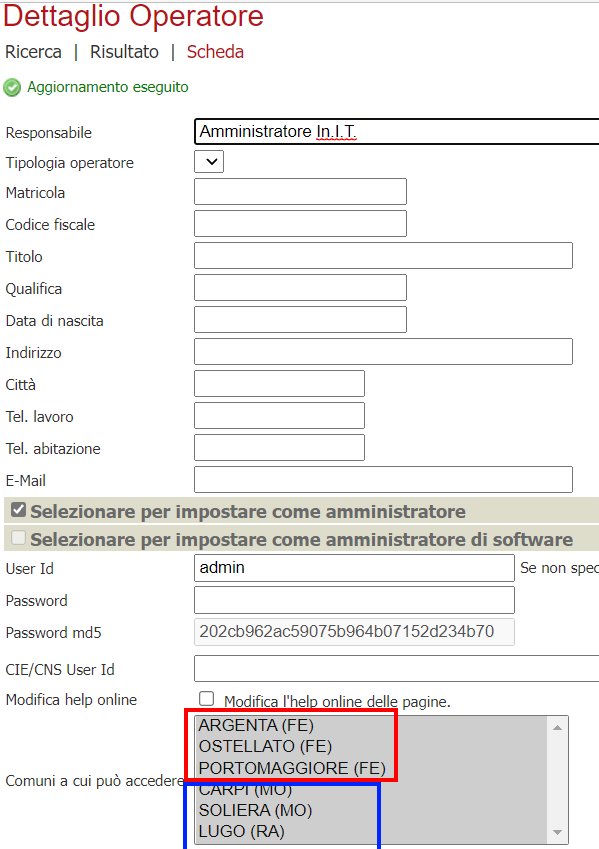

**Attenzione!!! Se ci sono servizi online pubblicati su altri moduli vanno esclusi nella relativa configurazione**

Es.:

> 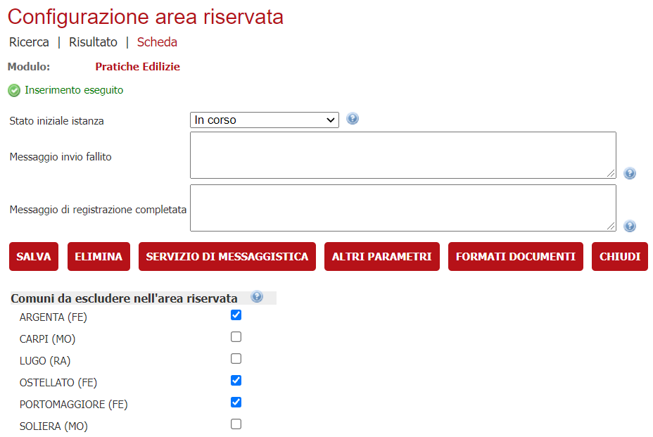

## Verticalizzazioni
La regola da configurare è STC indicando il puntamento all'endpoint dell'stc

### Ravenna

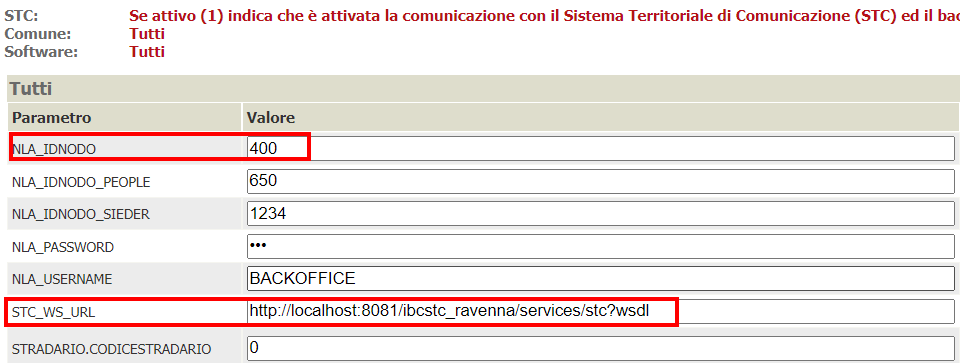
### Ferrara
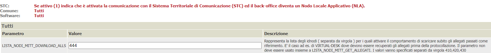

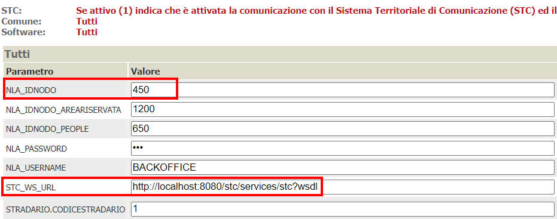
## Amministrazioni
Per convenzione nell'NLA-PROXY ci si mette in IDENTE, IDSPORTELLO l'alias / software dello sportello dove si vuole far creare le pratiche/comunicazioni. 
### Ravenna
Configurate le amministrazioni che rappresentano l'ufficio sismica (in realtà edilizia) e il nodo nla-proxy (ovvero per conto dell'ufficio di Argenta)

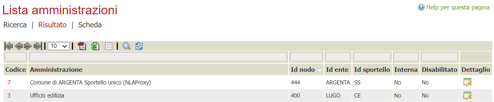

### Ferrara
Configurate le amministrazioni che rappresentano l'ufficio sportello unico e il nodo nla-proxy (ovvero per conto dell'ufficio sismica della provincia di Ravenna).

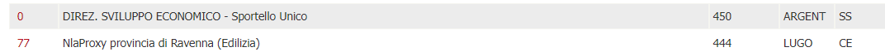

## Endoprocedimenti
La creazione delle pratiche nell'ambiente di Ravenna si basa sul fatto che l'endoprocedimento inviato sarà quello principale configurato nella voce dell'albero es: Albero Ravenna

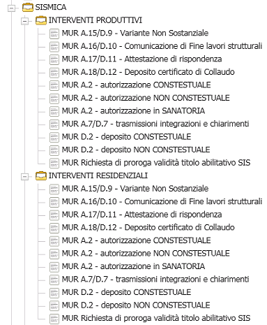
### Ravenna
Gli endo procedimenti a Ravenna dovrebbero essere mappati con gli identificativi degli endoprocedimenti presenti in Ferrara in modo tale che la pratica quando arriva sappia quale endoprocedimenti corrisponde.

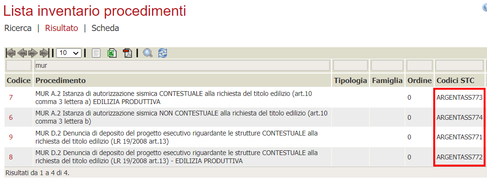

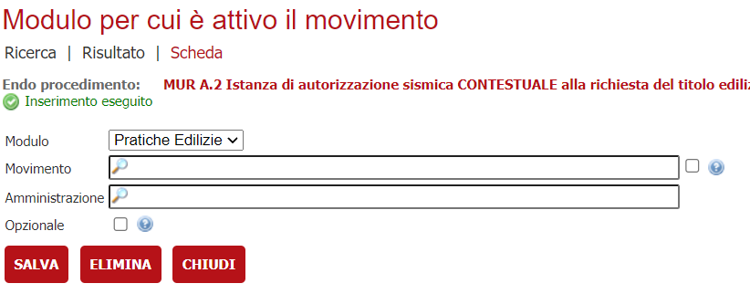

Es. di mappatura dalle pratiche provenienti da Ferrara

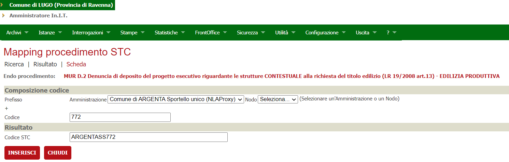

### Ferrara

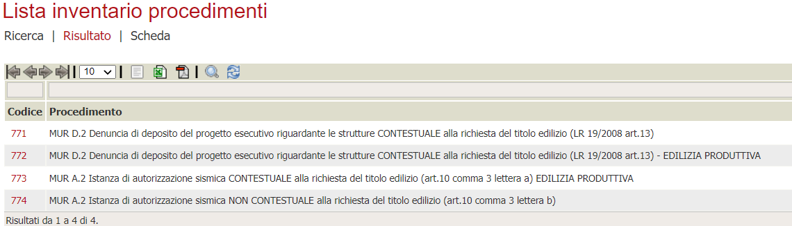

Per ogni endo specifico ATTIVA IN ed il movimento da usare es:

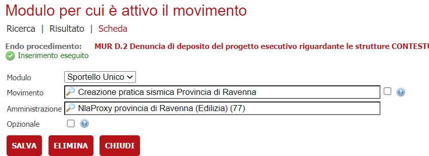

Mappature stc

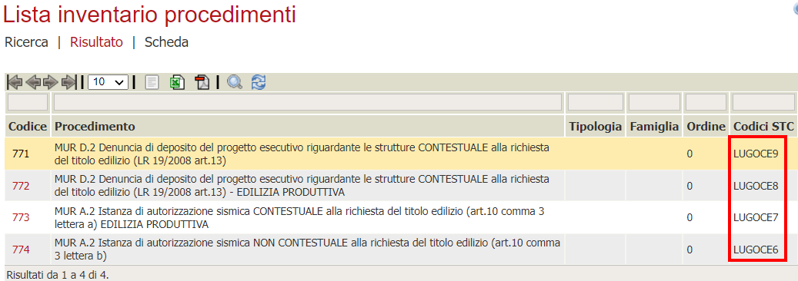

Per i test abbiamo creato questa alberatura a Ferrara (ma non rispecchierà e non dovrà essere configurata in questo modo perché arrivano generiche pratiche people)

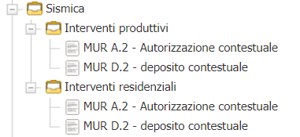

## Creazione pratica da Backoffice Ferrara

Nell'ambiente FERRARA è stato creato il movimento **SSSISM01 - Creazione pratica sismica Provincia di Ravenna.**

Il movimento è configurato per notificare su STC al nodo 444 – nla provincia di ravenna

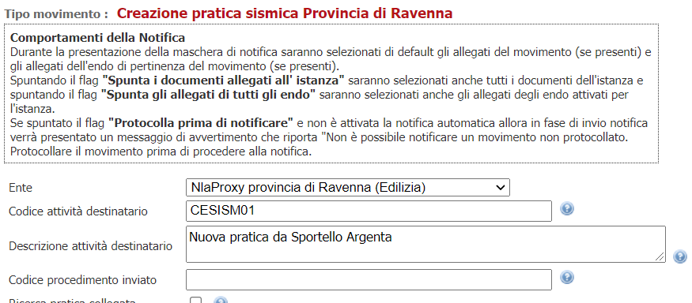

Ipotizziamo che verrà creato un movimento con id 

**CESISM01 – NUOVA PRATICA DA SPORTELLO ARGENTA**

Il movimento è stato creato nell'ambiente di Ravenna

## Richiesta integrazione da Ravenna
La pratica è stata acquisita nel back. L'operatore ha iniziato l'istruttoria e si accorge che è necessario richiedere una integrazione documentale.

In backend RAVENNA viene creato un nuovo movimento **CESISM02 – Richiesta di integrazione documentale a sportello Argenta** configurato per essere notificato su STC con codice attività dedstinatario

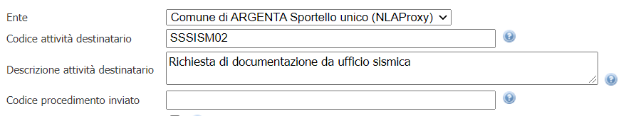

**SSSISM02 - Richiesta di documentazione da ufficio sismica**

Il movimento è stato creato nel backend di Ferrara.

## Invio integrazione da Ferrara
La richiesta di integrazione documentale è arrivata all'ufficio di Argenta. L'operatore richiede la documentazione al richiedente e la inoltra all'ufficio di LUGO (Ravenna)

In backend FERRARA viene creato un nuovo movimento **SSSISM03 – Inoltro documentazione** configurato per essere notificato su STC con codice attività 

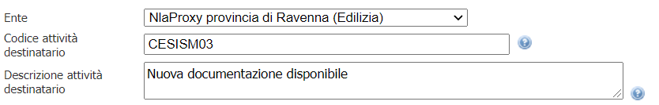

**CESISM03 – nuova documentazione disponibile**

Il movimento è stato creato nel backend di Ravenna.

## Invio esito da Ravenna
L'ufficio ha terminato le sue lavorazioni sulla pratica ed intende inviarne l'esito all'ufficio richiedente.

In backend ravenna viene creato un nuovo movimento con codice **CESISM99 – inoltro esito pratica a ufficio richiedente**

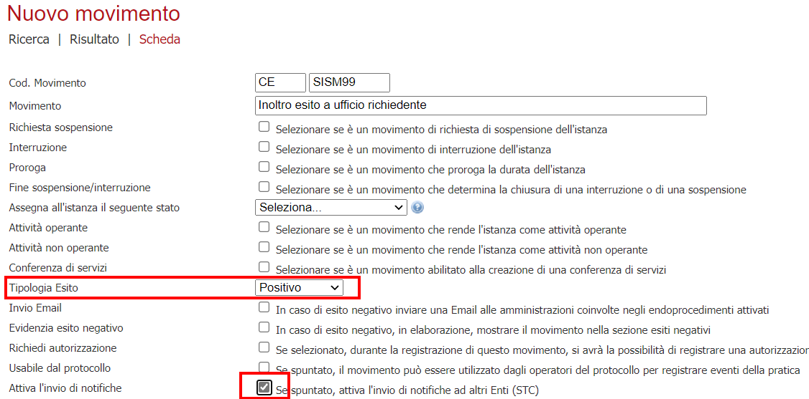

Il movimento è configurato per indicare un esito e per essere notificato da STC

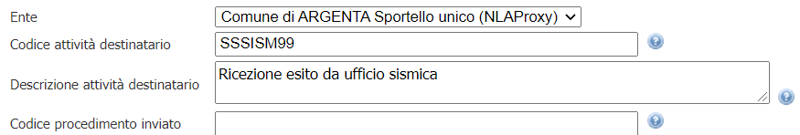

Configurato per inviare un codice attività **SSSISM99 - Ricezione esito da ufficio sismica.**

Il movimento è stato creato anche in backend FERRARA, anche questo configurato per indicare l'esito

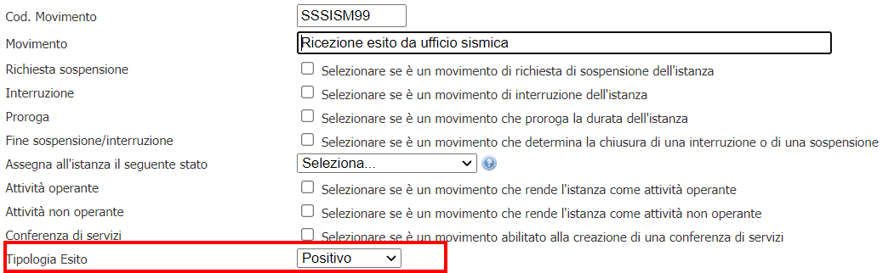

# Nla-proxy
Il nodo nla-proxy espone due porte applicative nla.

**NlaService:** il servizio non autenticato che viene invocato da STC per le chiamate interne

**NlaServiceProxy:** il servizio autenticato tramite WsSecurity (username / password token)che sarà invocato dall'altro sistema NLA-PROXY** 
## ISAPI
Sarà esposto nell'ISAPI per essere pubblico solamente il servizio NlaProxy.
## Configurazioni
Il nodo deve conoscere:

- Url, credenziali dell'endpoint dell'nla-proxy di destinazione. Quando deve inoltrare la chiamata all'nla-proxy di destinazione deve sapere trovare i riferimenti a quale endpoint inviare la domanda.
- mappa tra chiamante e nodo interno. Quando gli arriva una chiamata da nla-proxy esterno deve conoscere lo sportello mittente/destinatario a quale NLA interno rigirare la chiamata.
