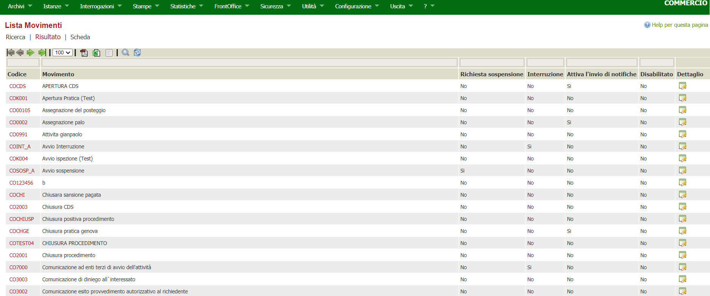
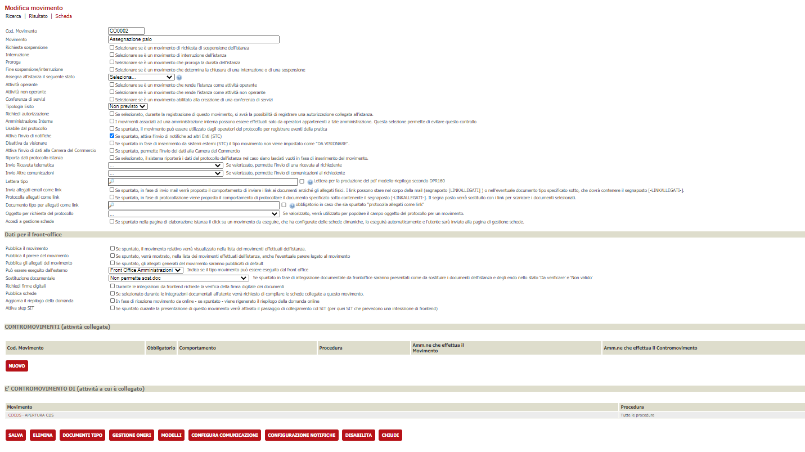
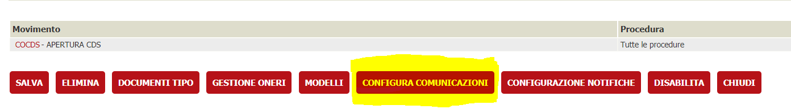
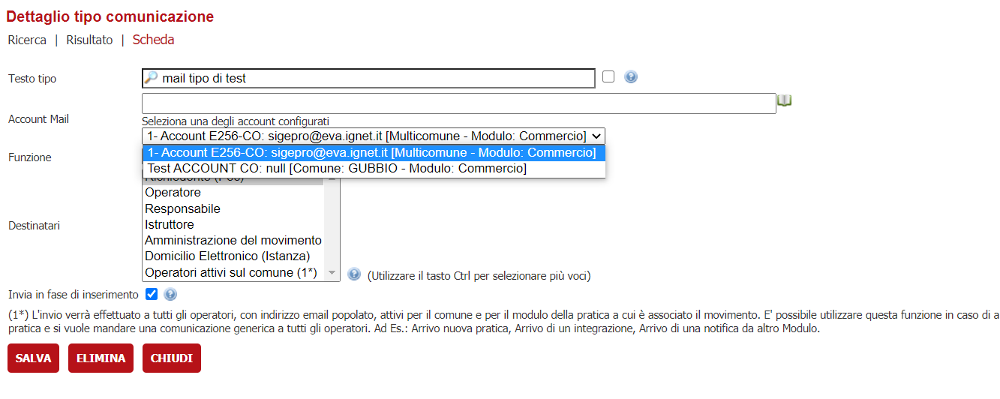
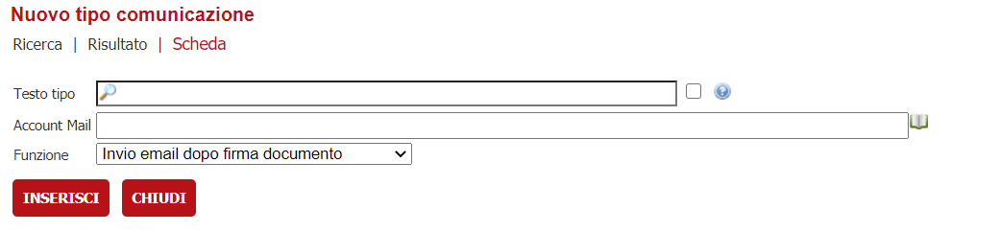

# Configurazione Tipimovimento Comunicazione

Per configurare un tipomovimento comunicazione si accede al menù 
Archivi -> Archivi (software) -> Movimenti . Navigerà alla pagina della lista dei movimenti .

*fig.1 Lista Movimenti*

 I link sulla colonna codice oppure sulla colonna dettaglio portano alla pagina della "modifica movimenti" .

 
*fig.2 Modifica Movimenti*

 Nella pagina visto nella *fig.2*, c'è un bottone "CONFIGURA COMUNICAZIONI" che porta ad un pagina dove è elencato la lista delle comunicazioni.

 
*fig.3 Link Configura comunicazioni*

  Da qui si può scegliere di modificare una specifica comunicazione oppure creare una nuova.

 
*fig.4 Lista Comunicazioni*

 Per modificare una comunicazione si clicca sul link della colonna codice o della colonna dettaglio come visto in *fig 4* . Si ottiene una schermata del genere. Si può scegliere un account diversa e poi salvare la modifica.

 
*fig.5 Modifica Comunicazioni*

 Per creare una nuova comunicazione è necessario cliccare il bottone "NUOVO" come visto in *fig.4*. Si otterà una maschera del genere.

 
 *fig.6 Nuovo comunicazione*

 Qui si trova un campo input accanto cui c'è un icona di un libro, se cliccato viene visualizzato un menu a tendina sotto di esso da cui è possibile scegliere un account, vedi *fig.5*.

