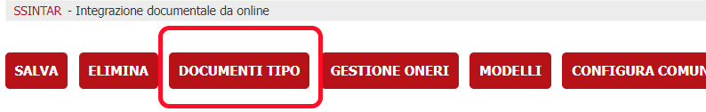
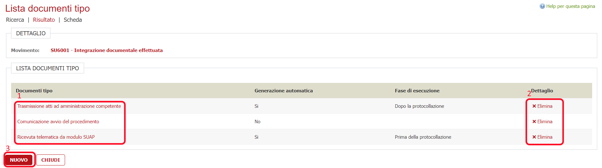
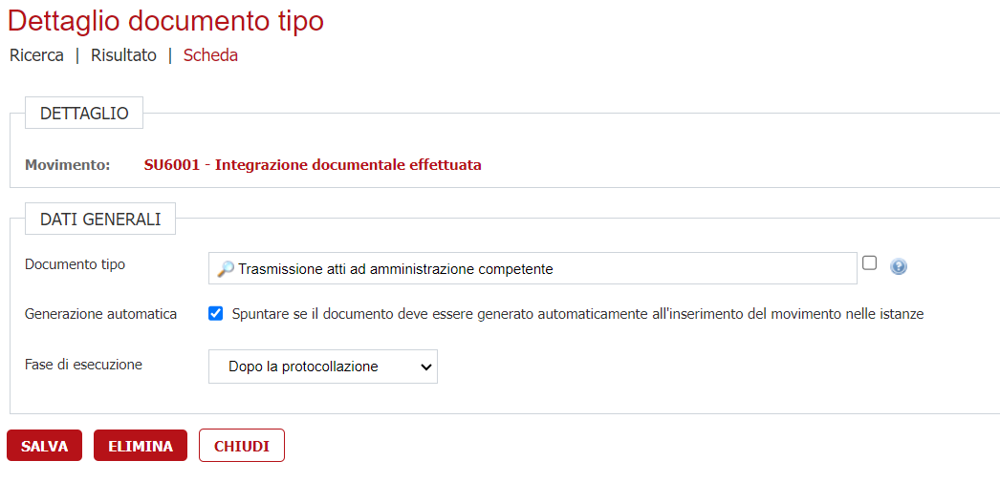

# Configurazione documenti tipo

Ad ogni Tipomovimento è possibile associare uno o più documenti tipo che verranno utilizzati come template e sostituiti con
i dati presenti nell'istanza e nel movimento stesso.
E' stata introdotta la possibilità di generare automaticamente tali documenti decidendo anche la fase di generazione ( allo stato 
attuale è possibile decidere se generare il documento prima o dopo la protocollazione )

A questa configurazione ci si accede tramite il pulsante **Documenti tipo** presente nel dettaglio di ogni tipo movimento

*fig.1 Accesso alla configurazione dei documenti tipo*

## Lista dei documenti tipo configurati

Accedendo alla sezione **Documenti tipo**, viene mostrata subito la lista dei tipi documento configurati con anche l'indicazione dell'eventuale generazione automatica ( Si / No ),
e della fase di generazione nel caso sia stata indicata la generazione automatica

*fig.2 Elenco dei documenti tipo configurati*

Da questa pagina è possibile entrare nel dettaglio di una configurazione esistente (**1**), eliminare una configurazione esistente (**2**)
oppure effettuare una nuova configurazione (**3**)

## Dettaglio di un documento tipo

*fig.3 Dettaglio di un documento tipo configurato*

In questa pagina è possibile visualizzare e modificare la configurazione fatta per un documento tipo indicando quale documento tipo andrà generato, 
se deve ezsere generato automaticamente o no ed eventualmente la sua fase di generazione

E possibile anche da questa sezione eliminare una configurazione precedentemente fatta

## Nuovo documento tipo

*fig.4 Inserimento di un nuovo documento tipo*

Dalla lista delle configurazioni effettuate, tramite il pulsante **Nuovo** si accede alla sezione che permette di inserire un
nuovo documento tipo e di specificarne la generazione automatica e l'eventuale fase di generazione. Una volta inseriti i parametri
richiesti, è possibile confermare il tutto tramite il pulsante **Inserisci**

## Eliminazione di un documento tipo

Sia dalla lista dei documenti tipo configurati che dal dettaglio di un documento tipo, è possibile cancellare la configurazione
mediante il pulsante **Elimina**. Questa operazione non cancellerà i documenti già generati nei movimenti delle istanze ma 
solamente la configurazione in modo che non venga più presa in considerazione per i nuovi movimenti che verranno effettuati
nelle istanze
