# ZIP LOGICO
## Introduzione
Lo scopo della funzionalità è quello di semplificare la procedura per scegliere i documenti della pratica da mandare in protocollazione ed evitare la duplicazione degli stessi andando ad occupare memoria.

Il flusso del lavoro sarà così diviso:
1.	Possibilità da parte di un operatore, all'interno di un movimento, di scegliere tra i documenti della pratica un sotto set il cui riferimento sarà salvato in una nuova tabella (zip logico). I documenti scelti saranno visionabili da chi accederà al movimento
2.	In fase di protocollazione sarà possibile protocollare questo set di documenti, andando a selezionare un flag (protocolla zip logico)
3.	Verrà creato un nuovo tag che creerà un link, da stampare su documento, per permetterà tramite l'app "download app" di scaricare fisicamente gli alleati come accade oggi. 
La terminologia per indicare le funzionalità è puramente indicativa e potrà essere cambiata.

## Creazione zip Logico
Dal dettaglio di un movimento si aggiunge un nuovo pulsante "zip logico", che permetterà di selezionare un sotto set di documenti a partire da tutti quelli afferenti alla pratica (soluzione simile alla creazione dello zip da documenti della pratica).

La funzionalità è attiva solo se il movimento non è stato ancora protocollato ed è accessibile dalla pagina di dettaglio del movimento cliccando il bottone [ZIP LOGICO]:

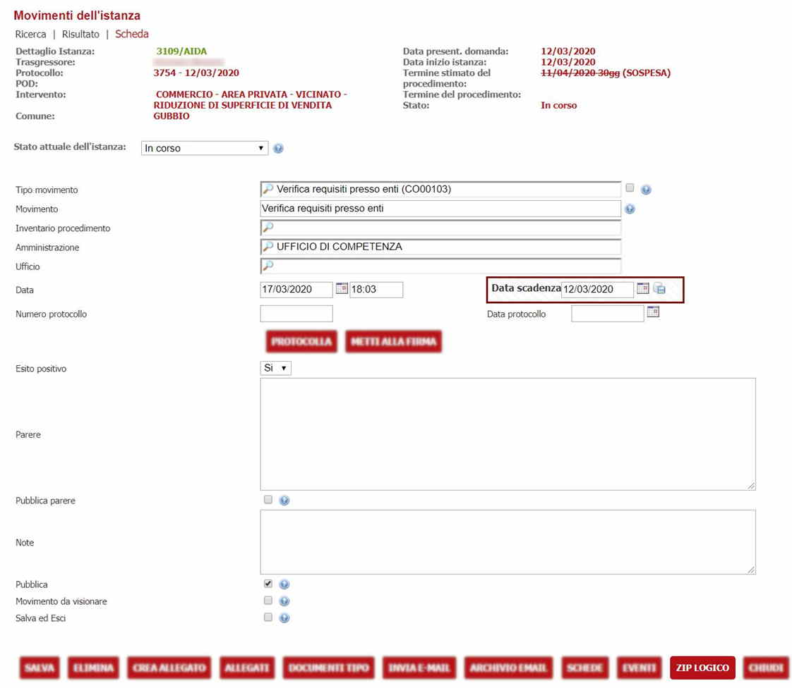

Lo zip logico viene creato andando a salvare i riferimenti dei documenti scelti su una nuova tabella (senza duplicare fisicamente l'allegato), sarà possibile in un secondo momento visionare i documenti scelti.
Contestualmente verrà creato un tag che permetterà di stampare, su un documento, un link dal quale il tecnico potrà scaricare i documenti mediante pin come già accade oggi.

## Creazione dello Zip Logico

La prima volta che si accede comparirà la seguente maschera di selezione di tutti i documenti dell'istanza, dalla quale sarà possibile selezionare i documenti per creare lo zip logico:

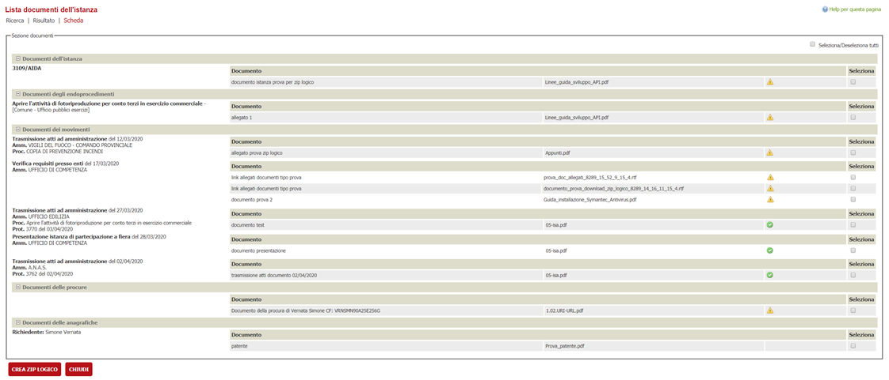

1.	Selezionare  almeno uno dei documenti spuntando il checkbox   , o eventualmente selezionarli tutti spuntando il checkbox  
2.	Cliccare il bottone  
3.	Prima di procedere con l'inserimento, viene informato l'operatore che l'operazione verrà riportata nei log
4.	Spuntare quindi il checkbox e premere il bottone [INSERISCI]

Una volta creato lo Zip Logico per informare l'utente che c'è uno Zip Logico associato al movimento, nella pagina di dettaglio del movimento il bottone [ZIP LOGICO] si presenterà in questo modo. 

Cliccando ora questo bottone si potrà accedere alla pagina di visualizzazione dello Zip Logico.

### Inserimento di nuovi documenti allo Zip Logico

Per aggiungere uno o più documenti cliccare il bottone [AGGIUNGI DOCUMENTO] , sarà mostrata una maschera di selezione dei documenti dell'istanza simile a quella vista nella fase di creazione. 

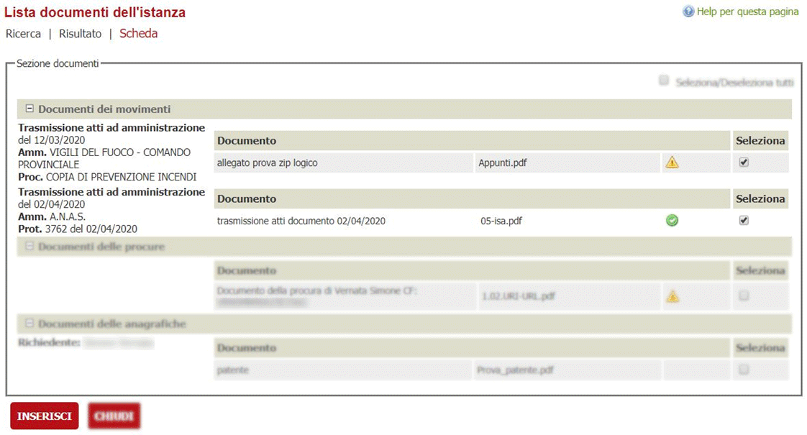

In questa sezione vengono mostrati solo i documenti della pratica che non sono presenti nello Zip Logico.
Anche in questo caso per inserire uno o più documenti nello Zip Logico la procedura è la stessa già vista nella fase di creazione dello Zip Logico:
1.	Selezionare almeno un documento o eventualmente tutti.
2.	Cliccare il bottone  
3.	Viene informato l'operatore che l'operazione sarà riportata nei log, come accade per la fase di creazione dello zip logico.

Anche la gestione degli esiti dell'operazione di inserimento è la stessa vista in precedenza

### Eliminazione dello Zip Logico

Per eliminazione si intende eliminare i riferimenti logici ai documenti che sono associati allo zip logico.
Per eliminare uno o più documenti dallo Zip Logico:
1.	Selezionare il documento o i documenti desiderati
2.	Cliccare il bottone **[ELIMINA]**
3.	Verrà chiesto all'operatore di confermare la cancellazione, previo inserimento della password (si può impostare una password nelle regole **GESTIONE CANCELLAZIONE**) 
4.	Saranno eliminati dallo Zip Logico i riferimenti dei documenti selezionati al punto 1).
Per eliminare interamente lo Zip Logico, basta selezionare tutti i documenti spuntando il checkbox **seleziona/deseleziona tutti**

L'inserimento e la cancellazione di documenti sono possibili solo se il **movimento non è stato protocollato**

## Documento principale dello zip logico

Quando si crea uno zip logico è possibile associare un documento principale che di solito viene usato per le comunicazioni. 

In questo documento vengono messi i link per il download dello zip logico per i destinatari delle mail/pec.

Per poter fare questa associazione è necessario creare un file dalla funzionalità **"CREA ALLEGATO"** e spuntare ***"Zip logico"*** come da immagine che segue. 

 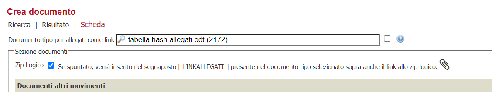

Il documento così creato viene ad essere associato allo zip logico. L'associazione viene visualizzata all'interno dello ZIP logico.

 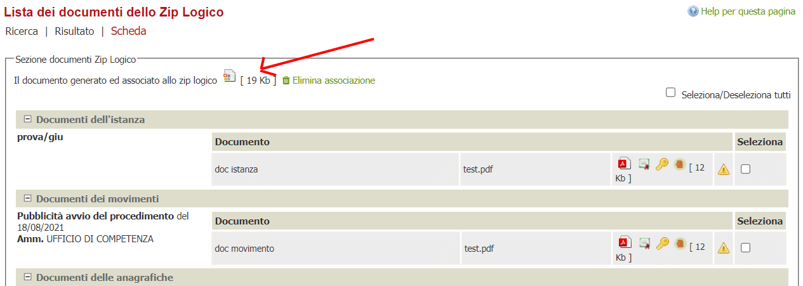

Qualora venisse generato un nuovo documento con la stessa modalità viene riportato all'operatore un messaggio che indica che lo zip logico ha già associato questo documento e che quello nuovo non verrà associato.

 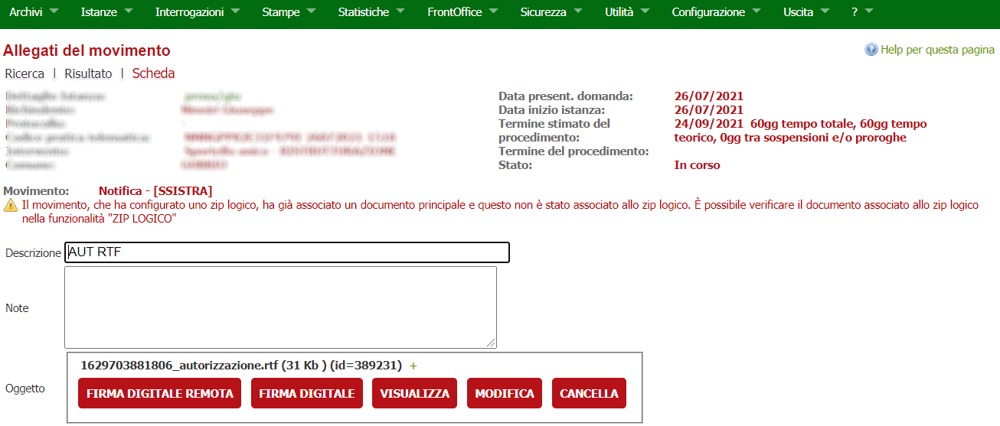

Il documento principale dello zip logico è quel documento che viene inviato nelle comunicazioni e che serve per non allegare alla mail/pec tutti gli allegati. Infatti la mail potrebbe essere *"pesante"* e quindi il doc presenta il link per scaricare gli allegati configurati nello zip logico.

Il documento principale dello zip logico serve a livello di interfaccia di selezione dei documenti nelle vari funzionalità.

Quando si seleziona quel documento automaticamente viene selezionato il flag zip logico e viceversa. 
Questo serve ad aiutare l'operatore nella scelta e diminuire i casi di errore nelle funzionalità di protocollazione, invio mail, notifica STC.

## Protocollazione

Per le protocollazioni in uscita è possibile inviare anche lo zip logico, se presente.
La pagina di protocollazione presenterà nella sezione documenti, il seguente checkbox:

 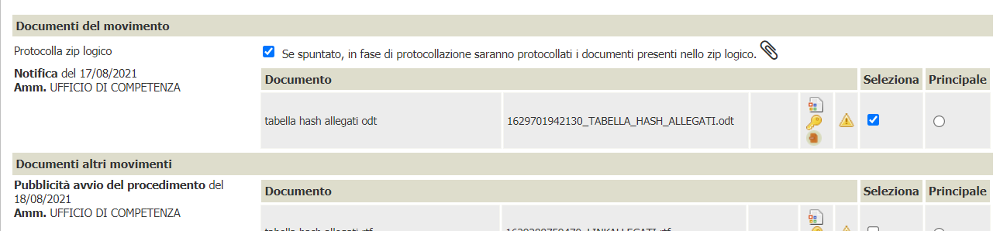

È possibile visualizzare i documenti presenti nello Zip Logico:
 
 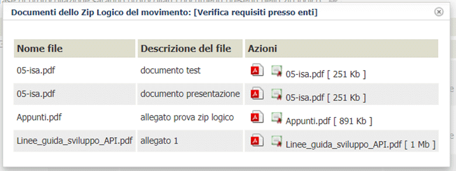

Spuntando il checkbox [Protocolla Zip Logico]:

1.	Viene automaticamente selezionato il documento principale dello zip logico e vengono contrassegnati come non selezionabili i documenti che appartengono allo zip logico.

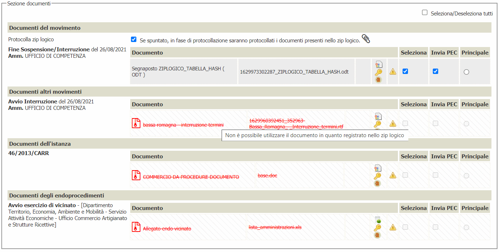

2.	Durante la protocollazione saranno protocollati oltre ai documenti del movimento anche i documenti presenti nello zip logico.

3. Se si deseleziona il check zip logico, automaticamente viene deselezionato il doc principale. 

***Gli allegati presenti nello zip logico non possono venir selezionati come allegati singoli***

Una volta che il movimento è stato protocollato lo **ZIP LOGICO** registrato non è più modificabile e le funzioni di modifica non sono più presenti. È possibile solamente il download dello zip logico.

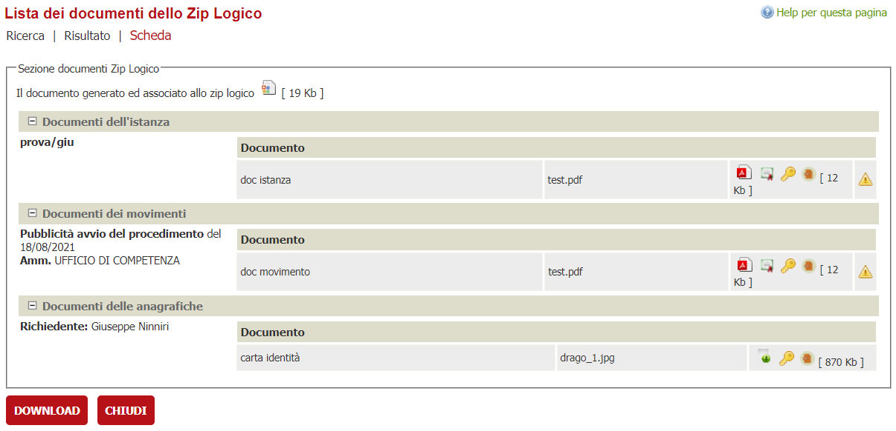

## Invio mail

Nella pagina di invio email è possibile inserire nel corpo o negli allegati della mail il link fisico allo zip logico, in modo da poterlo scaricare.
In questo caso è possibile scegliere di allegare il link allo Zip Logico solo se si spunta il seguente checkbox, già presente nella pagina:

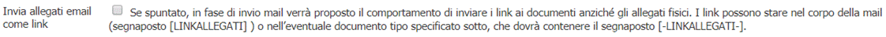

Una volta infatti comparirà il checkbox seguente [Allega Zip Logico]:

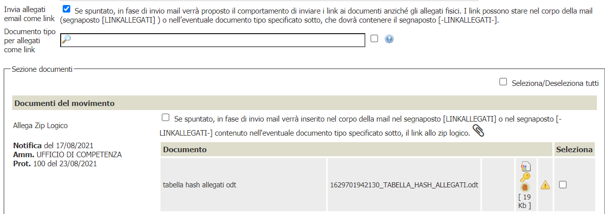

-	Se non viene spuntato, sarà eseguito il solo il comportamento descritto dal checkbox [Invia allegati come link].

-	Altrimenti:

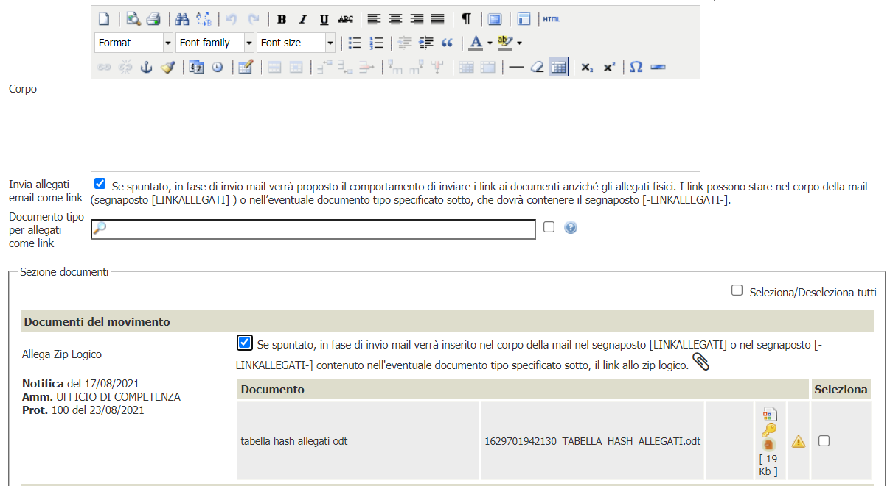

Come nella fase di protocollazione vengono contrassegnati come non selezionabili i documenti che appartengono allo zip logico.

- Se l'operatore sceglie anche il documento tipo da allegare, allora sarà allegato alla mail il documento contente i link allo zip logico e ai documenti del movimento se selezionati. 

- Altrimenti saranno inseriti nel corpo della mail il link allo zip logico e gli eventuali link dei documenti del movimento selezionati. 
    
Anche qui cliccando sull'icona  si possono visualizzare i documenti dello zip logico.

## Crea documento con link

Nella pagina di creazione di un documento con link è possibile creare un documento contenente il link allo Zip Logico, se tale documento contiene il segnaposto [-LINKALLEGATI-] proprio come accade per l'invio email.
Sarà possibile scegliere se inserire nel documento anche il link allo Zip Logico in maniera del tutto analoga alla funzionalità invio email.
Nella sezione documenti sarà mostrato il seguente checkbox [Zip Logico], se il movimento ha associato lo zip logico:

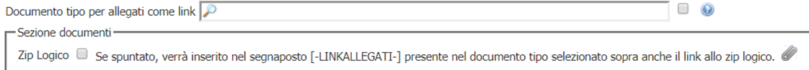

Anche qui cliccando sull'icona **CLIP** si possono visualizzare i documenti dello zip logico.
Dopo aver scelto un documento tipo, selezionando il checkbox [Zip Logico]:
1.	Vengono nascoste le sezioni degli altri documenti della pratica, esclusa quella dei documenti del movimento.
 
2.	Cliccando il bottone **INSERISCI** sarà inserito il documento popolato con il link allo Zip Logico e i link ai documenti del movimento se selezionati.

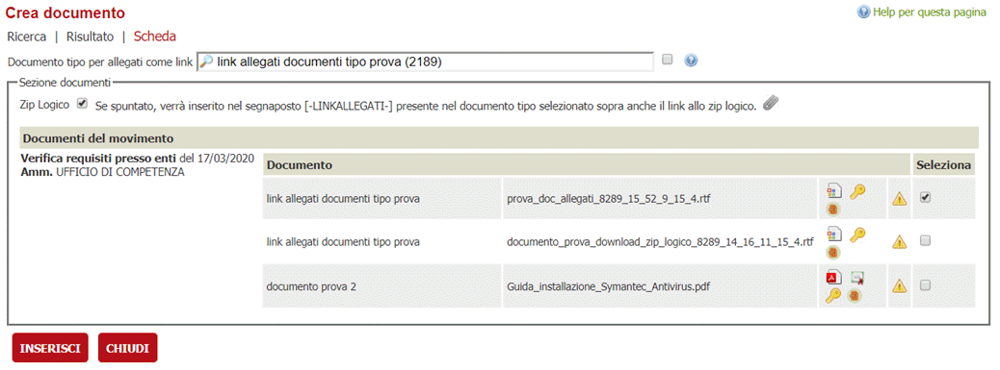

## Notifica STC

Anche nella funzionalità notifica STC è possibile selezionare lo zip logico con lo stesso comportamento già visto nella protocollazione e nella notifica mail.

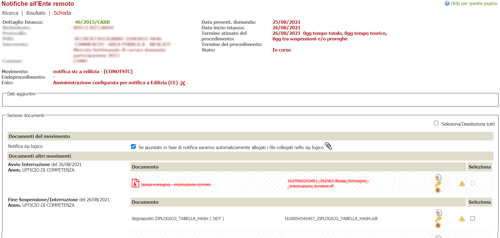

## Segnaposto Mail tipo e Lettere tipo

Sono stati predisposti due nuovi segnaposto utilizzabili nelle funzionalità **"CREA ALLEGATO"** ed **"INVIA MAIL"**

I segnaposto sono:

- **ZIPLOGICO_NUM_FILE**

    il segnaposto recupera il numero dei file presenti nello ZIP LOGICO

- **ZIPLOGICO_TABELLA_HASH**

    Il segnaposto scrive una tabellina con le colonne nome file, descrizione, sha 256 ad esempio
    DESCRIZIONE | NOME FILE | IMPRONTA HASH FORMATO SHA256
    --- | --- | ---
    doc movimento|test.pdf|056c935e4dfa223cbf08....
    carta identità|drago_1.jpg|7c1eb7e2a7e7597....

Per utilizzare i segnaposto su documenti RTF/ODT 

inserire i tag **[-ZIPLOGICO_NUM_FILE-]** e **[-ZIPLOGICO_TABELLA_HASH-]** , 

mentre per utilizzarli nel corpo di una mail tipo

inserire i tag  **[ZIPLOGICO_NUM_FILE]** e **[ZIPLOGICO_TABELLA_HASH]**.

Il segnaposto **ZIPLOGICO_TABELLA_HASH** è personalizzabile, per capire come personalizzarlo fare riferimento alla 
[(guida alla personalizzazione dei segnaposti)](../segnaposti/segnaposti-personalizzabili.md)